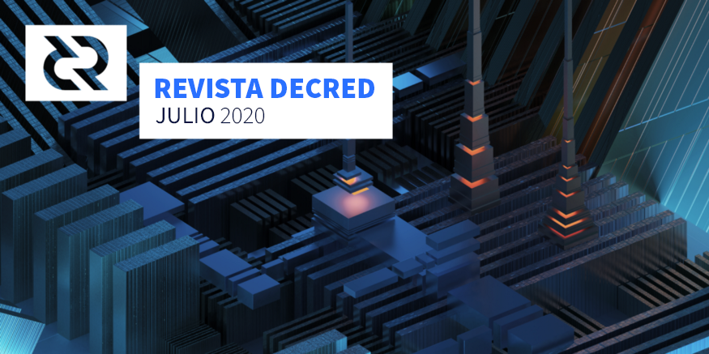

# Revista Decred — Julio 2020

Imagen : torres de retransmisión por @saender

## Desarrollo

A menos que se indique lo contrario, el trabajo que se informa aquí tiene el estado "merged to master". Significa que el trabajo se completó, revisó e integró en el código fuente que los usuarios avanzados pueden construir y ejecutar, pero aún no está disponible en los binarios de lanzamiento para usuarios regulares.

[dcrd](https://github.com/decred/dcrd): 
- Manejar a los pares con el mensaje [`"notfound"`](https://github.com/decred/dcrd/pull/2253)” (si se indica que un par tiene algún dato, pero no los entrega en una solicitud, lo más probable es que ese par esté jugando mal y necesite ser bloqueado)
- Añadir más [cobertura a las pruebas](https://github.com/decred/dcrd/issues/2069) del paquete `rpcserver`
- Actualizar el código de [normalización de campo](https://github.com/decred/dcrd/pull/2258) para proteger mejor contra la posibilidad de operaciones de tiempo no constantes debido a la predicción de rama y agregar varias pruebas para garantizar que la nueva lógica sea sólida. (Este PR se basa en uno [anterior](https://github.com/btcsuite/btcd/pull/1084) del 2017)
- Optimizar el uso de memoria en el [nodo](https://github.com/decred/dcrd/pull/2294) al momento de hacer staking, txscript [stack](https://github.com/decred/dcrd/pull/2298), [registro](https://github.com/decred/dcrd/pull/2301), y el código del [registro de recompensas](https://github.com/decred/dcrd/pull/2302)
- [Exportar](https://github.com/decred/dcrd/pull/2240) las funciones de consenso, para eliminar todo el código que no es de consenso del paquete `txscript`
- [Mover](https://github.com/decred/dcrd/pull/1965) el código mining hacia el paquete interno de `mining`
- Exportar los módulos del [`mempool`](https://github.com/decred/dcrd/pull/2274), [`mining`](https://github.com/decred/dcrd/pull/2275), y [`fees`](https://github.com/decred/dcrd/pull/2287) a módulos internos. Todo esto con la intención de modularizar aún más el código para hacer que su mantenimiento futuro sea mucho más fácil.
- [Mover](https://github.com/decred/dcrd/pull/2288) el código del rcpserver a un paquete interno
- [Rediseño](https://github.com/decred/dcrd/pull/2277) y [refactorización](https://github.com/decred/dcrd/pull/2276) del `cpuminer` para usar el generador de plantillas de bloque para simplificar las pruebas.
- [Exportar](https://github.com/decred/dcrd/pull/2243) funciones `txscript` para reducir el tamaño del PR

Comentarios sobre el estado de las optimizaciones:

> El flame graph para el uso de la CPU muestra claramente que las cosas están siendo dominadas por IO ahora, por lo que las mayores aceleraciones que quedan definitivamente vendrán de ese frente. ~ 10% GC, <1% de validación, ~ 3,5% de E / S de pares, ~ 55% de E / S de disco, ~ 3% de costo de creación de perfiles, ~ 27% inactivo y el resto en bits y bobs menores. ([@davecgh](https://chat.decred.org/#/room/!zefvTnlxYHPKvJMThI:decred.org/$U9ybkey7ppiqGR_K_BagIHwcoyNGTS-H91hEaXzghmI))

Se [fusionaron](https://github.com/decred/dcrd/pulls?q=is%3Apr+merged%3A2020-07-01..2020-07-31+sort%3Aupdated-asc) un total de 53 pull requests por parte de 8 colaboradores, agregando 11K y eliminando 5K líneas de código.

El código del [pull request](https://github.com/decred/dcrd/pull/2170) para descentralizar el fondo de tesorería se encuentra en [revisión](https://twitter.com/marco_peereboom/status/1290439680937385985) con 350 comentarios. Un cambio muy notable es que las transacciones TSPEND usarán firmas de Schnorr:

> Sugerí que usáramos firmas de Schnorr para los pagos en el fondo de tesorería a fin de recoger algunos de los beneficios que brindan, como firmas más pequeñas y garantías formalmente demostrables. Recientemente limpié el código de Schnorr para llevarlo a los altos estándares del proyecto para el código de consenso y, aunque hay algunos cambios que queremos hacer en el futuro antes de cambiarlo para un uso generalizado con firmas de múltiples partes entre múltiples fuentes. (@davecgh)

Si tiene algún hardware inactivo, puede ayudar mediante la prueba [fuzz dcrd](https://github.com/degeri/dcrd-continuous-fuzz).

[dcrwallet](https://github.com/decred/dcrwallet):
- Parámetro opcional [gaplimit](https://github.com/decred/dcrwallet/pull/1761) en el comando `discoverusage`
- Parámetro [account](https://github.com/decred/dcrwallet/pull/1767) opcional en el comando `listunspent`
- Implementar el método [`ticketinfo`](https://github.com/decred/dcrwallet/pull/1783) para proporcionar información detallada sobre el estado de todos los tickets de la cartera (necesario para el vspd)
- Agregar los [parámetros](https://github.com/decred/dcrwallet/pull/1780) de CoinJoin cuando se llama a `PurchaseTicketRequest`
- Implementar el comando [`getpeerinfo`](https://github.com/decred/dcrwallet/pull/1797) en el modo SPV
- Agregar un nuevo comando para cambiar la [frase de contraseña pública](https://github.com/decred/dcrwallet/pull/1510) de la cartera
- Corrección de errores

[Decrediton](https://github.com/decred/decrediton):
- Respaldar y recuperar el [archivo SCB](https://github.com/decred/decrediton/pull/2535) generado por dcrlnd (explicación en la [documentación](https://docs.decred.org/lightning-network/backups/))
- Mostrar [información general](https://github.com/decred/decrediton/pull/2575) de la red Lightning
- Agregar una [decodificación](https://github.com/decred/decrediton/pull/2523) adecuada para las transacciones de staking (necesario para la firma de mensajes en el VSP)
- [Actualización](https://github.com/decred/decrediton/pulls?q=functional+is%3Apr+merged%3A2020-07-01..2020-07-31+sort%3Aupdated-asc) del código de React, utilizando componentes funcionales y modulares
- Soporte inicial de PoC para el nuevo sistema de staking del [vspd](https://github.com/decred/decrediton/pull/2516)
- Soporte para los [enlaces acortados](https://github.com/decred/decrediton/pull/2602) de las propuestas
- Eliminar el requisito de passphrase al importar un [redeem script](https://github.com/decred/decrediton/pull/2616)
- Corrección de errores

Se realizaron 35 Pull Requests por parte de 6 colaboradores, añadiendo 9K y eliminando 7K líneas de código.

[Politeia](https://github.com/decred/politeia):

Se han implementado varias funciones nuevas en el sitio proposals.decred.org: proceso de Pedidos de Propuestas (Request For Proposals o RFP), visualización plana de los comentarios (ayuda a detectar rápidamente nuevos comentarios sin buscarlos en el hilo), modo oscuro, enlaces acortados de las propuestas y un cambio para reducir el bloqueo de la publicación de comentarios a una vez al día en lugar de una vez por hora. Esto se solucionará por completo con la migración al nuevo backend de tlog.

Cambios:
- [Utilidad](https://github.com/decred/politeia/pull/1240) en la línea de comandos para el procesos del RFP
- Pruebas unitarias
- Corrección de errores

[CMS](https://cms.decred.org/):
- El administrador puede [buscar](https://github.com/decred/politeiagui/pull/2033) a un contratista por dominio o tipo
- Mostrar los [nombres](https://github.com/decred/politeiagui/pull/2041) de la propuesta en vez de token
- Asignar el [propietario](https://github.com/decred/politeiagui/pull/2055) a la propuesta (GUI)
- revisión del administrador del resumen y los detalles del [gasto](https://github.com/decred/politeiagui/pull/2032) en la propuesta
- Nueva pestaña para que los [propietarios](https://github.com/decred/politeiagui/pull/2046) de las propuestas revisen los detalles de facturación
- [Resaltado](https://github.com/decred/politeiagui/pull/2057) de caracteres no permitidos

[vspd](https://github.com/decred/vspd):
- Verificación de [coherencia](https://github.com/decred/vspd/pull/86) en la cartera de votación (el último cambio importante para el lanzamiento)
- Tabla para mostrar el [estado](https://github.com/decred/vspd/pull/149) de cada cartera de votación – para el administrador
- Control de versiones para la API y corrección de errores

El vspd ahora ha sido implementado en testnet por un par de operadores de VSP existentes, la implementación parece haber sido sencilla para ellos y todo está funcionando como se esperaba.

[dcrlnd](https://github.com/decred/dcrlnd):
- Actualizar para usar [dcrwallet](https://github.com/decred/dcrlnd/pull/90) y [dcrd](https://github.com/decred/dcrlnd/pull/105)
- Paquete de escaneo para detectar transacciones relevantes para el nodo de Lightning Network de manera más eficiente y modo SPV
- [Implementaciones](https://github.com/decred/dcrlnd/pull/93) para el paquete `chainntnfs` y un [controlador](https://github.com/decred/dcrlnd/pull/93) para el paquete `chainview` que usa dcrwallet incrustado y remoto como un recurso de eventos en cadena. Esto nos permite desacoplar aún más dcrlnd de un dcrd subyacente, que es un requisito para tener una instancia de dcrlnd ejecutándose en modo SPV
- [Cambio](https://github.com/decred/dcrlnd/pull/94) entre el paquete principal `dcrlnd` para usar los nuevos controladores respaldados por cartera para que las operaciones de E / S en cadena ahora se realicen completamente por la instancia de dcrwallet  y dcrlnd ya no requiera una conexión a un dcrd en ejecución para realizar su trabajo
- Habilitar y probar el [modo SPV](https://github.com/decred/dcrlnd/pull/95) para las carteras remotas
- [Introducir](https://github.com/decred/dcrlnd/pull/99) los cambios entre v0.9.0-beta y 0.10.0-beta: se consideraron para su inclusión 139 pull requests y algunos commits separados

[dcrdex](https://github.com/decred/dcrdex):
- Mostrar en el cliente un cuadro de diálogo para la reconfiguración de la cartera
- [Manejo inteligente de tarifas](https://github.com/decred/dcrdex/pull/505). Para minimizar las tarifas de minería y obtener la tarifa óptima al momento del intercambio (no en el momento de la orden), se utilizan estimaciones de tarifas inteligentes. Para hacer frente a los pedidos que necesitan bloquear las monedas necesarias para financiar los intercambios, lo que puede ocurrir mucho después de la colocación del pedido cuando las tarifas en cadena han cambiado, los pedidos deben reservarse lo suficiente para una "tarifa máxima". En otras palabras, los pedidos se reservan lo suficiente para una "tarifa máxima" en caso de que las tarifas de BTC sean altas cuando se completa la orden, pero la tarifa de red óptima en el momento del emparejamiento se utiliza para la transacción del contrato de intercambio. (y aquí hay un [tweet](https://twitter.com/chappjc/status/1280510447515586565) para ayudar)
- Mejora en el [bloqueo de fondos](https://github.com/decred/dcrdex/pull/525) para llenar las ordenes
- Funciones adicionales para la administración del servidor: [bloquear](https://github.com/decred/dcrdex/pull/469), [desbloquear](https://github.com/decred/dcrdex/pull/479), [notificar](https://github.com/decred/dcrdex/pull/555) y [notificar a todos](https://github.com/decred/dcrdex/pull/534)
- [Cancelar la orden fallida automáticamente](https://github.com/decred/dcrdex/pull/475) y notificar a los clientes (cuando una orden sea revocada o falle)
- [Actualizar](https://github.com/decred/dcrdex/pull/448) el esquema de la base de datos
- [Reconectar](https://github.com/decred/dcrdex/pull/503) el cliente automáticamente al libro de ordenes después de una reconexión con el servidor
- La interfaz de línea de comandos del cliente ahora proporciona el [libro de ordenes](https://github.com/decred/dcrdex/pull/496)
- [Prevenir](https://github.com/decred/dcrdex/pull/527) cerrar ventanas por accidente (apagar el programa) con ordenes activas e intercambios
- [Mejoras](https://github.com/decred/dcrdex/pull/560) en UI/UX
- Corrección de errores y optimizaciones

[dcrandroid](https://github.com/planetdecred/dcrandroid):
- Actualizar la traducción en francés
- [Obtener propuestas de Politeia](https://github.com/planetdecred/dcrlibwallet/pull/153) publicadas en la librería de dcrlibwallet
- Corrección de errores incluyendo la librería de dcrlibwallet

[godcr](https://github.com/planetdecred/godcr):

Es una nueva versión de la cartera SPV de escritorio escrita con solo golang.

Mira la [Revista Decred de junio](https://medium.com/decred-es/revista-decred-junio-2020-a7716b71251e) para una introducción de godcr.

- Widget del [estado de sincronización](https://github.com/planetdecred/godcr/pull/170)
- Actualizar página [SEND](https://github.com/planetdecred/godcr/pull/184) para igualarla a las aplicaciones móviles
- [Aplicar](https://github.com/planetdecred/godcr/pull/173) un padding uniforme a todas las páginas
- Ajustes y correcciones de la interfaz de usuario

[decred.org](https://github.com/decred/dcrweb):
- Añadir artículos en la [página de noticias](https://decred.org/press/)
- [Animaciones de Lottie](https://github.com/decred/dcrweb/pull/892) en la página de Historia

Otros:
- [decredpower.com](https://decredpower.com/) ha migrado a HUGO el cual es mucho más flexible y más fácil de actualizar. También tiene un nuevo tema (No te preocupes, el tema [retro](https://decredpower.com/retro/) aún sigue ahí)
- El [Pull Request](https://github.com/trezor/trezor-utxo-lib/pull/9) para añadir el soporte de Decred a la librería de JS de Trezor está pendiente.
- @kozel publicó una [guía](https://medium.com/@artikozel/the-decred-node-back-to-the-source-part-one-27d4576e7e1c) detallada sobre cómo construir el software más reciente de Decred y hacerlo correr en un Raspberry Pi

## Comunidad

Damos bienvenida al nuevo colaborador con una fusión de código completada dentro de las ramas principales de desarrollo: @Kifen ([dcrwallet](https://github.com/decred/dcrwallet/pull/1520)).

Felicidades al nuevo contratista aceptado por el Decred Contractor Clearance(DCC): [@rstaudt2](https://github.com/rstaudt2) (desarrollo)

Estadísticas de la comunidad a partir del 1 de agosto:
- Seguidores en Twitter: 40,637 (+120)
- Suscriptores en Reddit: 9,875 (+21)
- Usuarios en la sala #general de Matrix: 124 (-498) *
- Usuarios en Discord: 1372 (+84)
- Usuarios en Telegram: 2520 (-87)
- Suscriptores en YouTube: 4150 (+40), vistas: 151K (+3K)
- Seguidores en Facebook: 3655 (+0), likes: 3,305 (-6)
- Seguidores en LinkedIn: 862 (+26)
- Estrellas en el repositorio dcrd en GitHub: 550 (+1), forks: 240 (-1)

El chat y su servidor de Matrix fueron actualizados el 9 de julio, para más detalles puede consultar la discusión por parte de la comunidad.

Puede consultar las gráficas con todos los datos de redes sociales [reportados](https://github.com/xaur/social-media-data/blob/graphs/graphs/index.md) en la Revista Decred (los datos en texto plano se encuentran dentro del mismo repositorio). Un buen recurso extra es la [página](https://dcrextdata.planetdecred.org/community) de estadística de la comunidad por parte del proyecto dcrextdata — rastrea a pocas cuentas, pero con datos más profundos y gráficas interactivas.

## Gobernanza

En julio, el [fondo de tesorería](https://explorer.dcrdata.org/address/Dcur2mcGjmENx4DhNqDctW5wJCVyT3Qeqkx) recibió 13,050 DCR y gastó 16,073 DCR. Con la tasa promedio diaria de DCR / USD en julio de $15.13, esto es $197K recibidos y $243K gastados. A la tasa promedio diaria de junio de $16.05, la cifra en USD facturada por el trabajo completado en ese mes es de $258K. A partir del 1 de agosto, el saldo del fondo de la tesorería es de 630,766 DCR (10.7 millones de dólares a $16.92).

En julio, 7 propuestas fueron publicadas:
- [Propuesta](https://proposals.decred.org/proposals/c81926b) por parte de @lindseymmc para la continuación de los servicios de relaciones públicas solicitando $3500 / mes y con un año de cobertura fue aprobada con el 90% (25% de participación total), mucho mejor que la primera propuesta que obtuvo un 72% de aprobación.
- $15,000 dólares para la [creación de carteles en realidad aumentada](https://proposals.decred.org/proposals/dedf452074752d7e29304a0566643feb26d1d130596e04c613e15de113ac2d08).

- [Propuesta](https://proposals.decred.org/proposals/32cba00b8bb0f41689ca8216e2e14a0e3d91a724c83369b3fcda02490dc119f4) para cubrir la moderación de los canales de Matrix, Discord, Telegram y Politeia, con un gasto máximo de $9000 pero tan solo se espera gastar $4800 en los 6 meses que cubre. Este trabajo actualmente ya se paga, pero la propuesta se realiza es con la intención de formalizar esta entrada y limitar el presupuesto.
- [Propuesta](https://proposals.decred.org/proposals/2dcbc3e14c06c6e84449f5e2756b944d5ed23be41c23a9f5225f3eef424ce0ae) para integrar a DCR como opción de pago en dos sitios web de reserva de viajes: ($30K), más actividades de promoción ($21.5K).
- [Propuesta](https://proposals.decred.org/proposals/3372cfce1218ba81d9c8ca0535cd9dd590f60c92adc068c0089218ae7e3e99e1) para gastar 10K en marketing (incluyendo retweets pagados y anuncios) — consulta el [post](https://www.reddit.com/r/decred/comments/hzo3yu/creating_a_decred_marketing_workgroup/) en Reddit.
- [Propuesta](https://proposals.decred.org/proposals/3372cfce1218ba81d9c8ca0535cd9dd590f60c92adc068c0089218ae7e3e99e1) para crear 20 memes, cada meme costaría 10 DCR.
- [Propuesta](https://proposals.decred.org/proposals/7a67ed5) para ser anfitrión de una serie de juegos de póker, con premios en DCR (300 DCR /mes)

Dos de estas propuestas tienen un problema con los presupuestos denominados en DCR.

También este mes, la cuestión de cambiar la emisión de DCR fue sometida a una [encuesta](https://www.reddit.com/r/decred/comments/hz9i6d/poll_the_decred_great_inflation/) en Reddit por parte de @Checkmate, en un esfuerzo por solucionar el problema. La encuesta atrajo 87 votos y 65 se opusieron a cualquier consideración adicional de cambiar la política de emisión de DCR.

Consulte el [#33 del Politeia Digest](https://medium.com/decred-es/politeia-digest-33-19-de-julio-2020-4aaa21924312) para obtener más detalles de las dos primeras propuestas, el #34 con detalles de las otras nuevas propuestas saldrá pronto.

## Red

Hashrate: el [hashrate de julio](https://explorer.dcrdata.org/charts?chart=hashrate&zoom=kc0s5ehh-kdbsef8t&scale=linear&bin=block&axis=time) abrió a ~ 394 Ph/s y cerró a ~ 307 Ph/s, tuvo un mínimo en 280 Ph/s y alcanzó un máximo de 582 Ph/s durante todo el mes. 

[Distribución del hashrate en los pools a partir del 1 de agosto](https://dcrstats.com/pow) (aproximado): 
- Poolin 33%
- UUPool 26%
- lab.antpool.com 9.6%
- BTC.com 3.4%
- Luxor 0.9%
- F2Pool 0.8%
- BeePool 0.09%
- CoinMine 0.03%
- Suprnova 0.02% 
- Otros ~ 26%.

Staking: el [precio promedio del ticket](https://dcrstats.com/) a 30 días fue de 144.3 DCR (+4.9). El [precio](https://explorer.dcrdata.org/charts?chart=ticket-price&zoom=kc0s5ehh-kdbsef8t&bin=window&axis=time&visibility=true-false) varió entre 137.1–155.5 DCR. El [monto bloqueado por stake](https://explorer.dcrdata.org/charts?chart=ticket-pool-value&zoom=kc0s5ehh-kdbsef8t&bin=day&axis=time) fue de 5.75–5.88 millones de DCR, que correspondió al 48.98–50.06% del [suministro total en circulación](https://explorer.dcrdata.org/charts?chart=stake-participation&zoom=kc0s5ehh-kdbsef8t&bin=day&axis=time).

Nodos: en [julio](https://charts.dcr.farm/d/000000014/nodes?orgId=1&from=1593561600000&to=1596240000000) hubo un promedio de 134 nodos públicos y 241 nodos por parte de dcr.farm. 
Distribución promedio por versión en julio: 
- 51% dcrd v1.5.1
- 10% dcrd v1.5
- 6% dcrd v1.6.0 dev builds
- 5% dcrd v1.5.0 dev builds y RC builds
- 1.3% dcrd v1.4
- 7% dcrwallet v1.5.1
- 1% dcrwallet v1.5
- 0.6% dcrwallet v1.4
- 18% para otras versiones.  

## Integraciones
- El Exchange NovaDAX ha [añadido](https://twitter.com/Decred_BR/status/1275190825060794377) los pares BRL, USDT, BTC y ETH para DCR.
- Binance ha añadido los pares [DCR/BUSD](https://www.binance.com/en/support/articles/fee761e58d684bc3a1c7fc11660ab596) y [DCR/USDT](https://www.binance.com/en/support/articles/043fc71cdcce4fcfbdae133d8d0f35aa) 
- [XT.com listó](https://twitter.com/XTexchange/status/1062529195094339584) a DCR en noviembre del 2018 pero ahora ellos tienen el par [USDT](https://twitter.com/XTexchange/status/1281867070653816832) y un modo de apalancamiento.
- En [CoinMarketCap](https://coinmarketcap.com/currencies/decred/) eliminaron la definición de “Bitcoin fork” para Decred – lo cual es verdad, no somos un fork.

Advertencia: los autores de la Revista Decred no tienen idea de la confiabilidad de alguno de los servicios anteriores. Haga su propia investigación antes de confiar su información personal o activos.

## Comercio

[Decentralized Boutique](https://twitter.com/decentralizedbt/status/1288529718514536449) ha anunciado una “Granada Decred” la cual también está disponible para su descarga lista para imprimir en casa para las personas que prefieren evitar la entrega de artículos con forma de granada.

[@OfficialCryptos](https://twitter.com/OfficialCryptos/status/1289170923501817859) ha anunciado estampas del corazón de Decred.

## Alcance

Varios temas relacionados a marketing se discutieron en Reddit y Matrix, sobre todo qué papel debería desempeñar el fondo de tesorería de un proyecto descentralizado como Decred en estos temas.

@Checkmate ha estado publicando en reddit, provocando discusiones que también se han extendido a otras publicaciones de discusión relacionadas con el marketing.

Las principales discusiones de este mes:
- @mrbulb publicó un [taller](https://www.reddit.com/r/decred/comments/hj7n52/what_is_decred_workshopwednesday/), invitando a las personas a explorar las 4 etapas clave del desarrollo.
- Forward Thinking Friday (FTF) 3 de julio - [Obra de arte](https://www.reddit.com/r/decred/comments/hkfj1r/forward_thinking_friday_decred_artwork_03_july/) Decred, desarrollando el concepto para un concurso de arte.
- Skepticism Sunday, domingo 5 de julio, considerando las carteras de hardware y el staking, @ jy-p [conoció](https://www.reddit.com/r/decred/comments/hluve9/decred_skepticism_sunday_05_july_2020/fx38dq3/) a un nuevo desarrollador al que le gustan estos temas. En esta edición también se contó con un [ragequit](https://www.reddit.com/r/decred/comments/hluve9/decred_skepticism_sunday_05_july_2020/fx2xh21/) épico de un participante del airdrop que ha participado en DCR y XMR, comenzó a hacer staking en 2019 pero ahora ya no. @bee cuestionó múltiples afirmaciones y @ jy-p también ayudo a [desmentirlas](https://www.reddit.com/r/decred/comments/hluve9/decred_skepticism_sunday_05_july_2020/fx3j2j6/).
- FTF, 10 de julio, se tuvo una [discusión](https://www.reddit.com/r/decred/comments/homdwc/forward_thinking_friday_10_july_2020/) sobre cómo hacer que los datos de la cadena lleguen a más personas, además de raps, grafitis y cierto escepticismo.
- Skepticism Sunday, domingo 12 de julio — Se enfocó en el [tema](https://www.reddit.com/r/decred/comments/hpsgye/decred_skepticism_sunday_12_july_2020/) de gobernanza, no tanto en el enfoque de moneda.
- FTF, 17 de julio, se discutió el tema de los [diferenciadores](https://www.reddit.com/r/decred/comments/ht4r8a/forward_thinking_friday_differentiators_17_july/) de Decred frente a otros proyectos.
- Skepticism Sunday, domingo 19 de julio: saltando el dinero fiduciario, 
[envolviendo](https://www.reddit.com/r/decred/comments/htuac8/decred_skepticism_sunday_19_july_2020/) a DCR en ETH.
- @Haon compartió un [concepto](https://www.reddit.com/r/decred/comments/hviup5/brainstorm_ideas_about_the_future_of_politeia/) de dapp para una gobernanza transparente basada en Politeia.
- FTF, 24 de julio, una discusión se centró en la [amplificación](https://www.reddit.com/r/decred/comments/hxblmd/forward_thinking_friday_content_amplification_24/) de contenido: patrones cíclicos y sobre cómo hacer llegar los mensajes correctos a las personas adecuadas.
- Después del [skepticism on Monday](https://www.reddit.com/r/decred/comments/hy4x66/decred_skepticism_sunday_26_july_2020/), el lunes 27 de julio @Checkmate publicó la parte 2 del debate sobre marketing ([la parte más difícil](https://www.reddit.com/r/decred/comments/hyrq5w/grassroots_marketing_discussion_round_2_the/)). Esta publicación estableció 3 observaciones: #1 los presupuestos de marketing hasta la fecha no han funcionado bien, #2 ausencia de estructura y líderes, #3 el fondo de tesorería crea malos incentivos para el marketing. Generó una gran discusión (40 comentarios hasta ahora) e incluso han traído a [@Dustorf](https://www.reddit.com/r/decred/comments/hyrq5w/grassroots_marketing_discussion_round_2_the/fzjjg0s/) de vuelta para compartir su perspectiva.

Si se encuentra en LinkedIn, puede consultar la nueva [página](https://www.linkedin.com/showcase/dcrdex/) de DCRDEX.

Advertencia: hay una extraña cuenta de [Decredcash](https://www.facebook.com/Decredcash/) en Facebook con un sorprendente número de seguidores (2.5K). Algunas publicaciones recientes parecen legítimas, pero se desconoce el propietario y tiene información sospechosa en la sección [acerca de](https://www.facebook.com/pg/Decredcash/about/), también habla de un extraño sistema de masternode.

Los logros de Monde PR para julio:
- Creó y presentó 4 historias para publicaciones de finanzas personales, negocios, cripto y tecnología.
- Aseguró 2 secciones de Q&A por correo electrónico con publicaciones de criptográficas y de ámbito general.

Cobertura de noticias por parte de Monde PR:
- Un artículo de liderazgo en [ValueWalk](https://www.valuewalk.com/2020/07/self-funding-cryptocurrencies-recession/) por @richardred sobre la resistencia de las criptomonedas autofinanciadas durante la recesión
- un artículo en [Forbes](https://www.forbes.com/sites/cbovaird/2020/07/08/bitcoin-volatility-reached-lowest-since-february-last-month/) con comentarios de @jy-p sobre la volatilidad de los precios de Bitcoin. Los comentarios también se incluyeron en un artículo en [BitPush News](https://www.bitpush.news/articles/872764), que se distribuyó a 4 medios de comunicación, [incluido Chain News](https://www.chainnews.com/zh-hant/articles/585418132268.htm).
- El comentario de  jy-p en [Cointelegraph](https://cointelegraph.com/news/decred-co-founder-calls-paypal-and-crypto-an-odd-combination) sobre los rumores de criptomonedas de PayPal se presentó en [Cointelegraph Italia](https://it.cointelegraph.com/news/paypal-letter-seems-to-confirm-crypto-capability-rumors) y [Corriere Romagna](https://www.corriereromagna.it/le-criptovalute-sbarcheranno-su-paypal-i-dubbi-degli-esperti/).

> Gracias a todos los que votaron y dieron sus comentarios. Estoy ansiosa por continuar los esfuerzos de relaciones públicas y trabajar con la comunidad para crear conciencia sobre el proyecto. Lindsey McConaghy (@l1ndseymm)

## Eventos
Atendidos:
- 2 de julio — [Legaltech #7](https://twitter.com/legal_medellin/status/1278507480570609664)— Internet. @elian platicó con Legal Hackers Colombia y BlockchainEx Colombia sobre las regulaciones fintech, el ecosistema criptográfico en Latam, los retos y oportunidades para innovar. Las preguntas por parte de la audiencia tuvieron relación con el entorno legal en México, Argentina y Colombia, también preguntaron sobre las oportunidades para colaborar y donde encontrar recursos educativos. ([video](https://www.youtube.com/watch?v=7B-_0yKJzGI))
- 3 de julio — [Viernes Criptográfico](https://twitter.com/anibalcripto/status/1278478260716933120) — Internet. @elian asistió a un panel sobre gobernanza blockchain entre Decred y Dash con [@anibalcripto](https://twitter.com/anibalcripto) (Cripto influencer venezolano), [@EzioRed](https://twitter.com/EzioRed) (editor de cointelegraph en español) y [@ernestocontrer](https://twitter.com/ernestocontrer) (Miembro core de dash). Esta fue una gran oportunidad para conectar con el ecosistema cripto en Venezuela y ver la grande diferencia entre Decred y Dash.
- 8 de julio — [Youth Entrepreneurship](https://twitter.com/in_insaf/status/1280771474966675456) — Internet. El evento fue organizado por la Organización Marroquí de jóvenes creadores, donde @arij habló sobre la tecnología blockchain y sobre cómo va a cambiar a la industria en el sector tecnológico. La presentación duró una hora y media (30 min de una sección de preguntas y respuestas). Al principio, solo eran 16 participantes, pero más personas entraron a mitad del webinar. ([reporte](https://github.com/decredcommunity/events/blob/master/reports/20200708-virtual-training-academy-internet.md))
- 9-11 de julio — [Campus Party](https://brasil.campus-party.org/) — Internet. Este fue el primer Campus Party llevado a cabo en línea con ponentes alrededor de todo el mundo. El equipo de Decred Brasil presentó tres diferentes ponencias por parte de Clara Nobre (“[Criptomonedas open source](https://www.youtube.com/watch?v=AD84kjsS50w): ¡Uniendo a comunidades y bytes que valen oro!”), Rafaela Romano (“[Monetización en blockchain](https://www.youtube.com/watch?v=m4zxnq7RJoQ): Una moneda para tus ideas”), y Fernando Guisso (“[Pagos instantáneos con criptomonedas](https://www.youtube.com/watch?v=CkQaUhlPTKA)”).
- 10 de julio — [Viernes Criptográfico](https://twitter.com/anibalcripto/status/1281194876932108288) — Internet. @adcade asistió a este panel por parte de comunidades criptográficas de México, Chile y Venezuela. En este panel se discutió sobre los proyectos de criptomonedas, cripto cultura, historias personales de cómo empezó cada uno, consejos para empezar en esta industria, y también sobre como tener equidad de género en la industria. El evento fue patrocinado por Binance y los anfitriones fueron @anibalcripto y @EzioRed. ([foto](https://twitter.com/elianhuesca/status/1281729905236025345))
- 15 de julio — [¿Segura, adaptable y sustentable?](https://twitter.com/Decred_ES/status/1283548889249992704) — Internet. Este fue un evento en vivo a través de Instagram con @adcade y el abogado Héctor Ibarra para discutir sobre las criptomonedas y las tres principales características de Decred: Seguridad, adaptabilidad y sustentabilidad. Se dio a conocer en profundidad las tres características y su usabilidad. También toco el tema sobre dónde y cómo comprar DCR.
- 22 de julio – [Academia Crypto Resources](https://twitter.com/cryptorc_tech/status/1284187985366462464) - Internet. @elian habló sobre las estafas de criptomonedas, qué tipo de estafas existen, cómo detectarlas, cómo prevenirlas y un resumen de los hacks más grandes en la industria de las criptomonedas. El evento fue anunciado en [Cointelegraph en español](https://es.cointelegraph.com/news/theyll-be-giving-a-talk-on-preventing-crypto-scams) y transmitido en vivo en [YouTube](https://www.youtube.com/watch?v=IAlXrrYCYcs).
- 22-23 de julio - [Blockchain Land](https://www.blockchain-land.tv/) - Internet. @pablito y @camilolwi estuvieron en el panel de [DAO](https://www.blockchain-land.tv/eventos/comunidades-con-codigos-el-rol-de-las-daos-en-la-blockchain-gustavo-segovia-mariano-di-pietrantonio-pablo-labarta-camilo-rodriguez/) con MakerDAO y Colony. Al día siguiente, @adcade dio una  “¿Quién paga por el desarrollo en las criptomonedas?”, Un segmento de 20 minutos sobre cómo contribuir a Decred. ([video completo](https://www.youtube.com/watch?v=On2zYc7BrvI) de 12 horas, [charla](https://www.youtube.com/watch?v=iot1tkctSRI) de @adcade)
- 23 de julio - Hablemos Decred 7 - Internet. @elian y Lorena Ortiz del Bitcoin Embassy Bar hablaron sobre estafas, cómo prevenirlas y cómo almacenar criptomonedas de forma segura. ([vídeo](https://www.youtube.com/watch?v=lRtXgtJ7dU8))
- 30 de julio - [Descentralizar 2020](https://descentralizar.org/) - Internet. Descentralizar es un evento virtual organizado por Bitcoin Argentina, la asociación de criptomonedas más grande de Argentina, que reúne a la comunidad de desarrolladores, emprendedores, inversionistas y público en general. Decred fue patrocinador del evento.
- 31 de julio - [Decred Virtual Meetup](https://www.meetup.com/es/Decred-Australia/events/272243922/) - Internet. @eSizeDave, @Checkmate y @Zohand organizaron este evento en Zoom para actualizar a la comunidad sobre los últimos desarrollos de Decred, los próximos lanzamientos, el análisis general del mercado y las nuevas estadísticas elaboradas para la cadena de bloques.

## Media

[thedecreddigest.com](https://thedecreddigest.com/) ha sido trasladado a [thedecreddigest.org](https://thedecreddigest.org/).

### Artículos seleccionados:

Español:

- Más de 20 desarrolladores han contribuido a Decred en lo que va de año por Fernando Quirós ([es.cointelegraph.com](https://es.cointelegraph.com/news/more-than-20-developers-have-contributed-to-decred-so-far-this-year))

Inglés:

- The Federal Reserve: A blatantly rigged game por @ jy-p ([blog.decred.org](https://blog.decred.org/2020/07/01/The-Federal-Reserve-A-Blatantly-Rigged-Game/)) - desencadenó un [debate](https://twitter.com/behindtext/status/1278424658962984962) en Twitter y una [discusión](https://www.reddit.com/r/decred/comments/hjsgg1/the_federal_reserve_a_blatantly_rigged_game/) sobre la historia del dinero donde tantas crisis se vieron amplificadas por la especulación, deudas y la impresión de dinero.
- The Decred Node: Back to the Source — Part One por @kozel ([medium](https://medium.com/@artikozel/the-decred-node-back-to-the-source-part-one-27d4576e7e1c))
- Decred On-Chain Mini Pub 1: Relative MVRV ratio por @PermabullNino ([medium](https://medium.com/@permabullnino/decred-on-chain-mini-pub-1-relative-mvrv-ratio-ea2564ca420f))
- Decred On-Chain Mini Pub 2: HODL power por @PermabullNino ([medium](https://medium.com/@permabullnino/decred-on-chain-mini-pub-2-hodl-power-d1cf8bafbffc))
- Decred On-Chain Mini Pub 3: Difficulty ribbon price por @PermabullNino ([medium](https://medium.com/@permabullnino/decred-on-chain-mini-pub-3-difficulty-ribbon-price-d644e470b989))

### Traducciones:
- Why we need Decred: An inclusive approach to sound money — por Adcade ([Español](https://medium.com/decred-es/porque-decred-es-necesario-un-enfoque-inclusivo-sobre-el-dinero-duradero-b8235fb312f3)).
- The Federal Reserve: A blatantly rigged game — en [Árabe](https://insaf01.github.io/decred-arabic/articles/the-federal-reserve-a-blatantly-rigged-game.html) por @arij (correcciones de @ Abdulrahman4, que ha estado revisando la mayoría de los textos árabes, ¡gracias!), En [Portugués](https://stakey.club/translated/federal-reserve/) por @mm y en [Español](https://medium.com/decred-es/la-reserva-federal-un-sistema-realmente-manipulado-d40dedcc619b) por @francov_

### Videos:

Español:

- Decredizados #05: Decred integrado a Rosetta de Coinbase por @victorarubin, @nachito y @pablito ([youtube](https://www.youtube.com/watch?v=lomSwQjs9uQ&t=2s))
- Código Decred #01: Introducción a Git y Github por @pablito y @nachito ([youtube](https://www.youtube.com/watch?v=RFX0P9MKLKg&t=530s))

Inglés:

- Decred bi-weekly news update — 13 de julio del 2020 por @Exitus ([youtube](https://www.youtube.com/watch?v=yqI5R_WthT4))
- Decred bi-weekly news update — 31 de julio del 2020 por @Exitus ([youtube](https://www.youtube.com/watch?v=SwDH0mIAB_w))
- Decred Webinar: Sociology, the future of work and incentive alignment hosted por Decred Australia ([youtube](https://www.youtube.com/watch?v=1dcHwap7xHQ))
- Clay Stakey, Speed Runner - Decred Ticket 871071c... por @richardred ([youtube](https://www.youtube.com/watch?v=PAt-slBHVTo), versión de [twitter](https://twitter.com/RichardRed0x/status/1283874248994492416)) — Cortometraje de 22 segundos con Clay Stakey en una votación de velocidad
- Decred and the open ledger by Decred Society ([youtube](https://www.youtube.com/watch?v=npfjhfVUmMQ)) — Un recorrido por el explorador de bloques dcrdata
- Decred price analysis — 16 de julio del 2020 por Brave New Coin ([youtube](https://www.youtube.com/watch?v=O2M6oVhL9rU))

### Audio:

Inglés:
- Decred in Depth 28: DCR round up. @Checkmate y @PermabullNino hablan sobre los fundamentos de Decred, el sistema económico manipulado, inspirado en el artículo de @ jy-p sobre el tema y actualización a la comunidad sobre las propuestas de cada uno. ([libsyn](https://decredindepth.libsyn.com/dcr-round-up-with-checkmate-permabull-nio-0), [soundcloud](https://soundcloud.com/decredindepth/dcr-round-up-with-checkmate-1))

- Decred in Depth 29: @Ammarooni hace otra aparición en DiD para hablar sobre la política monetaria inflacionaria a lo largo de la historia, la búsqueda de formas de almacenar valor y las formas en que Decred se basa en la propuesta de valor de Bitcoin. ([libsyn](https://decredindepth.libsyn.com/ammar-naseer-hyperinflation-sound-money-dcrs-role))
- Rough Consensus 9: Early crypto bull? @mr.black, @Checkmate y @PermabullNino discuten la posible aparición de un mercado alcista y las narrativas relevantes que podrían respaldarlo, que incluyen DeFi, staking, apalancamiento, búsqueda de rendimiento y activos duros. ([libsyn](https://roughconsensus.libsyn.com/episode-9-early-crypto-bull))
- Bankless 20: Ethereum Opportunity con Chris Burniske. Chris destaca la importancia de la gobernanza en las criptomonedas y menciona a Decred como ejemplo: “A largo plazo, la gobernanza buena y equitativa, las cosas que involucran a las personas, que dan a las personas una voz para al menos ser escuchadas, son clave para la supervivencia y la resiliencia, incluso si pueden ralentizar la ejecución semana a semana debido a un poco de parálisis de análisis y al estar demasiado distribuidos”. ([bankless.substack.com](https://bankless.substack.com/p/-ethereum-opportunity-chris-burniske), [youtube](https://www.youtube.com/watch?v=oG3CUT9kziE))

### Videojuegos
- coli, famoso en el canal #trading, ha estado agregando a Stakey a sus juegos, incluido [Stakey Jump](https://www.reddit.com/r/decred/comments/hk83uh/stakey_jump/)

### Obras de Arte
- @aithzakaria1 publicó nuevos dibujos: [astronauta](https://twitter.com/aithzakaria1/status/1278714765939036166), [mariposa de cristal](https://twitter.com/aithzakaria1/status/1281058200054308865), [llave dorada](https://twitter.com/aithzakaria1/status/1282487571373842438), [bob stakey](https://twitter.com/aithzakaria1/status/1284048337562411010)
- @OfficialCryptos: versión a lápiz de un [lagarto DCR blindado](https://twitter.com/OfficialCryptos/status/1285152788947832833), [mariposa DCR](https://twitter.com/OfficialCryptos/status/1279525695048364038) y algunos otros
- @svitekpavel [anunció](https://www.reddit.com/r/decred/comments/htdsts/decred_artwork_new_repo_on_github_free_to_use/) un nuevo [repositorio](https://github.com/Decred-Bulls/decred-artwork) para recopilar obras de arte relacionadas con Decred que son de uso gratuito e intenta incluir archivos fuente originales (AI, PSD, etc.) para que la obra de arte sea editable o reutilizable en creaciones posteriores. La primera pieza que se incluirá son los gráficos DCR de mariposa de u / BitartZone, que surgieron del [capullo](https://www.reddit.com/r/decred/comments/ho1x71/dcr_bounty_create_decred_butterfly_svg_and/) de una publicación sobre un DCR Bounty.

Imagen : [Decred tallado en madera](https://twitter.com/aithzakaria1/status/1288926196751904768) por @aithzakaria1

## Discusiones en la comunidad

### Noticias en los medios de comunicación:
- La mayoría de las salas de Matrix se actualizaron a la versión 5, lo que debería resolver algunos errores al unirse a las salas. Dado que los miembros de la sala anterior no se unen automáticamente a la nueva (deben aceptar una invitación), una consecuencia de la actualización es una fuerte caída en el número de usuarios (por ejemplo, #general pasó de 622 a 124 miembros). Por otro lado, esto revela la cantidad de usuarios activos durante las últimas 3 semanas.
- La sala de chat #showerthoughts ya está disponible, el lugar para desahogarse de esas ideas fuera de lo común. @matheusd insiste en que las ideas sean arrojadas sin un modo estricto de lógica.
- El cliente de escritorio de Riot para el protocolo Matrix, así como su empresa desarrolladora New Vector, han cambiado de nombre a [Element](https://element.io/blog/welcome-to-element/). El cambio también vino con algunas actualizaciones de la interfaz de usuario, agregando vistas previas de la sala, notificaciones mejoradas y más.
- [Aviso](https://element.io/previously-riot) importante para los usuarios de Riot para escritorio que cargan la aplicación desde riot.im: “Durante las próximas semanas, aún puede usar Riot en la web en riot.im/app. Asegúrese de iniciar sesión en su cuenta pronto para realizar una firma de su nuevo inicio de sesión, y asegurarse de tener acceso a sus mensajes cifrados ".
- La primera compilación experimental de Riot peer-to-peer para iOS se [publicó](https://matrix.org/blog/2020/07/10/this-week-in-matrix-2020-07-10#riot-ios-p2p-demo) en modo [TestFlight](https://testflight.apple.com/join/Tgh2MEk6).
- RiotX obtuvo llamadas VoIP y compatibilidad con widgets, también se cambió el nombre a Element. Disponible en [F-Droid](https://f-droid.org/packages/im.vector.app/) y [Google Play](https://play.google.com/store/apps/details?id=im.vector.app).

### Publicaciones en Reddit:
- “[This party sucks](https://www.reddit.com/r/decred/comments/hy7h7w/this_party_sucks_i_wish_i_was_at_home_staking/). I wish I was at home staking Decred”- @Salirus compartió su dolorosa experiencia de ir a la fiesta equivocada (versión de [twitter](https://twitter.com/coveryfire7777/status/1287389278444630017)).
- Celebrando como la comunidad [responde](https://www.reddit.com/r/decred/comments/hp834o/a_sound_example_of_community_engagement/) en lugares donde Decred puede y debe ser mencionado.
- Video del historial de [Decred en Git (2016-2020)](https://www.reddit.com/r/decred/comments/i0fcf4/decred_git_history_2016_2020/), por @pablito.
- Ideas para [recompensar](https://www.reddit.com/r/decred/comments/hw3atn/ideas_for_growing_the_decred_userbase/) a los influencers por educar a su público sobre Decred.
- La idea de [filtrar monedas marcadas](https://www.reddit.com/r/decred/comments/hsyij4/filtering_of_tainted_coins_in_dcrdex/) (por actividades ilegales) en el dcrdex fue recibida con algunas críticas, en parte debido a la complejidad que presenta.
- Otro hilo para “acaparar la atención” con comentarios que atacan los [casos de uso en DCR](https://www.reddit.com/r/decred/comments/hj5w4q/hi_im_new_just_wondering_what_are_some_usecases/) fue removido (por que la cuenta fue eliminada). Recompiló respuestas sustanciales, pero recapacitó muy pronto.

### Discusiones en Twitter:
- @chappjc [preguntó](https://twitter.com/chappjc/status/1288167672849596417) si un intercambio descentralizado de código abierto que no busca ganancias cuenta como DeFi.
- @jholdstock está [de vuelta en Twitter](https://twitter.com/JamieHoldstock/status/1288030715486056448) para publicar una actualización sobre el vspd y pedir que más programadores se animen a probarlo, @sethsimmons [inmediatamente](https://twitter.com/sethisimmons/status/1288554162628833280) probó el testnet y [compartió](https://twitter.com/sethisimmons/status/1288189814349664258) su experiencia.
- @pablito le [sugirió](https://twitter.com/plabarta_/status/1286062208460390401) a Messari que pudo haber perdido una DAO en su gráfico y ayudó a arreglarlo. Ahora luce mucho mejor.
- @DecredAustralia [dio](https://twitter.com/DecredAustralia/status/1287541151105298432) el término de [#DCRDiet](https://twitter.com/hashtag/DCRDiet) donde las personas eligen invertir su dinero en DCR en lugar de comida rápida y artículos innecesarios.
- [@decredcitizen](https://twitter.com/decredcitizen), una nueva cuenta en Twitter con toda la vibra de Decred.

> Decred no son ellos, él, ella, tú.
Decred soy yo y nosotros. ([tweet](https://twitter.com/decredcitizen/status/1287827725596622848))

## Mercados

En junio, DCR cotizaba entre 13.70-16.28 USD / 0.00132–0.00177 BTC La tarifa diaria promedio fue de 15.13 USD.

El nuevo par en Binance DCR / USDT llegó rápidamente al top 10 con un volumen en 24 horas de $ 50K a partir del 6 de agosto, según [CoinMarketCap.](https://coinmarketcap.com/currencies/decred/markets/) En NovaDAX, el nuevo par DCR / BRL domina a los otros pares con un volumen diario de $5K.

@PermabullNino comenzó la nueva serie Decred On-Chain Mini Pub donde explora una métrica a la vez.

[La Parte 1](https://medium.com/@permabullnino/decred-on-chain-mini-pub-1-relative-mvrv-ratio-ea2564ca420f) presenta varias métricas nuevas derivadas de la capitalización de mercado de BTC y DCR que reflejan la psicología de los stakeholders y la sobrevaloración / infravaloración del mercado.

[La Parte 2](https://medium.com/@permabullnino/decred-on-chain-mini-pub-2-hodl-power-d1cf8bafbffc) combina la capitalización de mercado y el% de suministro bloqueado en el grupo de tickets para derivar dos nuevas métricas exclusivas de DCR que igualaron los máximos y mínimos históricos con buena precisión.

[La parte 3](https://medium.com/@permabullnino/decred-on-chain-mini-pub-3-difficulty-ribbon-price-d644e470b989) analiza la dificultad de Decred y deriva una nueva métrica de precios frente al USD y BTC que ha actuado como un imán de precios en los mercados bajistas.

Como de costumbre, todo el código para generar los gráficos está abierto en [GitHub](https://github.com/permabullnino/nino_on_chain) para que cualquier investigador interesado pueda reproducir los resultados o construir sobre ellos.

@Checmkate [señaló](https://twitter.com/_Checkmatey_/status/1282465250801926144) que hay una gran cantidad de métricas de Decred onchain que vale la pena observar en este momento.

## Noticias relevantes externas

Cloudflare sufrió un problema que derribó muchos de los sitios que dependen de sus servicios, el [efecto](https://cointelegraph.com/news/cloudflare-outage-shows-crypto-holders-are-not-that-decentralized) se pudo [ver](https://twitter.com/lopp/status/1284275353389862914) en el volumen de transacciones de Bitcoin, presumiblemente porque las transacciones de carteras web que dependen de Cloudflare no funcionaron.

A más de 75 empresas de la industria de la cadena de bloques y las criptomonedas no les importa aceptar [préstamos](https://www.coindesk.com/consensys-polychain-tron-ciphertrace-blockchain-startups-got-18m-in-us-ppp-bailout-loans) de nómina respaldados por el gobierno de EE. UU. Estos incluyen equipos tan conocidos (y financiados) como Consensys (Ethereum) y Electronic Coin Company (Zcash), que ya disfruta el 20% de las recompensas del bloque ZEC. Las opiniones están divididas entre aquellos que piensan que tomar préstamos patrocinados por el gobierno está en desacuerdo con los ideales de la criptomoneda y aquellos que piensan que estarán en desventaja si se abstienen mientras otros se ayudan a sí mismos. Esto demuestra que incluso una ICO bien suscrita o las recompensas en bloque del 20% en curso no son garantías de una situación de financiación segura y sostenible, también es necesario gestionar el gasto y, si es posible, establecer algunas reservas.

Josh Concinnati [anunció](https://twitter.com/acityinohio/status/1289223795903881216) que renuncia a su cargo de Director Ejecutivo de la Fundación Zcash. La "carta" de renuncia tuiteada cita principios como "En sistemas abiertos, aquellos que ayudan a diseñar procesos que otorgan poder a sus organizaciones deben negarse a ejercerlo. La carta también indica que una de las principales razones de la partida de Josh es que su relación con la ECC y su capacidad para trabajar con ellos se dañaron irreparablemente durante la disputa de marcas registradas, que formó parte de las negociaciones sobre la financiación del desarrollo de Zcash después del período inicial del 20% para el ECC.

Josh también [compartió](https://gist.github.com/acityinohio/8590e5384806090fbcf5609e613eae51) un consejo que se aplica a las criptomonedas en general y a Decred: "cuidado con el positivismo implacable y no examinado y el fanatismo casi religioso", "bienvenido a las críticas serias", "no cargues el culto al startup-ismo en el núcleo de tu protocolo, y resistir los intentos de otros de hacerlo”, y “cuestionar dónde reside realmente la influencia y quién la ejerce”.

The Great Reddit Scaling Bake-Off (habla acerca de escalar el uso de Ethereum) atrajo una atención considerable y muchas [contribuciones](https://www.reddit.com/r/ethfinance/comments/hbjyd3/the_great_reddit_scaling_bakeoff/).

Alguien se [quejó](https://medium.com/coinmonks/a-primer-on-ethereum-social-governance-fde47d678de9) de los procesos de gobernanza de Ethereum en plataformas como Twitter a las que los desarrolladores no prestan atención, y pide una plataforma de gobernanza de Ethereum todo en uno “que mida de forma eficaz el sentimiento de la comunidad Ethereum para garantizar que sus voces estén representadas”.

Ravencoin fue objeto de un [ataque](https://medium.com/@tronblack/ravencoin-post-vulnerability-fix-fb3a4bd70b7b) que aprovechó un error de protocolo para imprimir RVN sin límite, fuera del cronograma de emisión. El ataque fue habilitado por un [PR](https://github.com/RavenProject/Ravencoin/pull/732) de un desarrollador sin historial y explotado algún tiempo después de fusionarse en versiones de producción del software Ravencoin. Una vez que se anunció la vulnerabilidad y se lanzó la solución, surgieron nuevos atacantes para explotarla mientras la red se apresuraba a actualizar suficientes mineros dentro de la primera ventana de activación. Gran parte del RVN acuñado por estos nuevos atacantes se quemó posteriormente, ya que al menos uno de ellos reveló información de identificación personal, y el desarrollador principal de Ravencoin amenazó (y de hecho lo hizo) involucrar a la policía. El ataque estuvo funcionando durante algún tiempo, acuñando RVN regularmente, mezclándolo y vendiéndolo: el 4% de todo el RVN en circulación ahora se creó (y vendió) de esta manera. Como este RVN adicional estaba fuera de la emisión planificada, la comunidad de Ravencoin ahora debe decidir cómo acomodar el RVN adicional dentro del límite de emisión planificado. El tema también fue cubierto por @BlockCommons en [Twitter](https://twitter.com/BlockCommons/status/1281930933889896449). Este ataque recuerda el exploit BTCP que cubrimos en [diciembre de 2018](https://xaur.github.io/decred-news/journal/201812.html#relevant-external), donde un desarrollador sin un historial introdujo un error que se aprovechó para imprimir una cantidad significativa de monedas. Es un recordatorio más del cuidado extremo que requiere el código de consenso tanto a nivel técnico como social.

Cuando Twitter fue [hackeado](https://www.nytimes.com/2020/07/31/technology/twitter-hack-arrest.html) para hacer circular una estafa de Bitcoin, miles de personas se apresuraron a enviar a Elon, Barrack y Kanye su BTC, con la expectativa de que estas celebridades lo duplicaran por ellos. Coinbase [impidió](https://www.theblockcrypto.com/post/72200/coinbase-says-it-prevented-over-1000-customers-from-sending-280000-worth-of-bitcoin-to-twitter-hackers) que más de 1,000 de sus clientes realizaran estas transacciones, lo que demuestra que quizás algunas personas podrían estar mejor si no controlan sus propias claves.

Alguien se está haciendo pasar por un [periodista de Cointelegraph](https://cointelegraph.com/news/cointelegraph-cracks-down-on-staff-imposters-investigation-on-the-way) para estafar a la gente, ofreciendo escribir artículos a cambio de un pago.

Un investigador de Monero financiado por el Community Crowdfunding System (CCS) ha [encontrado](https://www.reddit.com/r/Monero/comments/i1fknt/ccs_results_monero_atomic_swaps_research/) una forma de realizar intercambios atómicos BTC / XMR. El método no utiliza contratos bloqueados por tiempo de hash (HTLC), que son comunes en muchas formas de intercambio atómico, pero no son posibles en Monero. En cambio, toda la lógica para el intercambio opera en el extremo de Bitcoin. El autor advierte que, si bien la implementación ahora es posible, esto sería un desafío técnico, una nueva propuesta de CCS para este trabajo puede estar próxima.

Binance [anunció](https://www.binance.com/en/support/articles/f73f03d86f1a421fb9afce1221baff2e) que agregarán "cold staking", aunque aún no se han anunciado las monedas. Si bien el modo "flexible staking" permite retiros inmediatos, los clientes que participan en " cold staking " se comprometerán a bloquear sus activos durante un intervalo definido, con sanciones por retiros anticipados.

Ledger, [anunció](https://twitter.com/Ledger/status/1288372785098764288) que su base de datos de marketing había sido vulnerada, con la filtración de 1 millón de direcciones de correo electrónico junto con los nombres completos y direcciones postales de 9.500 clientes. La única forma de garantizar que sus datos personales no se filtrarán es no compartirlos nunca. Este incidente destaca el desafío de adquirir carteras de hardware sin comprometer la privacidad. No existe tal problema para las carteras de software que se pueden descargar de forma anónima.

Rusia se está poniendo al día en la regulación de las criptomonedas con el [primer proyecto de ley](https://cointelegraph.com/news/russian-lawmakers-finally-pass-countrys-major-crypto-bill) que otorga a las criptomonedas un estatus legal, pero prohíbe su uso como método de pago.

Se presentó un nuevo [proyecto](https://cyberlaw.stanford.edu/blog/2020/06/there%E2%80%99s-now-even-worse-anti-encryption-bill-earn-it-doesn%E2%80%99t-make-earn-it-bill-ok) de ley contra el cifrado en el Senado de los EE. UU, que haría obligatorias las puertas traseras de acceso y control y prohibiría cualquier oferta de servicios de cifrado de extremo a extremo.

## Sobre esta edición

Este es la edición #28 de la Revista Decred, un índice de todos los números originales y traducciones se encuentran disponibles [aquí](https://xaur.github.io/decred-news/).

La mayoría de la información de terceros se transmite directamente desde la fuente después de un control de fiabilidad mínimo. Los autores de la Revista Decred no tienen la capacidad de verificar todas las reclamaciones. Tenga cuidado con las estafas y haga su propia investigación.

Sus [comentarios](https://github.com/xaur/decred-news/blob/docs/contributing.md#feedback) y [contribuciones](https://github.com/xaur/decred-news/blob/docs/contributing.md) siempre son bienvenidas.

### Créditos:

- Redacción y edición: bee, chappjc, degeri, elian, l1ndseymm, richardred
- Revisión y comentarios: adcade, buck54321, davecgh, emiliomann, jholdstock, jz
- Imagen de portada: saender
