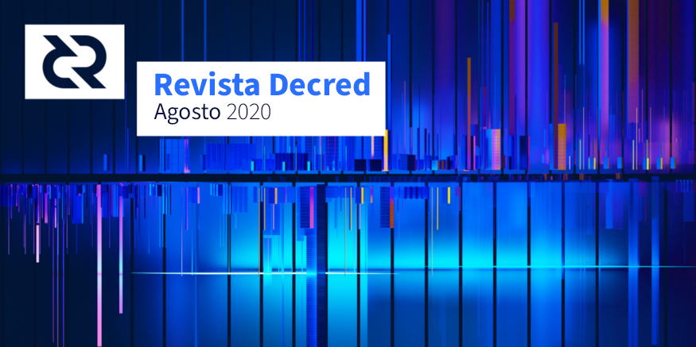

# Revista Decred — Agosto 2020

 

Imagen : Bidireccional por @saender

Aspectos destacados de agosto:

- Se lanzó un parche en v1.5.2 para corregir un posible vector de denegación de servicio.
- El equipo dcrdex tiene hasta 6 miembros activos, y deben estar quemando los teclados con más de 50 RP fusionados en el mes, eliminando errores y casos extremos a medida que se revelan mediante pruebas.
- La revisión del épico PR que descentraliza al fondo de tesorería ha concluido y se están aplicando los toques finales.
- vspd ha recibido algunos toques finales y ahora se ha trabajado en las integraciones de Decrediton y dcrwallet.
- Los elementos clave para el cambio de Politeia a tlog ahora están en su lugar, una vez que se complete una refactorización para acomodarlos, comenzarán las pruebas.

## Desarrollo

## Comunidad

Damos bienvenida a los nuevos colaboradores con una fusión de código completada dentro de las ramas principales de desarrollo: @hsyia ([dcrdocs](https://github.com/decred/dcrdocs/pull/1122)), @brandoncurtis ([decred-release](https://github.com/decred/decred-release/pull/173)), @isuldor ([dcrwebapi](https://github.com/decred/dcrwebapi/pull/107)), @JustinBeBoy ([dcrios](https://github.com/planetdecred/dcrios/commits?author=JustinBeBoy)).

### Estadísticas de la comunidad a partir del 1 de septiembre:

-	Seguidores en Twitter: 40 816 (+179)
-	Suscriptores en Reddit: 9 906 (+31), en línea: 320
-	Usuarios en la sala #general de Matrix: 174 (+50) *
-	Usuarios en Discord: 1 394 (+22)
-	Usuarios en Telegram: 2 468 (-52)
-	Suscriptores en YouTube: 4 180 (+30), vistas: 154 000 (+3K)
-	Seguidores en Facebook: 3 655 (+0), me gustas: 3 305 (-6)
-	Seguidores en LinkedIn: 875 (+13)
-	Estrellas en el repositorio dcrd en GitHub: 557 (+7), forks: 246 (+6)

**Recuerde que en la sala de #Matrix [se realizó una gran purga en julio](https://github.com/DecredES/traducciones/blob/master/revista-decred/2020/202007.md#comunidad).**

**Estos son algunos [datos de otras cuentas de Decred](https://github.com/decredcommunity/social-media-stats):**

#### Facebook: 

-	[Decred Brasil](https://www.facebook.com/groups/decredbrasil/): 5799 miembros (-36) y 57 publicaciones en 30 días.
-	[Decredinternational](https://www.facebook.com/groups/decredinternational/): 802 miembros y 20 publicaciones en 30 días.

#### Instagram:

-	[decred_es](https://www.instagram.com/decred_es/): 390 seguidores (+15).
-	[Decredbr](https://www.instagram.com/decredbr/): 767 seguidores (+50).
-	[Decredproject](https://www.instagram.com/decredproject/): 578 seguidores (+2).

#### Twitter:

-	[DecredArabia](https://twitter.com/DecredArabia): 298 seguidores (+5).
-	[DecredAustralia](https://twitter.com/DecredAustralia): 436 seguidores.
-	[Decred_BR](https://twitter.com/Decred_BR): 540 seguidores (+13).
-	[Decred_CA](https://twitter.com/Decred_CA): 334 seguidores.
-	[Decred_ES](https://twitter.com/Decred_ES): 909 seguidores (+49).
-	[Decred_PL](https://twitter.com/Decred_PL): 226 seguidores (+3).

#### Youtube: 

-	[Decred Arabia](https://www.youtube.com/channel/UCCtB2BfsA2VdT0FJXpsYICA): 29 suscriptores y 600 vistas.
-	[Decred Brasil](https://www.youtube.com/channel/UC73wa2ddXuPWsmenVfeFTYg): 369 suscriptores (+108) y 13 mil vistas (+4 mil).
-	[Decred en Español](https://www.youtube.com/channel/UCCprOo4gR1vsjJTAzv8BMBQ): 74 suscriptores y 1,300 vistas (+400).

**La sala de matrix #planetdecred en planetdecred.org tiene 151 usuarios**

## Gobernanza
En agosto, [el fondo de tesorería](https://explorer.dcrdata.org/address/Dcur2mcGjmENx4DhNqDctW5wJCVyT3Qeqkx?chart=balance&zoom=ijhhasg0-kf4x1y80&bin=month) recibió 12,961 DCR y gastó 10,787 DCR. Con la tasa promedio diaria de DCR / USD en julio de $17.02, esto es $221K recibidos y $184K gastados. A la tasa promedio diaria de junio de $15.13, la cifra en USD facturada por el trabajo completado en ese mes es de $163K. A partir del 6 de septiembre, el saldo del fondo de la tesorería es de 634,747 DCR (8.5 millones de dólares a $13.37).

Propuestas nuevas y finalizadas:

- [Propuesta](https://proposals.decred.org/proposals/1dc1571) para la financiación en el área de diseño para cubrir 6 meses de trabajo en UI / UX ($35K), Identidad ($16K) y Visual Comms ($14K) - aprobada con 80% de votos a favor y 25% de participación.
- [Propuesta](https://proposals.decred.org/proposals/32cba00) para continuar pagando a los moderadores de Politeia, Matrix, Discord y Telegram (máximo $ 9K durante 6 meses) - aprobada con un 73% de votos a favor y una participación del 29%.
- [Propuesta](https://proposals.decred.org/proposals/2dcbc3e) de pagar $50 mil por campañas de integración y promoción en dos sitios de reserva de viajes - rechazada con un 15% de aprobación y una participación del 24%.
- [La propuesta](https://proposals.decred.org/proposals/1e55a41) de producción de video por parte de @Salirus se publicó a principios de septiembre.
- A principios de septiembre también se publicó la primera [propuesta de RFP](https://proposals.decred.org/proposals/91becea), tiene como objetivo cambiar los mensajes en decred.org y está invitando a proponer los cambios a realizar.

Se han abandonado cuatro propuestas: [carteles de realidad aumentada](https://proposals.decred.org/proposals/dedf452), [marketing por parte de @fst_nml](https://proposals.decred.org/proposals/3372cfc), [memes en las redes sociales](https://proposals.decred.org/proposals/4f81031) y una [serie de póquer Decred](https://proposals.decred.org/proposals/7a67ed5) (@darthcrypto planea regresar con una propuesta más desarrollada).

@pavel compartió una [captura de pantalla](https://twitter.com/_Checkmatey_/status/1295858198260248576) y una actualización sobre el desarrollo del sitio web [Decred OnChain](https://proposals.decred.org/proposals/0230918):

> Las subpáginas de los gráficos están casi listas. Desde la perspectiva de UX / UI, estamos trabajando en la página de inicio. Yo diría que hemos terminado en ± 75%. ([chat](https://matrix.to/#/!qYpAAClAYrHaUIGkLs:decred.org/$3FcfGt9YIOR81fM5CnqEFib4d7HYJPqGe_2oE3Q4JL4?via=decred.org&via=matrix.org&via=planetdecred.org))

Previo a la propuesta:
- @kozel lidera una idea de [propuesta](https://www.reddit.com/r/decred/comments/igfqjc/decred_content_and_asset_translation_proposal_an/) para la traducción de contenido.
- @lewildbeast está recopilando comentarios con el objectivo de elaborar una [propuesta](https://github.com/decredcommunity/proposals/pull/6) para ofrecer premios a los desarrolladores e investigadores que fueron pioneros en la nueva tecnología de la que se beneficia Decred (por ejemplo, carteras HD)

@bee está probando una “infraestructura para la redacción de propuestas” basada en GitHub que permite a varias personas editar el borrador, obtener comentarios y ayuda para formatear, realizar un seguimiento de las revisiones y publicar comentarios. Mantener los borradores en un lugar conocido los hace visibles y permite guardar cualquier progreso para que otros lo revisen, incluso si el autor original deja de desarrollar la propuesta. Actualmente se encuentran alojados los [premios](https://github.com/decredcommunity/proposals/pull/6) de @lewildbeast y la idea de [propuesta](https://github.com/decredcommunity/proposals/pull/7) para la integración en BTCPay por parte de @elian. Para usar esto, envíe un Pull Request al [repositorio](https://github.com/decredcommunity/proposals/pulls) de propuestas o envíe mensaje a @bee en la sala [Matrix](https://decred.org/matrix/) #proposals.

Consulte el [#34](https://medium.com/decred-es/politeia-digest-34-julio-20-agosto-8-2020-7b2ed06d5263) y el [#35](https://medium.com/decred-es/politeia-digest-35-agosto-9-22-2020-c18500fda9fd) del Politeia Digest para obtener una revisión más detallada.

## Red

Hashrate: el [hashrate de agosto](https://explorer.dcrdata.org/charts?chart=hashrate&zoom=kd8zvp86-kek04pzi&scale=linear&bin=block&axis=time) abrió a ~ 313 Ph/s y cerró a ~ 486 Ph/s, tuvo un mínimo en 248 Ph/s y alcanzó un máximo de 557 Ph/s durante todo el mes.

[Distribución del hashrate](https://dcrstats.com/pow) en los pools a partir del 1 de agosto (aproximado):

-	UUPool 39% 
-	Poolin 30%
-	lab.antpool.com 9%
-	BTC.com 2.3%
-	Luxor 0.8%
-	F2Pool 0.6%
-	BeePool 0.09%
-	CoinMine 0.03%
-	Suprnova 0.02%
-	Otros ~ 19%.

Staking: [el precio promedio del ticket a 30 días](https://dcrstats.com/) fue de 151.4 DCR (+7.1). [El precio varió entre 141.2–168.1 DCR](https://explorer.dcrdata.org/charts?chart=ticket-price&zoom=kd8zvp86-kek04pzi&axis=time&visibility=true-false&mode=stepped). El [monto bloqueado por participación](https://explorer.dcrdata.org/charts?chart=ticket-pool-value&zoom=kd8zvp86-kek04pzi&bin=block&axis=time) fue de 5.82–6.09 millones de DCR, que correspondió al [49.11%–51.03%](https://explorer.dcrdata.org/charts?chart=stake-participation&zoom=kd8zvp86-kek04pzi&bin=block&axis=time) del suministro total en circulación.

El precio por ticket alcanzó los 168.12 DCR, que es un nuevo máximo desde el cambio del algoritmo de precios en 2017.

Nodos: en [agosto](https://charts.dcr.farm/d/000000014/nodes?orgId=1&from=1596240000000&to=1598918400000) hubo un promedio de 141 nodos públicos y 139 nodos por parte de dcr.farm. (el total era ~ 250 antes de una fuerte caída el 10 de agosto, es posible que se hayan perdido algunos datos).

Distribución promedio por versión en agosto:

-	41% dcrd v1.5.1
-	11% dcrd v1.5.0
-	7% dcrd v1.5.2
-	6% dcrd v1.6 dev builds
-	5% dcrd v1.5 dev and RC builds
-	0.9% dcrd v1.4
-	10% dcrwallet v1.5.1
-	1.1% dcrwallet v1.5
-	1% dcrwallet v1.4
-	16% otras versiones

La [actualización de Our Network](https://ournetwork.substack.com/p/our-network-issue-34) por parte de @Checkmate comparte algunas observaciones sobre un promedio de 100K DCR mezclados diariamente, lo que genera una parte significativa del volumen en cadena, aumento de hashrate luego de cierta recuperación del mercado por encima del "termocap" y cambios en tres métricas específicas de Decred.

[El nuevo artículo de investigación](https://medium.com/@_Checkmatey_/decred-mining-market-mechanics-fd26b921dc46) de @Checkmate ofrece una descripción completa del funcionamiento del mercado de minería en Decred. Para aquellos que prefieren el formato de video / audio, una descripción general resumida del documento y los gráficos está disponible en [YouTube](https://www.youtube.com/watch?v=TJn6qTko0Xw). Aun así, se recomienda una lectura completa.

> Comprender los incentivos, la mecánica y las métricas de rendimiento del mayor vendedor natural de la cadena Decred arroja luz sobre los precios del mercado y la solidez de la seguridad de la red. Esta investigación debe proporcionar una base sólida para interpretar el contexto y el desempeño del mercado de la minería en Decred.

## Integraciones

- Transak [tuiteó](https://twitter.com/transak_finance/status/1294322399031316480) que ahora DCR se puede comprar a través de su servicio en 32 países.
- BitcoinToYou ahora [permite comprar y vender DCR](https://twitter.com/bitcointoyou/status/1291473453812535301) por la moneda fiduciaria brasileña BRL. @michae2xl [presentó a Decred en una transmisión en vivo](https://www.youtube.com/watch?v=dk_2WYZ4EDU) en su canal.

Advertencia: los autores de la Revista Decred no tienen idea de la confiabilidad de alguno de los servicios anteriores. Haga su propia investigación antes de confiar su información personal o activos.

## Alcance

El trabajo para descentralizar al fondo de la tesorería está haciendo su merecido ruido en [Twitter](https://twitter.com/marco_peereboom/status/1293364590399512577). Gracias a todos los desarrolladores por publicar algunas actualizaciones de desarrollo y a todos los que [ayudan](https://twitter.com/_Checkmatey_/status/1293370599977361409) a [amplificar](https://twitter.com/jz_bz/status/1295447838843908098).

El equipo de Decred en Latinoamérica ha publicado el [segundo](https://www.reddit.com/r/decred/comments/i7ue8h/activities_report_decred_en_espa%C3%B1ol_proposal_2/) y [tercer](https://www.reddit.com/r/decred/comments/ip0uke/activities_report_3_decred_en_espa%C3%B1ol_proposal_2/) reporte de actividades durante la [propuesta de marketing](https://proposals.decred.org/proposals/3c02b67). Los tres reportes han sido archivados en la [base de propuestas](https://github.com/decredcommunity/proposals/tree/master/proposals/3c02b67/updates) en GitHub.

@michae2xl [ha reportado](https://www.reddit.com/r/decred/comments/ijhxzn/august_report_for_brazil_proposal/) sobre sus actividades de agosto para la [propuesta](https://proposals.decred.org/proposals/bc20f98) de marketing de Brasil ([archivado](https://github.com/decredcommunity/proposals/blob/master/proposals/bc20f98/updates/20200830.md)).

Los logros de Monde PR para agosto:

- Actualizó el calendario de relaciones públicas con propuestas e ideas para artículos y noticias durante los siguientes seis meses.
- Creó y presentó 2 ideas para realizar artículos en varios medios.
- Aseguró 2 secciones de Q&A por correo electrónico con publicaciones de criptográficas y de ámbito general.
- Envió comentarios de portavoces de Decred a una noticia.

Cobertura de noticias por parte de Monde PR:

- Un artículo en [AMB Crypto](https://eng.ambcrypto.com/bitcoin-on-chain-solutions-are-punching-above-its-weight-again/) con comentarios de @jy-p sobre la escalabilidad de Bitcoin, distribuido a 4 medios de comunicación, incluidos [Fintech Zoom](https://fintechzoom.com/fintech_news_bitcoin-news/bitcoin-on-chain-solutions-are-punching-above-its-weight-again/) y [Sunrise Reads](https://sunriseread.com/bitcoin-on-chain-solutions-are-punching-above-its-weight-again/109311/).
- Un artículo en [Finance Magnates](https://www.financemagnates.com/cryptocurrency/news/are-crypto-platforms-taking-personal-data-protection-seriously-enough/) con comentarios de @jy-p sobre la protección de datos personales.
- Un artículo en [Cointelegraph](https://cointelegraph.com/news/ledger-cto-discusses-wallet-s-safety-after-multiple-security-setbacks) con comentarios de @jy-p sobre la adversidad de seguridad en Ledger, distribuido a 7 medios de comunicación, incluidos [The Union Journal](https://theunionjournal.com/ledger-cto-discusses-wallets-safety-after-multiple-security-setbacks/) y [Armenian Reporter](https://www.reporter.am/ledger-cto-discusses-wallets-safety-after-multiple-security-setbacks/).

## Eventos

Atendidos:

- 5 de agosto - [Gobernanza y blockchain en América Latina](https://twitter.com/BlockSummitLA/status/1291029494065778689) - Internet. @elian junto con Cristobal Pereira y Ernesto Contreras de Dash discutieron sobre la gobernanza blockchain de Decred en comparación con Dash, la mecánica del fondo de tesorería de Decred, Politeia y el proceso de las propuestas. El evento fue anunciado en [Cointelegraph español](https://es.cointelegraph.com/news/online-seminar-on-governance-in-the-blockchain-and-its-contributions-to-latin-america). ([vídeo](https://www.youtube.com/watch?v=Sh3obx4Mx_0))
- 8 de agosto - [Hablemos Decred 8](https://twitter.com/Decred_ES/status/1288633074050306052) - Internet. @elian y el invitado José Manuel Da Silva de criptolugares.io hablaron sobre las criptomonedas y el comercio, particularmente en Venezuela, y las perspectivas de adopción. ([vídeo](https://www.youtube.com/watch?v=z-6a_tgE89E))
- 11 de agosto - [Decred Talk 1](https://twitter.com/Decred_BR/status/1292842513846460417) - Internet. En este primer episodio de la versión brasileña de Decred Talk, @michae2xl y André Horta (CEO BitcoinToYou) hablaron sobre Decred DAO y los ecosistemas autónomos. El evento se transmitió en el canal de BitcoinToYou. ([vídeo](https://www.youtube.com/watch?v=dk_2WYZ4EDU))
- 17 de agosto - Decred Talk 2 - Internet. La segunda edición de Decred Talk se realizó en Instagram. El objetivo era interactuar con miembros de la comunidad nuevos o desconocidos y responder a sus preguntas. ([vídeo](https://www.instagram.com/tv/CEAenAhF7m0/))
- 20 de agosto – [Hablemos Decred 9](https://twitter.com/Decred_ES/status/1294416104723488769) - Internet. @adcade y el invitado Mauricio Ocampo de technolawgeek.com discutieron las perspectivas legales de las criptomonedas. ([vídeo](https://www.youtube.com/watch?v=VzELuWRqCo4))
- 28 de agosto - [Situación legal de Bitcoin](https://twitter.com/paxful_LATAM/status/1297912240511881216) - Internet. Organizado por [Paxful Latam](https://twitter.com/paxful_LATAM).
- 28 de agosto - [Hablemos Decred 10](https://twitter.com/Decred_ES/status/1298432664245084161) - Internet. @adcade, @elian y el invitado [Carlos Ramirez](https://twitter.com/Ciberagente) hablaron sobre ciberseguridad, privacidad y ciberdelito. ([vídeo](https://www.youtube.com/watch?v=GosMlhxWK3M))
- 29 de agosto - [De las leyes a los protocolos](https://twitter.com/Decred_ES/status/1299506004607094784) - Internet. Organizado por [Students for Liberty Mexico](https://twitter.com/SFLMexico). (vídeo)
- 31 de agosto - [El futuro de las estructuras organizativas: centralizado vs descentralizado](https://twitter.com/Decred_ES/status/1298275771333705728) - Internet. @elian se unió a un panel con John DeVadoss (Neo) y Ernesto Contreras (Dash) para discutir la gobernanza en organizaciones descentralizadas. ([video](https://www.youtube.com/watch?v=yIlVTSObIzU)) Organizado por [Fintech Advisory Services](https://www.fintech-advisory.com/). ([vídeo](https://www.youtube.com/watch?v=yIlVTSObIzU))

@eSizeDave está facilitando un seminario web para ayudar a los académicos de la universidad australiana RMIT a aprender sobre Decred como parte de su investigación.

## Media

### Artículos seleccionados

- @elian fue entrevistado en el podcast de Territorio Bitcoin en [febrero](https://www.ivoox.com/episodio-105-entrevista-jesus-sanchez-bermejo-audios-mp3_rf_47751087_1.html) y [junio](https://www.ivoox.com/que-es-decred-entrevista-profundidad-elian-audios-mp3_rf_52242080_1.html) con 7 000 y 5 000 visitas respectivamente.
- @elian fue mencionado en el [artículo de Cointelegraph](https://es.cointelegraph.com/news/cryptology-and-marketing-the-challenges-of-organic-growth) sobre Criptomonedas y marketing: los retos del crecimiento orgánico

Inglés:

- Decred, mecanismo en la minería por @checkmate ([medium](https://medium.com/decred/decred-mining-market-mechanics-fd26b921dc46))
- La utilidad de los criptoactivos por @mm ([stakey.club](https://stakey.club/en/utility-of-cryptoassets/))
- La gobernanza blockchain – parte uno por @mm ([stakey.club](https://stakey.club/en/blockchain-gov-part1/))
- Our Network #34 actualizaciones en Decred por @checkmate ([substack.com](https://ournetwork.substack.com/p/our-network-issue-34))

Otros idiomas:

- El canal de [Decred Arabia](https://www.youtube.com/channel/UCCtB2BfsA2VdT0FJXpsYICA) está ahora activo.  (¡Por favor si tiene alguna historia, [envíela](https://github.com/xaur/decred-news/blob/docs/contributing.md))

Traducciones:
- @mm ha añadido un recopilatorio de viejos y nuevos artículos en [portugués](https://stakey.club/pt/articles/).
- Decred, mecanismo en la minería, [en español](https://territorioblockchain.com/decred-mecanica-del-mercado-minero/) por territorioblockchain.com
- Politeia Digest 33 y 35, en [árabe](https://insaf01.github.io/politeia-digest-ar/) (@arij, @abdulrahman4) y en [español](https://medium.com/decred-es/politeia-digest-spanish/home) (@pablito)
- El Decred Journal en su edición julio 2020 [fue traducido](https://xaur.github.io/decred-news/) al árabe (@arij, @abdulrahman4), chino (@dominic), portugués (@mm) y al español (@francov_). Y las versiones de mayo y junio en polaco están disponible gracias a @kozel. ¡Gracias a todos!  

### Videos

Inglés:

- Decred actualización quincenal – 18 de agosto del 2020 por exitus. ([youtube](https://www.youtube.com/watch?v=hjOi4sfvdNU))
- Top 6 señales de compra para Decred por Liteliger ([youtube](https://www.youtube.com/watch?v=186jzRRJ-80))
- Mecanicas en los mercados de minería, sobre la investigación por parte de @checkmate. ([youtube](https://www.youtube.com/watch?v=TJn6qTko0Xw))
- Tu sabías sobre la gobernanza de Decred por Decred Society - un resumen sobre el proceso dentro de Politeia. ([youtube](https://www.youtube.com/watch?v=1BNW60RE0rQ))

### Audio

Inglés:

- Staked Podcast, episodio 0.0. “Me tomo más de un año en tener la valentía y hacer este podcast”. ¡Gracias a Eduardo por lanzar el podcast! ([anchor.fm](https://anchor.fm/staked-podcast/episodes/Staked-Podcast-Episode-0-0-eimmd6/a-a31v0tg), [tweet](https://twitter.com/stakedpodcast/status/1299305564258938880)).
- Rough Consensus 10. En este episodio, el spidermen estuvo junto @notsofast — un OG de criptomonedas, Bitcoin vs altcoins, por qué Decred, minería, enfoque de inversión / comercio y mucho más. ([libsyn](https://roughconsensus.libsyn.com/episode-10-bitcoin-decred-altcoins-with-notsofast))

Aunque la [propuesta](https://proposals.decred.org/proposals/4f81031) para realizar memes fue abandonada, ¡la comunidad empezó a realizarlos de forma independiente!

- [Contribuyendo en la DAO](https://twitter.com/coveryfire7777/status/1292966872560918529)
- [El ataque en Decred](https://twitter.com/coveryfire7777/status/1293719678985146369)
- [Un Doge fuerte](https://twitter.com/coveryfire7777/status/1293984002349699072)
- [Costo de ataque](https://twitter.com/svitekpavel/status/1289793785669484544)
- [Decred con algunas características mientras Bitcoin y Ethereum luchan](https://twitter.com/lukebp_/status/1292622538560872448)

## Discusiones de la comunidad

Post seleccionados en Reddit:

- Un nuevo usuario [se pregunta](https://www.reddit.com/r/decred/comments/i5jcjp/dcrdex_seems_like_the_greatest_thing_ever_why_is/) por qué la comunidad crypto no le presta atención al DCRDEX.
- [La pregunta](https://www.reddit.com/r/decred/comments/i9ufxy/decred_team_and_treasury_fund_management/) sobre la gestión de los fondos del fondo de la tesorería tuvo varias respuestas detalladas.
- El viernes 31 de julio Forward Thinking se centró en la [mensajería contraria](https://www.reddit.com/r/decred/comments/i1gumi/forward_thinking_friday_contrarian_messaging_31/), donde @Checkmate sugirió dos áreas potenciales para que el marketing de Decred se uniera, "Decred está listo" y "Poseer el nombre, créditos descentralizados, frente a" De’Fi".
- El viernes del 7 de agosto [Forward](https://www.reddit.com/r/decred/comments/i5cy0y/forward_thinking_friday_7_aug_2020/) Thinking Friday se centró principalmente en ideas de marketing, y es donde se debatió por primera vez la idea de recompensar a los desarrolladores de Bitcoin que produjeron un trabajo útil para Decred.
- 14 de agosto El comentario principal de Forward [Thinking](https://www.reddit.com/r/decred/comments/i9w54z/forward_thinking_friday_14_aug_2020/) del viernes fue sobre la creación de DAE privados en Decred.
- 28 de agosto Forward Thinking. El comentario principal del [viernes](https://www.reddit.com/r/decred/comments/iip7ap/forward_thinking_friday_28_aug_2020/) fue sobre la creación de un índice crypto utilizando DCRDEX.

Discusiones seleccionadas de Twitter:

- Reluctant Raccoon simplemente no puede encontrar esa [satisfacción](https://twitter.com/ypical_/status/1292439057168060416) de un "token de gobernanza en DeFi" fuera de Decred.
- @DecredSociety [señaló](https://twitter.com/ypical_/status/1292439057168060416) que la calificación en la "madurez del mercado" FCAS ha bajado, pero en general el proyecto sigue siendo de grado A.
- @degeri [recuerda](https://twitter.com/degeri_crypto/status/1293729682584674304) que Decred siempre está contratando.
- @CATO_io [exploró](https://twitter.com/CATO_io/status/1299756617722925056) cómo la ética y el riesgo compartido de Decred conducen a un sistema más sólido. Buen ejemplo de divulgación creativa en el que se expone nuevos aspectos del proyecto.

## Mercados

En agosto, DCR cotizaba entre 15.25–23.49 USD / 0.00134–0.00202 BTC La tarifa diaria promedio fue de 17.02 USD.

Después de alcanzar un nuevo máximo de ~ $12 100 el 2 de agosto, BTC / USD se estrelló a $10 550 en minutos y provocó una liquidación espectacular de más de mil millones. ZeroHedge [escribió](https://www.zerohedge.com/markets/bitcoin-hits-1-year-high-then-plummets-after-someone-liquidates-1-billion-seconds-hammer) que la manipulación de precios es probable, ya que no es lo mejor para el vendedor "sacar toda la pila de ofertas en una sola transacción".

En una conversación de Twitter, @Checkmate compartió su [modelo](https://twitter.com/_Checkmatey_/status/1293652411316281344) en el que el mercado bajista de DCR se vio enormemente afectado por las ventas obligatorias de los mineros de ASIC que invirtieron en hardware en el pico del mercado alcista.

## Noticias relevantes externas

Bitcoin Cash se está preparando para otro hard fork. Los desarrolladores del cliente BitcoinABC [anunciaron](https://www.bitcoinabc.org/2020-08-24-celebrating-bchd-slp/) que la próxima bifurcación bianual del 15 de noviembre agregará el requisito de que una parte de cada recompensa de bloque vaya a una dirección controlada por los desarrolladores. Roger Ver y otros han [tuiteado](https://twitter.com/rogerkver/status/1300908197113458688) que esto no es aceptable y no se unirán a la bifurcación.

Ethereum Classic ha sufrido [otros](https://cryptobriefing.com/after-second-double-spend-attack-ethereum-classics-future-is-question/) [dos](https://www.coindesk.com/ethereum-classic-attacker-successfully-double-spends-1-68m-in-second-attack-report) ataques de doble gasto, y el atacante ganó $5.6 millones del primer ataque, que se ejecutó con $204 000 en hashpower alquilado. Los ataques reorganizaron tantos bloques que algunas implementaciones los ignoraron y la red se [particionó](https://blog.coinbase.com/coinbases-perspective-on-the-recent-ethereum-classic-etc-double-spend-incidents-1fd19ef215f3).

Charles Hoskinson de IOHK y Cardano [ha propuesto](https://cointelegraph.com/news/charles-hoskinson-s-iohk-submitted-a-decentralized-treasury-proposal-to-the-ethereum-classic-community) dos ECIP para ETC, uno para agregar puntos de control que detendría las largas reorganizaciones, y un segundo para agregar un fondo de desarrollo que recibe el 20% de las recompensas en bloque. La propuesta de recompensa en bloque parece muy controvertida en la comunidad, y los laboratorios de ETC rechazan la idea.

El token y el protocolo YAM nació y murió en agosto, su ciclo duró aproximadamente 3 días, lo que es rápido incluso para DeFi. El token fue facturado como un "token de gobernanza" para el protocolo YAM, pero tan pronto como el sistema comenzó, quedó claro que estaba fundamentalmente roto. Hubo una breve ventana en la que los agricultores de YAM se movilizaron para actuar y salvar a el protocolo, pero también hubo un error en la solución, por lo que ahora está muerto. YAM fue cubierto en descargos de responsabilidad sobre ser experimental, no auditado, y se produjo en un período de 10 días rompiendo otros contratos inteligentes juntos: una hora después del lanzamiento, se invirtieron $76 millones, aumentando a $300 millones el día siguiente antes de que se anunciara la falla fatal.

MakerDAO activó un contrato ejecutivo de "hechizo (spell)" que se suponía que elevaría el techo para WBTC, pero [en cambio](https://twitter.com/nanexcool/status/1292287024767082496) lo puso en cero. Parece que no se hizo ningún daño en esta ocasión más que retrasar la disponibilidad de más WBTC.

La Fundación Zcash [está seleccionando](https://decrypt.co/39105/a-five-member-board-to-control-36-million-treasury-for-zcash) una junta de 5 miembros para controlar la parte de los fondos de recompensa en bloque. La junta se seleccionará mediante votos del Panel Asesor de la Comunidad, que actualmente tiene 62 miembros, pero cada miembro ahora puede invitar a un miembro adicional.

El CEO de Coinbase [confirmó](https://www.theblockcrypto.com/linked/76588/coinbase-ceo-interview-token-service) que la compañía está desarrollando una plataforma para unirse al negocio de la oferta de intercambio inicial (IEO), titulado provisionalmente cómo Coinbase Launch.

La adopción de criptomonedas está más extendida en Nigeria y Vietnam según la [Encuesta Global de Consumidores de Statista](https://www.zerohedge.com/crypto/youll-never-guess-which-country-has-most-widespread-adoption-crypto-world).

La empresa de tecnología financiera Plaid ([utilizada](https://enegnei.github.io/This-Month-In-Bitcoin-Privacy/July_2020/#july-1st---class-action-lawsuit-against-plaid-inc) por Coinbase, Gemini y otros) ha sido afectada con una [demanda colectiva](https://www.natlawreview.com/article/fintech-startup-plaid-inc-hit-5m-class-action-lawsuit) de más de $5 millones.

> Imagínese que hay una empresa que conoce cada dólar que deposita o retira, cada dólar que carga o paga a su tarjeta de crédito y cada dólar que ahorra para la jubilación, pocas horas después de realizar la transacción. Imagínese que esto incluye cada libro, entrada de cine o comida que compra, cada factura que paga a un médico u hospital, y cada pago que hace (o pierde) en su hipoteca, préstamo estudiantil o factura de tarjeta de crédito. Imagine que esta empresa mantiene un archivo sobre usted que contiene toda esta información que se remonta a cinco años. Imagine que esta empresa utiliza su nombre de usuario y contraseña para iniciar sesión en la cuenta en línea que mantiene con su banco y actualiza ese archivo varias veces al día para mantenerse al día con cada movimiento financiero que realice.
>
> Imagina que esta empresa no es tu banco. Imagine que, hasta donde usted sabe, nunca proporcionó su nombre de usuario y contraseña a esta empresa ni la autorizó para acceder a sus cuentas en línea. Imagina que nunca has oído hablar de esta empresa.

Imagine que alguien se apoderó de su base de datos y la usó para identificar a los poseedores de criptomonedas.

Los principales intercambios de criptomonedas están redactando un [documento técnico](https://www.coindesk.com/crypto-exchange-group-eyes-bulletin-board-system-for-fatf-compliance-coinbase-exec) sobre el intercambio de datos de los clientes para cumplir con los requisitos de " travel route" FATF.

La [demanda colectiva](https://cointelegraph.com/news/600m-crypto-ad-ban-class-action-filed-in-australian-courts) contra Google y Facebook se presentó en Australia. Los gigantes de la tecnología están acusados del comportamiento anticompetitivo por prohibir los anuncios de criptomonedas en 2018, lo que supuestamente mató el mercado de ICO, dañando la industria de cripto en general sin bloquear de manera eficiente las estafas.

Un grupo bipartidista de miembros del Congreso de EE. UU. Ha [escrito](https://www.coincenter.org/congress-to-irs-proof-of-stake-block-rewards-should-not-be-taxed-as-income/) al Servicio de Impuestos Internos para pedir una aclaración sobre cómo se tratan las recompensas de PoS a efectos fiscales, y solicitando que se traten no como ingresos, sino como un bien producido por el validador, que se gravará cuando sea vendido.

El Servicio Postal de los Estados Unidos [presentó](https://www.zerohedge.com/crypto/usps-just-filed-patent-blockchain-based-secure-voting-system) una patente para un sistema de votación seguro basado en blockchain.

## Sobre esta edición

Este es la edición #29 de la Revista Decred, un índice de todos los números originales y traducciones se encuentran disponibles [aquí](https://xaur.github.io/decred-news/).

La mayoría de la información de terceros se transmite directamente desde la fuente después de un control de fiabilidad mínimo. Los autores de la Revista Decred no tienen la capacidad de verificar todas las reclamaciones. Tenga cuidado con las estafas y haga su propia investigación.

Puede enviar una historia [aquí](https://github.com/xaur/decred-news/labels/next%20release) para ser considerada para el próximo número. Los [comentarios](https://github.com/xaur/decred-news/blob/docs/contributing.md#feedback) y las [contribuciones](https://github.com/xaur/decred-news/blob/docs/contributing.md) siempre son bienvenidos.

### Créditos:
Redacción y edición: bee, degeri, l1ndseymm, lukebp, richardred.
Revisión y comentarios: davecgh, jholdstock, jrick, jz, Exitus, michae2xl.
Imagen de portada: saender.
