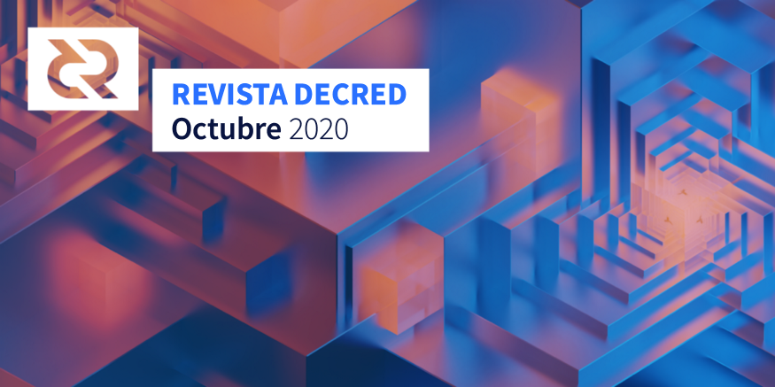

# Revista Decred – Octubre 2020

Imagen: Reestructuración I por @saender

## Lo más destacado de Decred en octubre:

- La v1.6.0 tuvo sus dos primeras versiones candidatas, luego de las correcciones de prueba de la comunidad y las mejoras se están incorporando a una tercera versión candidata que llegará pronto.

- El lanzamiento inicial del dcrdex MVP en mainnet acompañó al primer candidato de lanzamiento v1.6.0. Los usuarios de CLI ahora pueden agregar dcrdex a la instalación agregando un argumento adicional al comando de instalación.

- La atención de muchos miembros de la comunidad ahora se ha centrado en aprovechar al máximo la versión v1.6 adecuada cuando suceda; consulte la sección de Alcance para ver qué están planeando.

- Politeia celebró 2 años en producción, felicitaciones a las personas detrás de las 47 propuestas aprobadas y a los grupos de interés que votaron por ellas.

## Versión inicial de DCRDEX

Hace poco más de un año desde que se aprobaron la [RFP](https://proposals.decred.org/proposals/5431da8) y las propuestas de [desarrollo](https://proposals.decred.org/proposals/417607a) en Politeia, los usuarios de Decred ahora pueden comerciar entre DCR y BTC sin arriesgar sus fondos e información personal con intercambios de custodia.

La primera [versión](https://github.com/decred/dcrdex/releases/tag/release-v0.1.0) de MVP fue seguida por una versión rápida del parche [v0.1.1](https://github.com/decred/dcrdex/releases/tag/release-v0.1.1) que actualmente es la última.

Visite [dex.decred.org](https://dex.decred.org/) para comenzar, o siga la [guía](https://www.publish0x.com/block-commons/how-to-get-on-dcrdex-mvp-xolpzmv) de @richardred, o simplemente véala en acción en un [video](https://twitter.com/Decred_News/status/1320184172749721600). Los últimos libros de precios y pedidos se pueden ver en el panel de [Market](https://explorer.dcrdata.org/market?chart=depth&xc=aggregated&bin=1h&stack=1) de dcrdata, con más datos públicos.

> Quiero agradecer a TODOS nuestros evaluadores anteriores por sus comentarios y su paciencia mientras hacemos que esto se mueva. Hemos tenido en cuenta muchos de los comentarios y hemos resuelto una serie de problemas de UI / UX, y hemos corregido un par de errores que han aparecido. (@chappjc)

¡Felicitaciones a todos con el lanzamiento!

## Versión de los candidatos v1.6

Los candidatos de lanzamiento para dcrd, dcrwallet, Decrediton y dcrlnd están disponibles para probar [aquí](https://github.com/decred/decred-binaries/releases). Tenga en cuenta que, si bien las características clave están allí y funcionan en Decrediton, se presentarán una serie de mejoras de la interfaz de usuario y correcciones de errores en una tercera versión candidata.

Como siempre, [verifica los binarios](https://docs.decred.org/advanced/verifying-binaries/) antes de ejecutarlos.

La versión 1.6 será uno de los mayores lanzamientos jamás realizados por Decred. Si desea ayudar con la divulgación, consulte esa sección a de [alcance](https://github.com/DecredES/traducciones/blob/master/revista-decred/2020/202010.md#alcance).

## Desarrollo

A menos que se indique lo contrario, el trabajo que se informa aquí tiene el estado "fusionado con la rama master". Significa que el trabajo se completó, revisó e integró en el código fuente que los usuarios avanzados pueden construir y ejecutar, pero aún no está disponible en los binarios del lanzamiento en general.

[dcrd](https://github.com/decred/dcrd):

Se han hecho pruebas públicas en los candidatos 1 y 2 para v1.6. Puede leer las notas de la versión de RC2 y obtener el código fuente [aquí](https://github.com/decred/dcrd/releases/tag/release-v1.6.0-rc2). Los informes de errores son bienvenidos [aquí](https://github.com/decred/dcrd/issues).

Trabajo incluido en v1.6:

- El código de minería cambió para priorizar las transacciones con una [tarifa agregada](https://github.com/decred/dcrd/pull/1829) más alta en función de sus antepasados en el mempool (también conocido como Child Pays for Parent).
- Verificación de [agotamiento](https://github.com/decred/dcrd/pull/2398) de tickets para evitar un escenario teórico cuando el grupo de tickets es demasiado bajo y la cadena puede volverse irrecuperable si se agregan ciertos bloques.
- Generación optimizada de plantillas de bloques para [bloques rechazados](https://github.com/decred/dcrd/pull/2397).
- Múltiples ajustes y correcciones para el nuevo código del fondo de tesorería.
- Herramienta para generar certificados [reescritos](https://github.com/decred/dcrd/pull/2425) para admitir más casos de uso (como no incluir el nombre de host y la interfaz en el certificado o especificar cualquiera de los 4 algoritmos admitidos).
- [Arnés prueba](https://github.com/decred/dcrd/pull/2329) de generación en cadena mejorado.
- [Migración](https://github.com/decred/dcrd/pull/2446) de base de datos fija para admitir la actualización desde v1.4. 
- Para actualizar desde clientes incluso más antiguos donde la base de datos es demasiado antigua para migrar, la recarga de la cadena desde cero [se automatizó](https://github.com/decred/dcrd/pull/2449) para no requerir ninguna intervención manual del usuario.

Trabajo continuo más allá del punto de ramificación v1.6:

- Continuó la saga para cubrir [rpcserver](https://github.com/decred/dcrd/issues/2069) con pruebas.
- Paquete de `minería` reorganizado para facilitar las pruebas y la navegación.

[dcrwallet](https://github.com/decred/dcrwallet):

- Permitir que las cuentas de billetera se [cifren](https://github.com/decred/dcrwallet/pull/1823) y desbloqueen individualmente, cada una con su propia frase de contraseña.
- Comandos para consultar y establecer la [política de votación](https://github.com/decred/dcrwallet/pull/1897) para las transacciones de gasto de tesorería creadas por claves particulares.
- Comandos para establecer la política de votación para transacciones tspend [individuales](https://github.com/decred/dcrwallet/pull/1905).
- Requerir autenticación de [certificado TLS](https://github.com/decred/dcrwallet/pull/1867) para clientes gRPC y permitir para clientes.
- JSON-RPC. Esta es una forma más segura para que los programas se comuniquen con dcrwallet. Se actualizaron otros proyectos para respaldar este cambio (Decrediton, Politeia, dcrlnd y otros).
- Permitir que los clientes de gRPC [bloquee / desbloquee](https://github.com/decred/dcrwallet/pull/1883) la billetera una vez y luego llamen a los métodos sin una [frase de contraseña](https://github.com/decred/dcrwallet/pull/1880).
- Mejor manejo del [balance](https://github.com/decred/dcrwallet/pull/1879) [bajo](https://github.com/decred/dcrwallet/pull/1875) al comprar los tickets.
- Rastrear el [estado](https://github.com/decred/dcrwallet/pull/1866) de las tarifas de los tickets de vspd para manejar fallas en el procesamiento de tarifas de vspd.
- Múltiples correcciones para el replanteo de vspd.
- Arreglos para nuevos mensajes `getminingstate` y `getinitstate`.

[Decrediton](https://github.com/decred/decrediton):

- Soporte técnico de LN [Watchtowers](https://github.com/decred/decrediton/pull/2638).
- Múltiples mejoras de UI / UX para las [vistas de LN](https://github.com/decred/decrediton/pull/2641).
- [Comprador automático inicial de tickets](https://github.com/decred/decrediton/pull/2577) para el nuevo vspd.
- [Compra](https://github.com/decred/decrediton/pull/2729) manual de tickets con el nuevo vspd.
- Integración inicial de la compra de tickets combinada con [CSPP](https://github.com/decred/decrediton/pull/2773).
- [Listado](https://github.com/decred/decrediton/pull/2747) de entradas vspd.
- [Migrado](https://github.com/decred/decrediton/pull/2705) de [trezor.js](https://github.com/trezor/trezor.js) obsoleto a la API de [Trezor Connect](https://github.com/trezor/connect).
- Mostrar el [icono](https://github.com/decred/decrediton/pull/2666) del modo SPV en la barra lateral.
- Mostrar el [recuento de pares](https://github.com/decred/decrediton/pull/2685) en la barra lateral.
- Nueva pestaña para el [estado](https://github.com/decred/decrediton/pull/2813) del ticket.
- Recordar el [último](https://github.com/decred/decrediton/pull/2789) VSP usado.
- Resaltar las [palabras semilla](https://github.com/decred/decrediton/pull/2683) perdidas.
- Traducción [portuguesa](https://github.com/decred/decrediton/pull/2782) actualizada.
- Refactorización continua a componentes funcionales y módulos CSS.
- ~ 60 correcciones de errores.

En progreso:

- Soporte de [staking](https://github.com/decred/decrediton/issues/2681) en Trezor. Dado que los [cambios](https://github.com/trezor/trezor-firmware/pull/1249) necesarios en el firmware de Trezor pueden tardar mucho en fusionarse, los desarrolladores de Decred han [decidido](https://github.com/decred/decrediton/issues/2681#issuecomment-714265711) probar nuestro propio firmware personalizado.
- Pruebas de IU [automatizadas](https://github.com/decred/decrediton/pull/2659).

[Politeia](https://github.com/decred/politeia):

- [Imágenes](https://github.com/decred/politeiagui/pull/2158) de Markdown en línea.
Corrección de errores y ajustes de la interfaz de usuario para Politeia y CMS.

En progreso:

- [Pruebas de IU](https://github.com/decred/politeiagui/pull/2151) automatizadas.

- Actualización sobre la migración de backend de tlog:

> Tenemos una instancia de testnet y todavía estamos en el proceso de probar todo y corregir errores. Las rutas a prueba de inclusión y la cobertura de prueba también están en proceso. (@lukebp)

[vspd](https://github.com/decred/vspd):

- Optimizaciones y corrección de errores.

[dcrpool](https://github.com/decred/dcrpool):

- Soporte para la actualización del fondo de tesorería [DCP-6](https://github.com/decred/dcrpool/pull/252).
- Los pagos “[polvo](https://github.com/decred/dcrpool/pull/254)” a los participantes del grupo se perderán como tarifas del grupo. Una de las razones es que los pagos “polvo” fallarían en la transacción de pago de todos modos. Otro es que sirve como incentivo para contribuir con suficientes recursos al fondo común para obtener un pago normal cuando extrae un bloque y para desalentar la contribución de trabajo esporádico e intermitente.
- Se trabajó mucho para admitir [Postgres](https://github.com/decred/dcrpool/issues/257) como backend de base de datos.
- Mostrar los pagos pendientes y archivados de la [tarifa del grupo](https://github.com/decred/dcrpool/pull/249) en la página de administración.
- Código de [pago de recompensa](https://github.com/decred/dcrpool/pull/250) refactorizado.
- Muchas mejoras al código de prueba.

[dcrlnd](https://github.com/decred/dcrlnd):

- Actualizado al código [lnd v0.11.1](https://github.com/decred/dcrlnd/pull/103) mediante la transferencia de cientos de confirmaciones. Para sentir la escala del trabajo de transferencia, puedes consultar esta [lista](https://github.com/decred/dcrlnd/blob/master/docs/upstream-prs.csv) de cambios procesados.
Actualizar a la última versión de dcrd y dcrwallet.

dcrlnd está preparando v0.3.0 para ser lanzado junto con la gran versión v1.6 del software principal (dcrd, dcrwallet, Decrediton). Las notas de la versión están [aquí](https://github.com/decred/dcrlnd/blob/master/docs/release-notes/release-notes-0.3.0.md).

[dcrdex](https://github.com/decred/dcrdex):

La mayor parte del trabajo fusionado en octubre se incluyó en las versiones iniciales [v0.1.0](https://github.com/decred/dcrdex/releases/tag/release-v0.1.0) y [v0.1.1](https://github.com/decred/dcrdex/releases/tag/release-v0.1.1) de seguimiento.

- Implementar contratos opcionales de intercambio de [SegWit](https://github.com/decred/dcrdex/pull/741) BTC (ahorra ~ 30% en tarifas de tx).
- Se agregó un número objetivo configurable de confirmaciones para [transacciones de canje](https://github.com/decred/dcrdex/pull/739) (no tienen que ser extraídas tan rápido como swap tx, por lo que es posible ahorrar en tarifas).
- Generación de nuevas [direcciones](https://github.com/decred/dcrdex/pull/769) de depósito.
- Soporte del cliente [Tor](https://github.com/decred/dcrdex/pull/738).
- Apilar [múltiple](https://github.com/decred/dcrdex/pull/710) notificaciones y mantenerlas visibles durante ~ 4 segundos + un montón de otras mejoras en la interfaz de usuario de [notificaciones](https://github.com/decred/dcrdex/pull/744).
- Funcionalidad de [suspensión / reanudación](https://github.com/decred/dcrdex/pull/705) del mercado.
- Resolver el [estado de la coincidencia](https://github.com/decred/dcrdex/pull/704) al inicio.
- Cambios en el [sistema](https://github.com/decred/dcrdex/pull/700) de seguimiento y penalización de infracciones (curiosidad: ¿sabía que dcrdex tiene un modo `--anarchy`?).
- [Límites](https://github.com/decred/dcrdex/pull/750) implementados para la cantidad de pedidos que un usuario puede realizar.
- Verificar que las monedas que financian los pedidos sin completar [que no se hayan gastado](https://github.com/decred/dcrdex/pull/732).
- Permitir a los clientes desconectados un [tiempo de espera](https://github.com/decred/dcrdex/pull/725) para volver a conectarse antes de que sus pedidos se cancelen (revoquen).
- [Límites](https://github.com/decred/dcrdex/pull/754) de transferencia de datos para los clientes hasta que inician sesión.
- [Instrucciones](https://github.com/decred/dcrdex/pull/764) de mainnet en el archivo README.
- Numerosas correcciones de errores.

Se [fusionaron](https://github.com/decred/dcrdex/pulls?q=is%3Apr+merged%3A2020-10-01..2020-10-31+sort%3Aupdated-asc) un total de 48 PR de 7 contribuyentes, agregando 11 000 y eliminando 5 000 líneas de código.

En progreso:

- Soporte de billetera [DCR SPV](https://github.com/decred/dcrdex/pull/788).
- Punto final de la [API de datos](https://github.com/decred/dcrdex/pull/796) de mercado para consumo público.

[dcrandroid](https://github.com/planetdecred/dcrandroid):

- Error corregido donde el [saldo](https://github.com/planetdecred/dcrandroid/pull/516) no se actualizaba.

En progreso:

- Soporte de privacidad de [CSPP](https://github.com/planetdecred/dcrandroid/pull/520).

[dcrrios](https://github.com/planetdecred/dcrios):

- Error corregido de la pérdida de [precisión](https://github.com/planetdecred/dcrios/pull/723) al cambiar de moneda.

[godcr](https://github.com/planetdecred/godcr):

- Actualizar a la última versión de dcrlibwallet y refactorizar.

En progreso:

- nueva [implementación de UI](https://github.com/planetdecred/godcr/pull/260).

[dcrdata](https://github.com/decred/dcrdata):

- Se [agregaron](https://github.com/decred/dcrdata/pull/1787) los datos de dex.decred.org al panel de [Mercados](https://explorer.dcrdata.org/market?chart=depth&xc=aggregated&bin=1h&stack=1) (libros de pedidos y precio inicialmente, el volumen será el siguiente).

[dcrros](https://github.com/decred/dcrros):

- Soporte para nuevas transacciones de la [tesorería](https://github.com/decred/dcrros/pull/7) si pasa DCP-6.
- Cambio en el formato de los ID de tx [invertidos](https://github.com/decred/dcrros/pull/8) para expresar correctamente el rechazo del bloque de Decred en los términos de Rosetta.

[docs](https://github.com/decred/dcrdocs):

- Actualizar al tema [Material](https://github.com/decred/dcrdocs/pull/1131) de MkDocs más nuevo para mejorar la UX de búsqueda.
- Página de [PoW Mining](https://docs.decred.org/mining/overview/) [actualizada](https://github.com/decred/dcrdocs/pull/1134) con instrucciones y listas de ASIC y grupos relevantes.

[dcrdevdocs](https://github.com/decred/dcrdevdocs):

- Página [agregada](https://github.com/decred/dcrdevdocs/pull/89) sobre [compilaciones reproducibles](https://devdocs.decred.org/developer-guides/reproducible-builds/).

Otros:

- @degeri publicó una nueva [actualización](https://bounty.decred.org/2020/10/status-update/) sobre el programa Bug Bounty.
- dcrdevdocs ahora están en [IPFS y ZeroNet](https://www.reddit.com/r/decred/comments/j7cgzv/devdocs_on_ipfs_zeronet/), por si acaso.

## Comunidad

Damos bienvenida a los nuevos colaboradores con una fusión de código completada dentro de las ramas principales de desarrollo: @nitronick600 ([dcrdocs](https://github.com/decred/dcrdocs/pull/1134)), @GuzmanPintos ([dcrdocs](https://github.com/decred/dcrdocs/pull/1134)).

Estadísticas de la comunidad a partir del 1 de noviembre:

- Seguidores en Twitter: 40 818 (+28)
- Suscriptores en Reddit: 9 937 (+8)
- Usuarios en la sala #general de Matrix: 222 (+25)
- Usuarios en Discord: 1 432 (+36)1
- Usuarios en Telegram: 2 394 (-40)
- Suscriptores en YouTube: 4 210 (+0), vistas: 159 000 (+3 000)
- Seguidores en Facebook: 3 655 (+0), me gustas: 3 305 (-6)
- Seguidores en LinkedIn: 924 (+33)
- Estrellas en el repositorio dcrd en GitHub: 566 (+3), forks: 246 (-2)

## Gobernanza
En octubre, el [fondo de tesorería](https://explorer.dcrdata.org/address/Dcur2mcGjmENx4DhNqDctW5wJCVyT3Qeqkx) recibió 12 388 DCR  y gastó 14 748 DCR. Con la tasa promedio diaria de DCR / USD en agosto de $12.01, esto es 149 000 USD recibidos y 177 000 USD gastados. A la tasa promedio diaria de septiembre de $13.26, la cifra en USD facturada por el trabajo completado en ese mes es de 196 000 USD. A partir del 4 de noviembre, el saldo del fondo de la tesorería es de 638,044 DCR (7.9 millones de dólares a $12.38).

Se votaron las propuestas de los candidatos para la [propuesta de RFP](https://proposals.decred.org/proposals/91becea) para cambiar los mensajes en Decred.org (aprobada en septiembre), pero ninguna de ellas fue aprobada. Los resultados fueron los siguientes:

- [D.R.E.A.M](https://proposals.decred.org/proposals/4532397) - 48% de aprobación, participación del 29%.
- ["Money Evolved"](https://proposals.decred.org/proposals/02d9fc2) con cambios mínimos en el sitio: 25% de aprobación, participación del 25%.
- Decred - Construcción de una [infraestructura](https://proposals.decred.org/proposals/d6ff458) revolucionaria - Aprobación del 16%, participación del 18%.
- "Money Evolved" - más el recuadro "[Justo](https://proposals.decred.org/proposals/f0a00d5)" y una página agregada al sitio - 7% de aprobación, participación del 17%.

En octubre se envió una [propuesta](https://proposals.decred.org/proposals/c093b8a) de traducción de contenido y activos de @kozel y se aprobó a principios de noviembre con un 75% de aprobación y un 28% de participación. Esta propuesta cubrirá la traducción de las publicaciones y los activos de Decred a 6-8 idiomas, con un presupuesto máximo de $33 000 para cubrir 6 meses de trabajo. La propuesta está compuesta por personas que tienen un [historial](https://github.com/decredcommunity/translations/blob/master/index.md) de entregar traducciones de contenido Decred.

Los números [#37](https://blockcommons.red/politeia-digest/issue037/) y [#38](https://blockcommons.red/politeia-digest/issue038/) de Politeia Digest tienen más detalles sobre las propuestas del mes.

Una propuesta previa de Paris Smithson para el sitio WhyDecred.com se [anunció](https://twitter.com/ParisSmithson/status/1318278630208901126) en Twitter, se discutió en [Reddit](https://www.reddit.com/r/decred/comments/jkmhbv/whydecredcom_proposal_open_talk/) y finalmente en [Politeia](https://proposals.decred.org/proposals/8a09324) a principios de noviembre.

@richardred publicó un [informe](https://github.com/DecredES/traducciones/blob/master/dos-politeia-de-decred-en-numeros-y-graficos.md) de actividad de Politeia para su segundo año de funcionamiento. Algunos aspectos destacados:

- 46 propuestas publicadas, 21 aprobadas, 17 rechazadas, 6 abandonadas.
- 3 propuestas no lograron alcanzar el quórum (no sucedió en el año 1).
- La participación promedio (media) fue del 27,9%, un 3,3% menos que en el primer año.
- La aprobación promedio (media) de las propuestas aprobadas fue del 79%, frente al 86% en el primer año.
- Hubo más propuestas de marketing que en el primer año.
- El 48% de las propuestas provienen de contratistas (frente al 35% en del año pasado), y es más probable que sean aprobadas.
- 10 de las propuestas de este año solicitaban la renovación de la financiación, y estas tuvieron una tasa de éxito del 80%.
- Las propuestas con pago por hora tenían más probabilidades de aprobarse que las de costo fijo.

## Red
Hashrate: El [hashrate](https://explorer.dcrdata.org/charts?chart=hashrate&zoom=kfoi5rmw-kgziese8&scale=linear&bin=block&axis=time) de octubre abrió en 450 Ph / s y cerró en 225 Ph / s, tocando fondo en 185 Ph / s y alcanzando un máximo de 551 Ph / s durante todo el mes. 

[Distribución](https://miningpoolstats.stream/decred) del hashrate en los pools a partir del 1 de noviembre: 
- Poolin 37%, 
- UUPool 37%,
- Antpool 13%, 
- Huobipool 9%,
- F2Pool 1.2%, 
- BTC.com 1%, 
- easy2mine 0.9%, 
- Luxor 0.6%, 
- CoinMine 0.02%.

El 25 de octubre, la tasa del hash se redujo a 260 y continuó hasta los 185 Ph / s el 28 de octubre. La recuperación fue rápida empezando los primeros días de noviembre.

Staking: el precio medio de la [entrada a 30 días](https://dcrstats.com/) fue de 151,7 DCR (+3,1). [El precio](https://explorer.dcrdata.org/charts?chart=ticket-price&zoom=kfoi5rmw-kgziese8&bin=window&axis=time&visibility=true-false) varió entre 139,2 y 168,3 DCR. [El monto bloqueado](https://explorer.dcrdata.org/charts?chart=ticket-pool-value&zoom=kfoi5rmw-kgziese8&bin=block&axis=time) por [participación](https://explorer.dcrdata.org/charts?chart=stake-participation&zoom=kfoi5rmw-kgziese8&bin=block&axis=time) fue de 6,02 a 6,12 millones de DCR, lo que correspondió al 49,58 al 50,87% del suministro disponible en PoS.

El precio del boleto alcanzó los 168.28 DCR, siendo un nuevo máximo desde el cambio del algoritmo de precios en comparación al 2017.

Nodos: a lo largo de [octubre](https://charts.dcr.farm/d/000000014/nodes?orgId=1&from=1601510400000&to=1604188800000) hubo un promedio de 104 nodos públicos y 150 nodos totales por parte de dcr.farm. 

- Distribución promedio por versión en octubre: 
- 30% dcrd v1.5.2, 
- 23% dcrd v1.5.1, 
- 8% dcrd v1.6 dev builds, 
- 6% dcrd v1.5.0, 
- 3% dcrd v1.5 dev y RC builds, 
- 2.7% dcrd v1.7 dev builds, 
- 0.7% dcrd v1.4, 
- 12% dcrwallet v1.5.1, 
- 1.4% dcrwallet v1.5, 
- 0.8% dcrwallet v1.4, 
- 12% otros.

Contribución por parte de @PermabullNino a partir de los hallazgos recientes en On-chain (Mining Pulse, flujos de tickets, flujos de tesorería) en el [issue 41](https://ournetwork.substack.com/p/our-network-issue-41) de Our Network.

## Integraciones
[Stakey.net](https://stakey.net/) es el primer VSP del mainnet que ejecuta el nuevo software vspd. Ha [votado](https://stakey.net/vspd-stats/) 13 entradas y 40 están activos a partir del 11 de noviembre.
Nuestra primera compra de tickets privados usando un VSP verificado en cadena. Se compró sin una cuenta, utilizando fondos mezclados por CoinShuffle ++ a través del servicio de Tor Onion. ¡Ponte comodo y deja resto en sus manos! ([@stakeynet](https://twitter.com/stakeynet) on Twitter)

Advertencia: los autores de la Revista Decred no tienen idea de la confiabilidad de alguno de los servicios anteriores. Haga su propia investigación antes de confiar su información personal o activos.

## Alcance
@Checkmate convoca a los stakeholders de Decred a prepararse para el lanzamiento de Hidden Hydra, también conocido como Decred v1.6. Las discusiones se llevarán a cabo en Forward Thinking los viernes [16](https://www.reddit.com/r/decred/comments/jc6qjq/forward_thinking_friday_160_time_to_shine_16/) y [23](https://www.reddit.com/r/decred/comments/jgzs57/forward_thinking_friday_23_october_2020_the/) de octubre, junto con otra [convocatoria](https://www.reddit.com/r/decred/comments/ji9gm4/calling_all_stakeholders_prepare_to_release_the/) para la recolección de ideas sobre lo que se puede hacer para la difusión sobre Decred v1.6 y DCRDEX. Las ideas se están recopilando en una lista para que todo defensor de Decred sepa que hacer, puede checarlo [aquí](https://github.com/decredcommunity/outreach/pull/12) (la ayuda es bienvenida).

Decred Latam publicó el [cuarto informe](https://github.com/decredcommunity/proposals/blob/master/proposals/3c02b67/updates/20201012.md) de su segunda propuesta que enumera todos los eventos notables, presencia en los medios, desarrollo comercial y finanzas. Una estrategia notable que se está explorando es el alcance y la incorporación de desarrolladores en español:
- 4 episodios de Código Decred fueron lanzados desde julio: Introducción a [Git y GitHub](https://www.youtube.com/watch?v=RFX0P9MKLKg), Exploración de Decred con [Python](https://www.youtube.com/watch?v=FGhklclRNt0), [Verificación](https://www.youtube.com/watch?v=U3BwnmmF1Ro) de binarios Decred y [DCR Wallet](https://www.youtube.com/watch?v=S2SeVZqnO9A)
- El taller de introducción a blockchain y [dcrdata](https://www.youtube.com/watch?v=XSmdwWykmSo) se llevó a cabo en octubre.
- El nuevo canal de Telegram [@decredES_devs](https://t.me/decredES_devs) tiene más de 70 usuarios al momento de escribir esta Revista.

Un [desafío](https://www.talentland.talent-republic.tv/challenge/blockchain-learning-challenge-decred/) de aprendizaje y desarrollo de Blockchain de larga duración fue presentado por Decred Latam, el registro comenzo en el mes de octubre y se extenderá hasta el 9 de diciembre. En la Fase 1, los participantes asistirán a talleres para aprender sobre Bitcoin y blockchain, DAOs, gobernanza, API de dcrdata, etc. Tendrán que construir un proyecto original utilizando datos de blockchain públicos de Decred, publicarlo con licencia ISC y presentarlo en un video de 3 minutos. Todas las comunicaciones, tutorías y soporte se llevarán a cabo en el telegram de @decredES_devs. 3 ganadores recibirán $ 1,500, $ 700 y $ 300 en DCR. Más de 90 personas de más de 8 países de Latam se han registrado hasta ahora. (QUE CHINGON)!!!!!

@ michae2xl publicó un [informe](https://github.com/decredcommunity/proposals/blob/master/proposals/bc20f98/updates/20201102.md) de sus actividades de octubre para la propuesta de marketing de Brasil.

@pavel anunció una nueva [campaña](https://www.reddit.com/r/decred/comments/jhb5do/withdecred_on_twitter_new_earned_giveaway_campaign/) de sorteos en withDecred.org. Utiliza una combinación inteligente de códigos QR y Twitter para maximizar el compromiso y la difusión del mensaje al mismo tiempo.

El nuevo sitio web [WhyDecred.com](https://www.whydecred.com/) de Paris Smithson tiene una versión preliminar para [discusión](https://www.reddit.com/r/decred/comments/jkmhbv/whydecredcom_proposal_open_talk/) y comentarios. Este proyecto adopta el enfoque del panorama general explicando primero todos los problemas con el dinero que tenemos hoy y luego explicando cómo Decred los resuelve. Se utilizarán obras de arte de calidad para comunicarse. Ahora se está discutiendo una [propuesta](https://proposals.decred.org/proposals/8a09324) formal para financiar la finalización del sitio web.

Un nuevo proyecto [winatoms.com](https://winatoms.com/) de @ buck54321 está a prueba. Los usuarios pueden crear y resolver los [acertijos](https://winatoms.com/challenge/TckpZfv9RMCtTkPfFyfGjV7wjfeurpPoky7) de los demás, ganando DCR si la solución enviada es correcta. Actualmente solo funciona con testnet DCR y el estado del proyecto es "prototipo para discusión". Siga a [@winatoms](https://twitter.com/winatoms) en Twitter para obtener actualizaciones.

Los logros de Monde PR en octubre:
- creó / presentó 2 ideas de historias para blogs financieros y criptográficos, incluido el anuncio de DCRDEX.
- respondió a 4 solicitudes de comentarios.
- aseguró 4 entrevistas con los medios.

Cobertura de noticias por parte de Monde PR:
- El anuncio de DCRDEX fue cubierto por [Geek Insider](https://geekinsider.com/decred-announces-launch-of-dcrdex/), el boletín [The Ledger](https://fortune.com/2020/10/21/digital-banks-feature-product-or-business/) de Fortune, [Crowdfund Insider](https://www.crowdfundinsider.com/2020/10/168215-decred-a-security-and-scalability-focused-digital-currency-project-launches-dcrdex-a-non-custodial-exchange/), [Bankless Times](https://www.banklesstimes.com/2020/10/21/decred-launches-dcrdex/), [Crypto Comes](https://cryptocomes.com/news/decred-dcr-blockchain-veterans-break-into-defi-turf-dex-goes-live), [Day Crypto Trading](https://daycryptotrading.com/noticias/dcrdex-exchange-descentralizado-decred/), [Crypto Option](https://www.crypto-option.com/decred-announces-the-launch-of-its-first-decentralized-exchange-dcrdex/) y [Crypto Potato](https://cryptopotato.com/decred-announces-dcrdex-decentralized-exchange/), que se distribuyó en 3 medios de comunicación, incluidos [CoinMarketCap](https://coinmarketcap.com/headlines/news/decred-announces-dcrdex-decentralized-exchange/) y [Bitcoin Insider](https://www.bitcoininsider.org/article/96269/decred-announces-its-first-zero-fees-decentralized-exchange-dcrdex).
- el anuncio también se distribuyó a través de [PRweb](http://www.prweb.com/releases/decred_announces_launch_of_dcrdex_first_exchange_with_no_trading_fees_seeks_to_disrupt_billion_dollar_crypto_exchange_market/prweb17487844.htm), que fue recogido por 99 medios de comunicación, incluidos [MarketWatch](https://www.marketwatch.com/press-release/decred-announces-launch-of-dcrdex---first-exchange-with-no-trading-fees-seeks-to-disrupt-billion-dollar-crypto-exchange-market-2020-10-21) y [Benzinga](https://www.benzinga.com/pressreleases/20/10/n17998254/decred-announces-launch-of-dcrdex-first-exchange-with-no-trading-fees-seeks-to-disrupt-billion-dol). La lista de sindicatos lo puede ver [aquí](https://drive.google.com/file/d/161nx5O9V8gDWIZ_z6rXyvySpv32OOR9g/view).
- un artículo en [Cointelegraph](https://cointelegraph.com/news/defi-market-fall-showcases-how-rising-tvl-doesn-t-tell-the-full-story) con comentarios de @richardred sobre el mercado DeFi, distribuido a 21 medios de comunicación, incluidos [Cointelegraph China](https://cointelegraphcn.com/news/defi-market-fall-showcases-how-rising-tvl-doesn-t-tell-the-full-story) y [Cointelegraph España](https://es.cointelegraph.com/news/defi-market-fall-showcases-how-rising-tvl-doesn-t-tell-the-full-story)
- artículos en [Cointelegraph Italia](https://it.cointelegraph.com/news/paypal-to-offer-crypto-payments-starting-in-2021) y [TrendOnline](https://www.trend-online.com/prp/paypal-bitcoin/) con comentarios de @ jy-p sobre PayPal que ofrece pagos con criptomonedas.

## Eventos
Atendidos:

- 2 de octubre - [Hablemos Decred No.15](https://twitter.com/Decred_ES/status/1310685771884625920) - Internet. @elian habló con el invitado José Rodríguez de Bitso y Talent Land sobre el futuro de las finanzas descentralizadas, los tokens no fungibles y las inversiones del futuro utilizando tecnología blockchain. [(vídeo)](https://www.youtube.com/watch?v=wkT01O_mRZk)
- 2 de octubre - [Panel de gobernanza descentralizada](https://twitter.com/Decred_ES/status/1310961312105672705) - Internet. @elian representó el proyecto Decred en un panel con Crypto Resources Academy, Kleros y Maker DAO. La discusión fue sobre la relevancia y el futuro de la gobernanza descentralizada y las criptomonedas. [(vídeo)](https://twitter.com/Decred_ES/status/1312150389160988673)
- 8 de octubre - [Criptolugares Instagram en vivo](https://twitter.com/Decred_ES/status/1313869491160444929) - Internet. @elian conversó con Jose Manuel da Silva de Criptolugares para explicar el modelo de gobernanza de Decred, Politeia, y cómo comenzar a contribuir al proyecto. [(vídeo)](https://www.instagram.com/p/CGGZc5Gntil/)
- 9 de octubre - [Hablemos Decred No.16](https://twitter.com/Decred_ES/status/1313526622927171585) - Internet. @elian junto con los invitados Anibal Cripto (consultor de criptomonedas) y Ezio Rojas (jefe de noticias de Cointelegraph en Español) hablaron sobre las criptomonedas en Venezuela, los desafíos de la adopción y el futuro del dinero. [(vídeo)](https://www.youtube.com/watch?v=xxNFxZJuOwA)
- 16 de octubre - [Hablemos Decred No.17](https://es.cointelegraph.com/news/21-heads-crypto-art-show-they-will-analyze-the-intersection-between-art-and-cryptocurrencies) - Ciudad de México, México. El evento fue la presentación de “21 Heads Crypto Art Show” en la Embajada de Bitcoin. El panel trató sobre la intersección de las criptomonedas y el arte del papel potencial de los tokens no fungibles. [(vídeo)](https://www.youtube.com/watch?v=b89-CTM0bYk)
- 17 de octubre - [Introducción a Blockchain con la API de Decred (dcrdata)](https://www.eventbrite.com/e/open-source-workshop-introduccion-a-blockchain-api-de-decred-dcrdata-tickets-124107662359) - Internet. @pablito organizó un taller sobre cómo trabajar con datos de blockchain de Decred. [(vídeo)](https://www.youtube.com/watch?v=XSmdwWykmSo)
- 21 de octubre - [CCOSS 2020](https://www.eventbrite.com.mx/e/cumbre-de-contribuidores-de-open-source-software-ccoss-2020-tickets-91491063233) - Internet. CCOSS fue un evento de 5 días dedicado al código abierto. @adcade presentó a Decred en una charla “Modelo de contratista de código abierto en la industria de las criptomonedas”. [(vídeo)](https://www.youtube.com/watch?v=TuRAeBmnScQ)
- 23 de octubre - [Hablemos Decred No.18](https://es.cointelegraph.com/news/what-new-launches-are-planned-by-the-decred-ecosystem) - Internet. @adcade y @elian exploraron todos los detalles sobre el proyecto y lo que se lanzará en lo que cabe este año. [(vídeo)](https://www.youtube.com/watch?v=rjfYxi6CXyI)
- 29 de octubre - [Blockchain y Criptomonedas](https://www.eventbrite.es/e/entradas-blockchain-y-criptomonedas-america-latina-evento-online-124390452191) - Internet. @elian presentó las características de Decred que vienen en la v1.6. Organizado por Territorio Bitcoin. [(vídeo)](https://www.youtube.com/watch?v=dx8D18jlr9s)
- 29 de octubre - [Criptolugares Instagram en vivo](https://twitter.com/criptolugares/status/1321810282264645632) - Internet. En este segundo episodio en vivo con Criptolugares, @elian exploró las últimas actualizaciones de Decred. También hubo un sorteo de $ 100 en DCR entre 10 participantes. [(vídeo)](https://www.instagram.com/p/CG8ebPOnQg7/)
- 30 de octubre - [Hablemos Decred No.19](https://es.cointelegraph.com/news/new-edition-of-hablemos-decred-will-deal-with-cryptomontages-in-mexico) - Internet. El invitado Manuel Flores (fundador de la comunidad Bitcoin Monterrey) compartió su visión sobre los casos de uso reales de Bitcoin y las criptomonedas en México y Latam, la adopción y un futuro donde las criptomonedas están en el centro de la economía global. [(vídeo)](https://www.youtube.com/watch?v=ok9TVEXF8mM)

Tenga en cuenta que los eventos de Decred en español a menudo son anunciados por [Cointelegraph en español](https://es.cointelegraph.com/tags/decred).

Próximo Evento:
- Del 11 al 12 de diciembre: [Cripto Latin Fest Online 2020](https://twitter.com/Criptolatinfest/status/1321588347203162112).

## Media
[La revista Decred](https://www.publish0x.com/decredjournal), [Politeia Digest](https://www.publish0x.com/politeia-digest) y [Block Commons](https://www.publish0x.com/block-commons) ahora están en Publish0x.

Artículos seleccionados:
(Inglés)
- Decred announces launch of DCRDEX — First exchange with no trading fees seeks to disrupt billion-dollar crypto exchange market por @l1ndseymm. [(prweb.com)](https://www.prweb.com/releases/decred_announces_launch_of_dcrdex_first_exchange_with_no_trading_fees_seeks_to_disrupt_billion_dollar_crypto_exchange_market/prweb17487844.htm)
- How I learned to stop worrying and love the Decred DEX por @bochinchero. [(publish0x.com)](https://www.publish0x.com/bochinchero/how-i-learned-to-stop-worrying-and-love-the-decred-dex-xpjglkw)
- How to get on DCRDEX MVP por @richardred. [(publish0x.com)](https://www.publish0x.com/block-commons/how-to-get-on-dcrdex-mvp-xolpzmv).
- Year two of Decred’s Politeia in numbers and graphs por @richardred. [(blockcommons.red)](https://blockcommons.red/publication/politeia-at-2/)

Videos:
(Inglés)

- DCRDEX is live — animación por @karamble. [(youtube)](https://www.youtube.com/watch?v=XwGJyRBjdtM)
- Decred DEX flow por GhostWridah. [(youtube)](https://www.youtube.com/watch?v=hwIzAQqxyt8)
- Decred bi-weekly news update — Octubre 19 del 2020 por @Exitus. [(youtube)](https://www.youtube.com/watch?v=ZC65h2sklIQ)
- Staked Podcast 0.0.4 talking about Politeia. [(youtube)](https://www.youtube.com/watch?v=tbL_auhbsE0)
- Why run a Decred full node? por Decred Society. [(youtube)](https://www.youtube.com/watch?v=JX-HWGJZjoE)
- Interview with Akin Sawyerr (Strategy and Africa Decred Lead) por Staked Podcast. [(youtube)](https://www.youtube.com/watch?v=dXnA_rZwCTo)
- Interview with Checkmate (ReadySetCrypto Analyst, Co-host of @RoughConsensus Podcast) por Staked Podcast. [(youtube)](https://www.youtube.com/watch?v=U6Rcmipfuzo)
- What is Decred? — DCR beginners guide por Ternio. [(youtube)](https://www.youtube.com/watch?v=h0jMlrDqxyQ)

Audio:
(Ingles)

- Rough Consensus 11. . En este episodio, spidermen y Chris Dannen de Iterative Capital discuten el código abierto, Bitcoin, Decred y el arranque de las criptomonedas. [(libsyn)](https://roughconsensus.libsyn.com/episode-11-open-source-bitcoin-decred-with-chris-dannen)
- Decred in Depth 32: Pavel — - Marketing de base + Crecimiento de la comunidad Decred [(libsyn)](https://decredindepth.libsyn.com/pavel-grassroots-marketing-growing-the-decred-community)

Arte y Diversión:
(Inglés)

- The stars await with your [vote](https://twitter.com/exitusdcr/status/1314866865781592064) por @Exitus.
- Hidden [Hydra](https://twitter.com/real_rouse_/status/1321395402248200193) (Decred v1.6) por @rouse.
- [Chad](https://www.reddit.com/r/decred/comments/jc6vck/chad_memes/) memes por @Checkmate.
- Decred logo [word art](https://twitter.com/exitusdcr/status/1321964399431720962) por @Exitus.
- [The Big Long](https://twitter.com/ChadDegenerate/status/1321276927252967425): A Decred Story. Coming Soon™️ por @ChadDegenerate.
- Clay Stakey: [Time to Chill](https://twitter.com/RichardRed0x/status/1315375919532515329) por @richardred (18+)*** .

Traducciones:

- Conozca a los disruptores: cómo Jake Yocom-Piatt de Decred en donde pretende redefinir la gobernanza, con tecnología blockchain, [en español](https://medium.com/decred-es/conoce-a-los-disruptores-como-jake-yocom-piat-redefine-la-gobernanza-con-la-tecnolog%C3%ADa-blockchain-d959bb1ac296) por @francov_.
- Cómo entrar en DCRDEX MVP - [en español](https://medium.com/decred-es/c%C3%B3mo-instalar-y-usar-dcrdex-93c59d96f176) por @pablito.
- Gobernanza Blockchain - [Parte 1](https://github.com/DecredES/traducciones/blob/master/Gobernanza-blockchain-parte-uno.md) y [Parte 2](https://github.com/DecredES/traducciones/blob/master/Gobernanza-blockchain-parte-dos.md) en español por @francov_.
- Decred Journal de septiembre de 2020 se [tradujo](https://xaur.github.io/decred-news/) al árabe (@arij, @ abdulrahman4), chino (@Dominic), español (@francov_) y vietnamita (@duyenemdo, ¡bienvenido!). ¡Gracias a todos por correr la voz!

Otro contenido que no es en inglés:

- “Decred Project, el viaje de los créditos descentralizados” (“Decred Project, the journey of decentralized credits” )se publicó en un popular sitio de noticias criptográficas árabe [satoshiat.com](https://www.satoshiat.com/2020/09/%D9%85%D8%B4%D8%B1%D9%88%D8%B9-%D8%B9%D9%85%D9%84%D8%A9-decred-%D8%A8%D8%B1%D9%85%D8%B2%D9%87%D8%A7-dcr/). El artículo *** está completo y cubre todo, desde el origen y la historia de Decred, la importancia de la gobernanza y el consenso híbrido, hasta los últimos desarrollos como LN, privacidad y DEX.
- @rramires escribió una [guía](https://rramires.medium.com/instala%C3%A7%C3%A3o-e-configura%C3%A7%C3%A3o-da-dcrdex-no-windows-793d78994fde) detallada junto con una grabación en [video](https://www.youtube.com/watch?v=ZsDLbhc7iBY) en portugués sobre cómo configurar dcrdex en Windows.

## Discusiones en la comunidad

Publicaciones seleccionadas en Reddit:
- Decred skepticism sunday [4 de octubre](https://www.reddit.com/r/decred/comments/j56uys/decred_skepticism_sunday_4_october_2020/) tiene 35 comentarios
- Forward Thinking Friday (FTF) [9 de octubre](https://www.reddit.com/r/decred/comments/j8btv5/forward_thinking_friday_9_october_2020_airdrops/) imaginando un segundo airdrop y usando DCR como garantía.

Debates seleccionados en Twitter:
- @QuadraQ [explica](https://twitter.com/QuadraQ/status/1317335576048062464) cómo Decred corrige las debilidades de Bitcoin en cinco sencillos pasos
- Jared Tate señala que DEX está [cambiando las reglas del juego](https://twitter.com/jaredctate/status/1321293730125651972).
- La revista Decred obtuvo su primer resumen oficial de [hilo](https://twitter.com/decredproject/status/1318250359740039169) de tweets para perseguir a cualquiera que evite leerlo completo (asi es, te estoy hablando a ti).
- [Se agradece](https://twitter.com/cburniske/status/1317234859899678720) a las características claves de la v1.6 por @cburniske / @Checkmate:  “The full sovereign secure money stack”.

## Mercados

En octubre, DCR cotizaba entre USD 11,17-13,84 / BTC 0,00085-0,00124. La tarifa diaria promedio fue de $ 12.01.
Se informó que el [dcrdex](https://dex.decred.org/) había negociado un total de 4 BTC el [26 de octubre](https://matrix.to/#/!mlRZqBtfWHrcmgdTWB:decred.org/$vfxOI7g-SkKc1nMIOid39Wm_Lk1OOSx-6TFxLOmkWAI) y 25 BTC el [28 de octubre.](https://matrix.to/#/!aNnAOHkWUdNcEXRGjJ:decred.org/$BUsJJwTfvakxhAxuvgxYefQBgaJCe3oIaf6iPyDtY30)
Las tarifas de Bitcoin se han [disparado](https://jochen-hoenicke.de/queue/#0,1y) a valores no vistos durante mucho tiempo a finales de octubre, lo que hizo que las transacciones de dcrdex fueran más caras. El mempool se eliminó durante la primera semana de noviembre y las tarifas volvieron a la normalidad.
Los libros de pedidos del dcrdex se pueden ver en el panel [Market de dcrdata](https://explorer.dcrdata.org/market?chart=depth&xc=aggregated&bin=1h&stack=1). Seguirán los datos de volumen.

## Noticias Relevantes Externas
Mario Laul de Placeholder identificó [diez tesis](https://medium.com/@mariolaul/ten-theses-on-decentralized-network-governance-c1a24a9d59c7) sobre la gobernanza de redes descentralizadas. Esta descomposición de alto nivel de los principios básicos que impulsan las redes ofrece otra forma de ver a Decred.

El buen gobierno de la red alinea los intereses de todas las partes interesadas a través de un sistema suficientemente flexible de controles y equilibrios. La gobernanza desequilibrada o la incapacidad para resolver conflictos entre los stakeholders crea inestabilidad, lo que es particularmente problemático para las redes posicionadas para convertirse en una infraestructura administrativa de importancia sistémica con una base de usuarios muy grande.

IOHK ha distribuido $ 250 000 en ADA a Project Catalyst, que financiará proyectos propuestos por la comunidad. Según [Cointelegraph](https://cointelegraph.com/news/charles-hoskinson-s-treasury-concept-is-about-to-get-its-first-real-world-test-drive-with-project-catalyst), "Charles Hoskinson es un gran defensor de las tesorerías descentralizadas, que cree que es una de las mayores innovaciones de nuestro tiempo".

En septiembre se [publicó](https://eprint.iacr.org/2020/1126) un documento sobre intercambios atómicos entre Bitcoin y Monero y se financió una [propuesta](https://ccs.getmonero.org/proposals/h4sh3d-atomic-swap-implementation.html) correspondiente en el Sistema de financiación colectiva comunitaria de Monero, recaudando 2.7 000 XMR ($ 340 000) en solo 4 días. Otro grupo [repitió](https://medium.com/comit-network/monero-bitcoin-atomic-swap-1cab015d7af9) más en el protocolo para usar scripts multisig 2 de 2 que son comunes en Bitcoin.

El intercambio de criptomonedas OKEx, con sede en Malta, ha [suspendido](https://www.coindesk.com/okex-suspends-withdrawals) todos los retiros de criptomonedas porque un titular esta indispuesto, la razón es porque "actualmente están cooperando con una oficina de seguridad pública en investigaciones". La suspensión [todavía](https://bravenewcoin.com/insights/okex-withdrawal-suspension) estaba vigente una semana después, a pesar de una alerta de ballenas y el furor de las redes sociales por una gran transferencia a Binance, pero resultó estar [mal etiquetado](https://twitter.com/philip_gradwell/status/1317120228510359552).

El Departamento de Justicia de EE. UU. [publicó](https://www.justice.gov/opa/pr/attorney-general-william-p-barr-announces-publication-cryptocurrency-enforcement-framework) el Marco de aplicación de criptomonedas que proporciona una descripción general del espacio criptográfico y sus usos ilícitos, las leyes existentes y los desafíos y estrategias actuales para abordarlos. De manera similar a la [orientación](https://www.fincen.gov/sites/default/files/2019-05/FinCEN%20Guidance%20CVC%20FINAL%20508.pdf) de FinCEN de mayo de 2019, el documento es más relevante para los servicios de custodia.

Komodo [anunció](https://komodoplatform.com/community-update-on-atomicdex-kyc-aml/) que implementarán procedimientos KYC / AML en la red de liquidez de AtomicDEX que cuenta con el apoyo oficial de los desarrolladores, aunque el intercambio no es de custodia. El anuncio menciona otra cosa de la que preocuparse además de la reciente acción reguladora: "hay una recompra y un intercambio de tokens relacionados con tokens similares a valores que respaldan las operaciones de AtomicDEX, incluidos activos como token DEX, activos de SuperNET y cualquier token de reparto de ingresos".

La CFTC [acusó](https://www.cftc.gov/PressRoom/PressReleases/8270-20) a los propietarios de BitMEX por operar una plataforma comercial no registrada y por violar las regulaciones de la CFTC, incluida la falta de implementación de los procedimientos ALD.

FinCEN emitió una [multa](https://www.coindesk.com/fincen-fines-bitcoin-mixing-ceo-60m-in-landmark-crackdown-on-helix-coin-ninja) de $ 60 millones al propietario de un  Bitcoin mixer que fue arrestado en febrero. El servicio fue de [custodia](https://cryptobriefing.com/bitcoin-coin-mixers-legal-crosshairs/).

Coinbase publicó su primer [reporte](https://blog.coinbase.com/transparency-at-coinbase-c8edf6dce4d6) de transparencia con un desglose de las solicitudes de aplicación de la ley recibidas en la primera mitad del 2020.

PayPal [anunció](https://www.coindesk.com/paypal-new-york-conditional-bitlicense-paxos-cryptocurrency) que permitirá a los usuarios comprar BTC, ETH, BCH y LTC con su aplicación. La versión inicial no permitirá depósitos, retiros ni envío de criptomonedas a otras cuentas de PayPal. La compañía tiene un [historial](https://en.wikipedia.org/wiki/PayPal) de cuentas congeladas arbitrariamente y juicios asociados.

Dustin Dreifuerst de [Did You Know Podcast](https://didyouknowcrypto.com/ep26/) advierte sobre un [escenario](https://medium.com/@paracelsusburns/the-coming-bitcoin-war-ff3e96db3aad) en el que una afluencia de inversión institucional conducirá a un conflicto con los principios en los que se fundó la criptografía.

Tether [revirtió](https://cryptobriefing.com/tether-can-freeze-destroy-your-usdt/) una transacción de $ 1 millón en septiembre por un usuario que envió erróneamente los fondos en un smart contract para la plataforma DeFi Swerve.

El protocolo DeFi harvest.finance fue [hackeada](https://cryptobriefing.com/hackers-drain-defi-protocol-harvest-finance-24-million/) por $ 24 millones con un préstamo flash que manipuló el precio de una stablecoin en el pool Y de Curve.

Desaparecido desde mes pasado, Andre Cronje (de YFI) [implementó](https://twitter.com/AndreCronjeTech/status/1310763506170499072) contratos para una nueva plataforma de juego “Eminence”, en unas pocas horas se habían depositado $ 15 millones, y luego todo fue tomado por un hacker. Luego, el atacante devolvió $ 8 millones en un smart contract de YFI controlado por Cronje, y lo [distribuyó](https://www.coindesk.com/eminence-exploit-defi-compensated) entre las víctimas del hack.

El popular personaje de DeFi, Blue Kirby, ya no es popular, después de una [montaña rusa](https://thedailygwei.substack.com/p/the-rise-and-fall-of-blue-kirby-the) de 3 meses en los que pasaron de 0 a 20,000 seguidores en Twitter, consiguieron un trabajo con Yearn ganando $ 7 000 / mes, vendieron 500 ETH en Kirby NFT y recibieron 25 YFI del propio Andre Cronje. Las cosas comenzaron a ir mal para Kirby cuando alentaron a las personas a acumular los contratos beta de Eminence que fueron pirateados, empeoraron un poco cuando cobraron todo su YFI y fueron llamados, luego hubo un episodio con un nuevo "Off-Blue" tokens que Kirby estaba promocionando y que la gente encontró sospechosa. Alguien aparentemente amenazó con doxx Blue Kirby, y desaparecieron, borraron sus cuentas y se fueron con un estimado de $ 1 millón.

Uniswap celebró la [primera](https://app.uniswap.org/#/vote/1) y [segunda](https://app.uniswap.org/#/vote/2) votación de su nuevo sistema de gobernanza basado en UNI, ambos fracasaron con una aprobación del 97% al 98%, pero solo votos a favor del 3,75% al ​​3,96%, mientras que el quórum mínimo para aprobar es el 4% de votos a favor de la UNI. tokens. La primera propuesta buscaba rebajar el requisito para presentar una propuesta, en la actualidad el proponente debe tener o ser delegado al menos el 1% de todas las UNI, y pasar el requisito de quórum (del 4% al 3%). Las dos primeras propuestas fueron creadas por los mismos actores, incluido el protocolo Dharma y Gauntlet. La segunda propuesta buscaba extender el airdrop inicial a los usuarios de Uniswap que interactuaban con contratos de proxy, con ~ 20% de las direcciones para recibir estos tokens siendo usuarios de Dharma. Esto llevó a algunos participantes a [estructurar](https://gov.uniswap.org/t/urgent-discussion-on-current-vote-reduce-uni-governance-proposal-quorum-thresholds/7117) las propuestas como una especie de intento de adquisición.

GitHub ha eliminado el repositorio del popular proyecto [youtube-dl](https://github.com/ytdl-org/youtube-dl/) que permite descargar archivos de video de YouTube sin tener que lidiar con la interfaz de usuario de su navegador. Este es un recordatorio de lo que puede suceder con todos los datos de GitHub que no están almacenados en los repositorios de Git, lo cual es especialmente relevante cuando las discusiones y decisiones de diseño se almacenan en problemas y solicitudes de extracción fuera de Git.

Samsung está [integrando](https://cryptonews.com/news/samsung-adds-anti-money-laundering-features-to-it-crypto-wal-7911.htm) controles AML en sus teléfonos para que todos estén más seguros.

El gobierno del Reino Unido publicó una [declaración internacional](https://www.gov.uk/government/publications/international-statement-end-to-end-encryption-and-public-safety) sobre cifrado de extremo a extremo, firmada conjuntamente por representantes de EE. UU., Australia, Nueva Zelanda, Canadá, India y Japón ([reflejada](https://www.justice.gov/opa/pr/international-statement-end-end-encryption-and-public-safety) en el sitio web del Departamento de Justicia). El comunicado pide que las empresas de tecnología inyecten puertas traseras, por seguridad pública. El equipo de Matrix publicó una [respuesta](https://matrix.org/blog/2020/10/19/combating-abuse-in-matrix-without-backdoors) explicando por qué comprometer la seguridad y privacidad de todos para combatir el abuso por parte de la minoría de malos actores es fundamentalmente defectuoso y propuso medidas alternativas.

## ¡Envíen sus historias!
¿Deseas escribir y compartir algo?, por favor puedes comentarlo [aquí](https://github.com/xaur/decred-news/labels/next%20release). La historia puede ser sobre desarrollo, investigación, divulgación, comerciantes y servicios, contenido nuevo y prácticamente cualquier cosa que veas normalmente en la Revista Decred.

## Sobre esta edición
Este es la edición #30 de la Revista Decred, un índice de todos los números originales y traducciones se encuentran disponibles [aquí](https://xaur.github.io/decred-news/).

La mayoría de la información de terceros se transmite directamente desde la fuente después de un control de fiabilidad mínimo. Los autores de la Revista Decred no tienen la capacidad de verificar todas las reclamaciones. Tenga cuidado con las estafas y haga su propia investigación.

Puede enviar una historia [aquí](https://github.com/xaur/decred-news/labels/next%20release) para ser considerada para el próximo número. Los [comentarios](https://github.com/xaur/decred-news/blob/docs/contributing.md#feedback) y las [contribuciones](https://github.com/xaur/decred-news/blob/docs/contributing.md) siempre son bienvenidos.

Créditos: 
    - Redacción y edición: bee, elian, l1ndseymm, richardred.
    - Revisión y comentarios: bochinchero, davecgh, lukebp.
    - Imagen de portada: Imagen: Reestructuración I por @saender.
