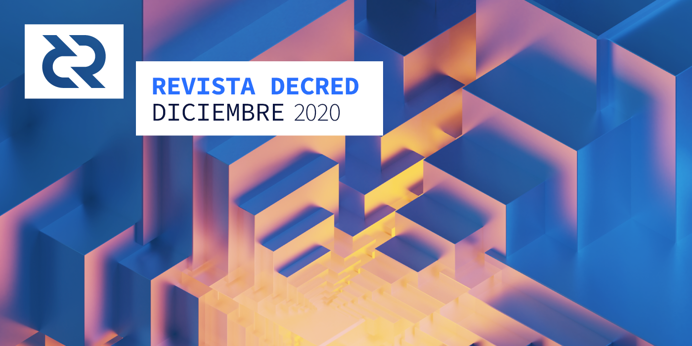

# Revista Decred — Diciembre 2020

Imagen: Reestructuración III por @saender

¡Feliz Año Nuevo a todos!

Lo más destacado de diciembre:
- Después de otro mes, la v1.6 se ve realmente muy brillante. Está preparado para la liberación de candidatos 5.
- Las métricas en cadena se volvieron locas en diciembre, incluido un gran salto en el precio del ticket a 191 DCR.
- Las métricas de las redes sociales también están despegando, con @decredproject rompiendo un nivel de resistencia clave.
- DCR se eliminó de la lista de Upbit, lo que provocó que el precio se disparara y el comercio de margen se agregó a varios otros intercambios.

## Desarrollo
A menos que se indique lo contrario, el trabajo que se informa aquí tiene el estado "fusionado con la rama master". Significa que el trabajo se completó, revisó e integró en el código fuente que los usuarios avanzados pueden construir y ejecutar, pero aún no está disponible en los binarios del lanzamiento en general.

[dcrd](https://github.com/decred/dcrd)

Fusionado a la rama maestra y soportado en v1.6:

- [Cálculos de tarifas](https://github.com/decred/dcrd/pull/2530) arreglados para corregir que algunas transacciones se consideren de menor prioridad en algunos escenarios de reorganización
- [Violaciones](https://github.com/decred/dcrd/pull/2533) de DCP-5 incluidas en la lista blanca. Debido a un error que se ha solucionado desde entonces, se aceptaron 5 bloques con un bloque antiguo versión 6 cuando la mayoría de la red ya se había actualizado a la versión 7. Los bloques eran válidos y ahora están incluidos en la lista blanca para permitir la sincronización completa de la cadena sin puntos de control.

Fusionados en la rama master: 

- Mover los [controles de contexto](https://github.com/decred/dcrd/pull/2481) de las funciones sanity/positional hacia las ubicaciones adecuadas para restaurar las restricciones previstas que estaban en vigor dentro del trabajo para descentralizar el fondo de tesorería.
- Cambiar la semántica de la [caché en el bloque](https://github.com/decred/dcrd/pull/2488) de la red principal para que sea menos dependiente del orden en que se ven los datos del bloque.
- Extraer el administrador de bloques en su propio paquete [`netsync`](https://github.com/decred/dcrd/pull/2500) para mejorar su capacidad de prueba y una sincronización más limpia con la red a partir de la valicación por consenso.
- Varios otros cambios en la descarga de bloques en [múltiples](https://github.com/decred/dcrd/issues/1145) pares.
- [Arnés de prueba](https://github.com/decred/dcrd/pull/2480) en la minería que facilitará la adición de cobertura de prueba y ayudará a optimizar el código para la plantilla de generación de bloques.
- Modificar la [authentificación](https://github.com/decred/dcrd/pull/2486) del servidor RPC para usar HMAC-SHA256 con una clave alatoria única para cada inicio para fortalecer contra ciertas clases de ataques en la memoria.
- Más pruebas cubiertas en el [rpcserver](https://github.com/decred/dcrd/issues/2069).
- Actualizaciones para seguir las [mejores prácticas](https://github.com/decred/dcrd/issues/2181) con los manejos de errores.
- Código más pequeño y acutalizaciones de prueba en todos los ámbitos.

Hubo 51 Pull Requests y 92 commits que fueron fusionados por parte de 6 contribuidores, añadiendo 10 000 y eliminandon 8 000 línea de código.

En otras noticias, hubo commmits el 30 de diciembre al 1 de enero pero afortunadamente no el 31 de diciembre.

[dcrwallet](https://github.com/decred/dcrwallet)

- [Seleccion aleatoria](https://github.com/decred/dcrwallet/pull/1937) para pagar las tarifas del VSP (esto también permite volver a intentar completar algunas compras de tickets en el VSP que han fallado antes).
- Resultados fijos [no publicados](https://github.com/decred/dcrwallet/pull/1941) que se utilizan para financiar otras transacciones (ocurrió con las tarifas de VSP que permanecen en estado no publicado hasta que se envía el ticket al VSP)
- Refacotorización del código.

En progreso: 

- Habilidad para [importar](https://github.com/decred/dcrwallet/pull/1945) las cuentas de voto derivadas de diferentes semillas (Para el soporte del staking en Trezor.

[Decrediton](https://github.com/decred/decrediton)

- Se añadió el botón para mezclar [todos lo fondos](https://github.com/decred/decrediton/pull/3041).
- Se añadió las [notas de v1.6](https://github.com/decred/decrediton/pull/3048) con imagenes animadas.
- Traducción (árabe, chino, alemán, japones, italiano, poláco, español).
- Arreglar ~26 problemas de UI.

Es muy probable que pronto haya un RC5 que solucione algunos problemas restantes.

[politeia](https://github.com/decred/politeia)

- Eliminar el [CSRF](https://github.com/decred/politeia/pull/1356) en las rutas públicas para evitar la posibilidad de vincular los votos filtrados mediante el token CSRF. El impacto en la privacidad fue mínimo: vincular tokens CSRF a votos filtrados requiría escribir código adicional, ya que la biblioteca CSRF utilizada no lo hace automáticamente.
- Pruebas de extremo a extremo en la UI para la [edición](https://github.com/decred/politeiagui/pull/2227) de propuesta.
- Remover el molesto modo de cierre de sesión y mover la función "Cerrar sesión permanente" que rara vez se usaba en la pestalla de cuenta.
- Nuevo comando `politeiavoter` para [verificar](https://github.com/decred/politeia/pull/1355) los votos.
- Mejoras en UX para el manejador de envios y revisión.
- Arreglar errores en Politeia y CMS.

Actualización de la implementación de tlog por @lukebp:
> Se ha agregado la capacidad de recuperar la marca de tiempo completa (prueba de inclusión) para cualquier parte de los datos enviados por el usuario. El trabajo de frontend para esto aún está en curso. La rama de backend tlog ahora tiene características completas y comenzaremos el proceso de revisión de código.

[vspd](https://github.com/decred/vspd)

- Rechazar los reusados o viejos [timestamps](https://github.com/decred/vspd/pull/215).
- Más cobertura de pruebas para la base de datos.
- Pequeñas correciones y preparativos para v1.0.

[dcrpool](https://github.com/decred/dcrpool)

- endpoint [single miner](https://github.com/decred/dcrpool/pull/274).
- Guardar la [información del cliente](https://github.com/decred/dcrpool/pull/293) en la base de datos y mostrar en cualquier instancia de dcrpool.
- Soporte para el [validador](https://github.com/decred/dcrpool/pull/294) del pool NiceHash (Permite conectar con dcrpool y los estádisticas basicas).

[dcrdex](https://github.com/decred/dcrdex)

- Nuevo botón para una [órden máxima](https://github.com/decred/dcrdex/pull/842) que completa los campos de cantidad con la cantidad máxima posible según el mercado, el lado del mercado y la billetera.
- endpoints de la API para los [datos de mercado](https://github.com/decred/dcrdex/pull/796) públicos através de HTTP y WebSockets.
- Mostrar el [ID de la cuenta](https://github.com/decred/dcrdex/pull/825) para cada servidor DEX.
- Favorecer los resultados [confirmados](https://github.com/decred/dcrdex/pull/865) para financiar los pedidos de BTC.
- [Renaudar](https://github.com/decred/dcrdex/pull/856) el intercambio de la base de datos (mejor que el enfoque anterior y menos código).
- Permitir que las aplicaciones escuchen en las dirección [IPv6](https://github.com/decred/dcrdex/pull/899).
- Mejorar los colores para diferenciar entre las órdenes de compra y venta.
- Muchas correcciones de errores y actualizaciones de dependencia.

Hubo 28 Pull Requests que fueron [fusionados](https://github.com/decred/dcrdex/pulls?q=is%3Apr+merged%3A2020-12-01..2020-12-31+sort%3Aupdated-asc) por parte de 7 contribuidores, añadiendo 8 000 y eliminandon 5 000 línea de código.

El cierre de la etiqueta [v0.1.4](https://github.com/decred/dcrdex/milestone/10) se acerca.

[dcrandroid](https://github.com/planetdecred/dcrandroid)

- Notificación cuando se [obtienen](https://github.com/planetdecred/dcrandroid/pull/523) los cfilter.
- Arreglar errores.

Fusionado en la librería dcrlibwallet.

- Soporte [vspd](https://github.com/planetdecred/dcrlibwallet/pull/163). 
- Método para consultar la información sobre los [pares](https://github.com/planetdecred/dcrlibwallet/pull/160) SPV conectados.
- Actualizaciones de dependencia en la correccón de errores.

Tenga en cuenta que las funciones agregadas a dcrlibwalle están disponibles para el consumo de dcrandroid, dcrios y godcr, asumiendo que estas aplicaciones agregan la interfaz de usuario necesaria.

[dcrios](https://github.com/planetdecred/dcrios)

- Pruebas de UI [automatizadas](https://github.com/planetdecred/dcrios/pull/707) para algunos escenarios usando XCUI.

[godcr](https://github.com/planetdecred/godcr)

- Interfaz para la [selección de moneda](https://github.com/planetdecred/godcr/pull/261).
- [Notificaciones](https://github.com/planetdecred/godcr/pull/274) cuando se copia el texto o se crea una transacción.
- Nuevo diseño en la UI para la página principal de [billeteras](https://github.com/planetdecred/godcr/pull/276).
- Ajustes en UI.
- Arreglar errores y optimizar.

Se requiere la API para superponer widgets para implementar completamente los diseños previstos para godcr. Esto llamó la atención del equipo de Gio en su Slack y está siendo tratado como una prioridad.

[tinydecred](https://github.com/decred/tinydecred)

En progreso: 

- Script para [recuperar](https://github.com/decred/tinydecred/pull/194) los fondos de las billeteras web de Copay antiguas (una de ellas estaba anterior mente en wallet.decred.org). El script ya ha ayudado a recuperar los fondos en la red principal de alguien.

[dcrros](https://github.com/decred/dcrros)

- Soporte para el [modo fuera de línea](https://github.com/decred/dcrros/pull/14) para cumplir completamente con las especificaciones de la [API de construcción](https://www.rosetta-api.org/docs/construction_api_introduction.html), donde ciertas operaciones solo se realizan en la instancia fuera de línea.

[decred.org](https://github.com/decred/dcrweb)

- Remover los contribuyentes [inactivos](https://github.com/decred/dcrweb/pull/935).
- Actualizaciones de dependencia.

Otros:

- Los investigadores de Electric Capital han mapeado la mayoría de los [repositorios](https://www.reddit.com/r/decred/comments/k9g76v/decred_developer_ecosystem_repositories/) en el ecosistema de Decred y han creado una herramienta para visualizar su actividad.

## Comunidad
Damos la bienvenida a los nuevos colaboradores con fusión de código master***: @piotrdelikat [(decrediton)](https://github.com/decred/decrediton/commits?author=piotrdelikat)

Estadísticas de la comunidad a partir del 2 de enero

Seguidores en:
- Twitter: 41 320 (+423)
- Suscriptores en Reddit: 10 051 (+69)
- Usuarios en la sala #general de Matrix: 287 (+34)
- Usuarios en Discord: 1 723 (+222)
- Usuarios en Telegram: 2 338 (-1)
- Suscriptores en YouTube: 4 300 (+50), vistas: 165 000 (+3 000)
- Seguidores en LinkedIn: 944 (+12)
- Estrellas en el repositorio dcrd en GitHub: 570 (+3), forks: 247 (+1)

Aspectos destacados de las estadísticas [obtenidas](https://github.com/decredcommunity/social-media-stats):
- [@decredproject](https://twitter.com/decredproject) Twitter rompió la "[resistencia](https://github.com/decredcommunity/social-media-stats/blob/graphs/graphs/index.md)" mágica de 41 000 seguidores con un salto inusual de +423
- [Reddit](https://www.reddit.com/r/decred/) rompió los 10 000 subs: tada:
- [Discord](https://discord.com/invite/GJ2GXfz) obtuvo un buen crecimiento de un 14%
- El telegram de [DecredTrading](https://t.me/DecredTrading) obtuvo un crecimiento de 72% de usuarios a un 158 (increíble)
- [@Checkmate](https://twitter.com/_Checkmatey_) obtuvo un aumento de 11% de seguidores (a 3 500) y escribio otros 1 000 tweets (~ 34 / día)
- El telegram de [DecredES](https://t.me/DecredES) ganó un  18% (a 245)
- [CoinMarketCap](https://coinmarketcap.com/currencies/decred/) tiene 17 800 observadores para Decred

¡Gracias a todos los embajadores de Decred de todas las plataformas por crear conciencia sobre el proyecto!

## Gobernanza
En diciembre, el [fondo de tesorería](https://explorer.dcrdata.org/address/Dcur2mcGjmENx4DhNqDctW5wJCVyT3Qeqkx) recibió 12 099 DCR y gastó 7 466 DCR. Utilizando la tasa promedio diaria DCR / USD en diciembre de $ 31.07, esto es $ 376 000 recibido y $ 232 000 gastado. A la tasa diaria promedio de noviembre*** de 18,19 dólares, la cifra en dólares facturada por trabajos anteriores es de $136 000. A partir del 5 de enero, el fondo de tesorería es de 641 260 DCR (30.2 millones de dólares a $47,16).

En diciembre se publicaron y votaron 2 propuestas:
- La tercera [propuesta](https://proposals.decred.org/proposals/350f64b) del equipo Decred ES en donde se solicitó $ 14 800 para financiar seis meses de trabajo, reducido por una solicitud inicial de $ 42 000, con elementos eliminados relacionados con Talent Land Blockchain Challenge y Codigo Decred. Esta propuesta fue rechazada con 54,5% de votos a favor, al no haber alcanzado el umbral del 60%; la participación fue del 37%.***
- La [propuesta](https://proposals.decred.org/proposals/5ce1636) de Decred Hackathons y LATAM Initial Chapter presentada después de que se cortara el elemento de hackathons de la propuesta de marketing de LATAM, las personas detrás de ella son miembros del equipo de ES. La propuesta solicitó un presupuesto máximo de $ 17,000 para crear materiales para hackathons y ejecutar dos de estos eventos, con $ 3 500 del presupuesto reservado para premios. La propuesta fue rechazada con un 50,2% de votos a favor y una participación del 36%.

Diciembre es el último mes facturable para las propuestas de marketing de [Estados Unidos](https://proposals.decred.org/proposals/c830ea5), [Latam](https://proposals.decred.org/proposals/3c02b67) y [Brasil](https://proposals.decred.org/proposals/bc20f98). Los contratistas que trabajan para ellos deberán presentar propuestas de renovación para mantenerse financiados.

@JoeGruff ha publicado tres breves [actualizaciones](https://github.com/decredcommunity/proposals/tree/master/proposals/3943bff/updates) de progreso y gastos para su propuesta de escáner de direcciones.

Si bien diciembre fue un mes tranquilo para las propuestas, ya hay dos nuevas en enero, para la financiación renovada de [DCRDEX](https://proposals.decred.org/proposals/d462ac3) y [Decred in Depth](https://proposals.decred.org/proposals/391108e) (bajo una nueva administración).

Politeia Digest se tomó un descanso en diciembre, pero volverá pronto.

## Red

Hashrate: el [hashrate](https://explorer.dcrdata.org/charts?chart=hashrate&zoom=ki3ivfpm-kjej4ggy&scale=linear&bin=block&axis=time) de diciembre se abrió a ~ 292 Ph / s y cerró ~ 340 Ph / s, tocando fondo en 240 Ph / s alcanzando un máximo de 452 Ph / s durante todo el mes.

[Distribución](https://miningpoolstats.stream/decred) del hashrate en los pools a partir del 1 de enero: 
- UUPool 42%
- Poolin 35%
- easy2mine 12%
- F2Pool 3.9%
- Antpool 2.7%
- Huobipool 2.6%
- BTC.com 1.3% 
- Luxor 1.2%
- CoinMine 0.02%

Staking: el precio medio del ticket a [30 días](https://dcrstats.com/) fue de 163.9 DCR (+5.2). El precio varió entre 150.6 y 190.99 DCR. El [monto bloqueado](https://explorer.dcrdata.org/charts?chart=ticket-pool-value&zoom=ki3ivfpm-kjej4ggy&scale=linear&bin=block&axis=time) por [participación](https://explorer.dcrdata.org/charts?chart=stake-participation&zoom=ki3ivfpm-kjej4ggy&scale=linear&bin=block&axis=time) fue de 6.42 a 6.68 millones de DCR, lo que correspondió al 52.01 a 54.20% del suministro disponible en PoS.

Otro mes, otro nuevo*** máximo alcanzado. El precio de los tickets llego a un máximo de 190.9 DCR y la participación en stake en el 54.2%.

Nodos: a lo largo de [diciembre](https://charts.dcr.farm/d/000000014/nodes?orgId=1&from=1606780800000&to=1609459200000) hubo un promedio de 87 de nodos públicos y 200 nodos de dcr.farm. 

Distribución de versiones promedio para diciembre: 
- 27% dcrd v1.5.2 
- 21% dcrd v1.6 dev y compilaciones RC 
- 16% dcrd v1.5.1
- 5% dcrd v1.7 dev builds 
- 5% dcrd v1.5.0
- 3% dcrd v1.5 dev y compilaciones RC 
- 0.7% dcrd v1.4
- 10% dcrwallet v1.5.1
- 1.3% dcrwallet v1.6 dev y compilaciones RC 
- 1% dcrwallet v1.5
- 0.7% dcrwallet v1.4
- 9% otros .

@Checkmate informa a través del boletín [Our Network](https://ournetwork.substack.com/p/our-network-issue-50-part-2) sobre una serie de métricas en cadena que están alcanzando máximos históricos.

@PermabullNino informa sobre un [aumento](https://twitter.com/PermabullNino/status/1338497116864438273) de ~ 500 000 DCR en el saldo del ticket pool durante un período de 28 días.

Mainnet Lightning Network está creciendo lentamente. A lo largo del 2020 hubo una media de 15 nodos, 30 canales y 6 DCR de capacidad. Mientras que el 8 de enero se encuentra en función *** 24 nodos, 42 canales y una capacidad total de 8.7 DCR según el [mapa LN](https://ln-map.jamieholdstock.com/) de @ jholdstock.

## Integraciones
[Ultravsp](https://ultravsp.uk/) (anteriormente Ultrapool) y [Ubiq VSP](https://dcrvsp.ubiqsmart.com/) lanzaron instancias del nuevo software de votación [vspd](https://github.com/decred/vspd) en la red principal. Sus servidores [dcrstakepool](https://github.com/decred/dcrstakepool) seguirán funcionando en [legacy.ultravsp.uk](https://legacy.ultravsp.uk/) y [dcr.ubiqsmart.com](https://dcr.ubiqsmart.com/), respectivamente.

Tenga en cuenta que Ultravsp tuvo que migrar de ultrapool.eu a un dominio [ultravsp.uk](https://ultravsp.uk/) del Reino Unido debido al [desorden del dominio](https://www.theregister.com/2021/01/05/brexit_81000_eu_domains/) Brexit, y no habrá redirección automática debido a la complejidad prohibitiva de configurarlo. Los usuarios del VSP que compraron tickets recientemente han sido notificados por correo electrónico.

Bittrex [agregó](https://twitter.com/BittrexExchange/status/1341801493964308482) una función de [intercambio instantáneo](https://bittrex.com/instant) que permite a los usuarios comprar activos rápidamente con una tarjeta de débito. Se informó que en DCR funcionaba.

Binance ha habilitado el [comercio de margen](https://www.binance.com/en/support/announcement/d3614081a4254d1c815eb07e09f6cda8) para los pares DCR / BTC y DCR / USDT, y anunció una "promoción de interés cero de 1 semana para pedir prestado DCR". ([discusión](https://www.reddit.com/r/decred/comments/k8gy0d/margin_trading_for_dcr_enabled_on_binance/)) :supervillano:

[MXC Exchange](https://www.mxc.com/) [agregó](https://twitter.com/MXC_Exchange/status/1334707659900035075) un X5 de margen de apalancamiento al par DCR / USDT además del par DCR / USDT regular que cotizaron en 2019.

El intercambio turco [Bitexen](https://www.bitexen.com/) [anunció](https://twitter.com/bitexencom/status/1339858540614266880) la cotización de DCR entre otros 11 activos.

[Swapzone](https://swapzone.io/), el agregador de intercambio instantáneo con sede en Malta, tiene soporte para DCR desde mayo o antes, pero en diciembre se puso en nuestro radar y se [agregó](https://github.com/decred/dcrweb/pull/937) a la página de [exchanges](https://decred.org/exchanges/) de decred.org.

Korean Upbit [ha eliminado a DCR de la lista](https://www.reddit.com/r/decred/comments/kfu4sb/whats_going_on_in_korea_upbit/), aparentemente en desacuerdo con la misión de Decred de proteger la privacidad individual. :supervillano:

> Advertencia: los autores de la Revista Decred no tienen idea de la confiabilidad de alguno de los servicios anteriores. Haga su propia investigación antes de confiar su información personal o activos.

## Alcance
El equipo de Decred en español publicó el [sexto informe y final](https://github.com/decredcommunity/proposals/blob/master/proposals/3c02b67/updates/20201211.md) para su segunda propuesta. La votación para su 3ª propuesta ha finalizado con un significativo 54.5% y 50.2% de votos a favor, pero no alcanzó el umbral requerido del 60%. El equipo está recopilando [comentarios](https://www.reddit.com/r/decred/comments/kkb97s/what_are_your_thoughts_on_the_decred_in_spanish/) en Reddit y planificando qué hacer a continuación.

@michae2xl publicó el [informe final](https://github.com/decredcommunity/proposals/blob/master/proposals/bc20f98/updates/20210105.md) que cubre las actividades de diciembre para la propuesta de marketing de Brasil.

Logros de Monde PR en diciembre:
- Creó y presentó dos historias para blogs financieros y de criptografía.

Cobertura de noticias por parte de Monde PR:
- @jy-p fue entrevistado por [NASDAQ Trade Talks](https://www.nasdaq.com/videos/tradetalks:-how-can-blockchain-can-be-used-in-elections) hablando sobre el uso de Decred en las elecciones brasileñas. La entrevista se mencionó en artículos posteriores en [Coin Journal](https://coinjournal.net/news/decred-bounces-off-42-after-spiking-50/), [Crypto Potato](https://cryptopotato.com/decred-dcr-pumps-50-as-social-sentiment-surges/), [Coin Market Cap](https://coinmarketcap.com/headlines/signals/decred-co-founder-on-nasdaq-tradetalks-decred/) y [CryptoMode](https://cryptomode.com/5-reasons-why-you-shouldnt-overlook-decred-dcr/).
- Los detalles del lanzamiento del DCRDEX y el uso de Decred en las elecciones brasileñas se presentaron en [Cointelegraph](https://cointelegraph.com/news/bitcoin-bull-market-pulls-kusama-ksm-decred-dcr-and-qtum-price-higher).
- @jy-p fue entrevistado por en el Podcast [Geek Insider](https://www.youtube.com/watch?v=mYK_Awn1wTk) hablando sobre el origen de Decred, el lanzamiento de DCRDEX y el uso de Decred en las elecciones brasileñas.
- Los detalles del lanzamiento de DCRDEX también se presentaron en [Brave New Coin](https://bravenewcoin.com/insights/decred-price-analysis-active-addresses-hit-all-time-highs-as-trend-metrics).
- Comentarios de la entrevista de Cointelegraph de @jy-p sobre los ciclos alcistas y bajistas de Bitcoin se presentaron en [Forex Academy](https://www.forex.academy/how-to-spot-bitcoin-bull-bear-cycles-beginners-edition/) e [Inside Bitcoin](https://insidebitcoins.com/news/bitcoin-btc-price-prediction-november-29-2020-2).
- Comentarios de @jy-p sobre los desafíos de seguridad de Ledger se publicaron en [The Union Journal](https://www.theunionjournal.com/ledger-cto-discusses-wallets-safety-after-multiple-security-setbacks/).

## Eventos
Atendidos:
- 3 de diciembre — [Hablemos Decred 24](https://decredcommunity.github.io/events/index/20201203.1) — Internet. @elian y @pablito discutieron sobre la privacidad en las criptomonedas.
- 5 de diciembre — [Conferencia Mundial de Blockchain](https://decredcommunity.github.io/events/index/20201205.1) — Wuhan, China. Este no fue un evento forma de Decred, pero @Dominic se reunión con viejos amigos de Cobo Wallet, F2Pool y otros, para introducirlos a la próxima versión 1.6 y las nuevas reglas de consenso.
- 10 de diciembre — [Hablemos Decred 25](https://decredcommunity.github.io/events/index/20201210.1) — Internet. El equipo de Decred en español se reunión para revisar el año de trabajo en la DAO, lo bueno, lo malo y los retos por ver en el 2021.
- 11 de diciembre — [Cripto Latin Fest online 2020](https://decredcommunity.github.io/events/index/20201211.1) — Internet. Coorganizado por Paxful Latam. Decred fue un patrocinador VIP. @elian presento a Decred y el próximo Hidden Hydra, que obtuvo ~ 1 600 vistas en Facebook y ~ 800 en Youtube. También habló sobre cómo prevenir las cripto estafas.
- 16 de diciembre — [UAM Xochimilco](https://twitter.com/addcade/status/1338544856344317953) — Mexico City, Mexico. @adcade habló sobre la organización de Decred y Politeia en Aula Multimedia Lab de la universidad de Xochimilco.
- 18 de diciembre — [Año nuevo en CR](https://decredcommunity.github.io/events/index/20201218.1) — Internet. La academia de Crypto Resources organizó un evento de fin de año e invitó a socios como Decred, Bitso, Prime XBT DAI, Binance, y otros. Durante el panel de gobernanza @elian presentó como es que la gobernanza de Decred funciona, el rol de Politeia y la descentralización del fondo de tesorería.
- 24 de diciembre — [Decred AMA](https://decredcommunity.github.io/events/index/20201224.1) — Internet. Este AMA por la comunidad de OKEX en español tomó lugar en [Telegram](https://t.me/OKExLATAM) con ~ 500 usuario. Cerca de 30 preguntas fueron respondidas sobre la gobernanza de Decred, privacidad, desarrollos futuros, historia y el DEX. También hubo regalos de DCR ($20 de OKEx y $30 de Decred en español). También ~ 30 nuevos usuarios ingresaron al canal de [@DecredES](https://t.me/DecredES) en Telegram.
- 30 de diciembre — [Decred en español, regalo de año nuevo](https://decredcommunity.github.io/events/index/20201230.1) — Internet. Para participar las personas necesitaron ingresar al grupo de Telegram [@DecredEs](https://t.me/DecredES) y comentar que es lo que les gusta de Decred. Hubo 28 comentarios, los mejores 9 fueron seleccionados en base al conocimiento y entendimiento del proyecto que se tiene y recibieron 3 DCR en total.

La información anterior está disponible con mayor detalle en nuestro [rastreador de eventos](https://decredcommunity.github.io/events/index/) que se está construyendo para saber qué funciona y mejorar los informes de los esfuerzos de marketing. Gracias a todos los que [enviaron](https://github.com/decredcommunity/events/blob/master/docs/submit-index.md) y revisaron eventos.

## Media
@mm ha completado su serie de 7 partes sobre la gobernanza blockchain:

> Estos artículos se encuentras en inglés pero muy pronto todos estarán en español también.

- [Parte 1](https://stakey.club/en/blockchain-gov-part1/), introduce sobre las criptomonedas, la impresión de dinero y Bitcoin.
- [Parte 2](https://stakey.club/en/blockchain-gov-part2/), cubre como es que funciona la tecnología detrás de las criptomonedas, la seguridad en el Proof of Work, incentivos e inflación.
- [Parte 3](https://stakey.club/en/blockchain-gov-part3/), explica las arquitecturas básicas (con permiso/sin permiso, publicas/privadas), la gobernanza en Bitcoin, privacidad y fungibilidad, y aplicaciones de blockchain más allá del dinero digital (por ejemplo, votaciones digitales).
- [Parte 4](https://stakey.club/en/blockchain-gov-part4/), introduce sobre los fundamentos de Decred (seguridad, consenso, fondeo, la piel en juego) y las comparaciones de PoW y PoS.
- [Parte 5](https://stakey.club/en/blockchain-gov-part5/), evalúa la seguridad y gobernanza de Bitcoin vs Decred usando el simulador de ataques [InvalidationGame](https://github.com/mmartins000/invalidationgame) de @mm, considerando ataques externos e internos. También en otros detalles provee estimaciones separadas para el gasto de capital y el opex requerido para atacar a Bitcoin y a Decred.
- [Parte 6](https://stakey.club/en/blockchain-gov-part6/), prueba una serie de hipótesis contra algunos datos reales (los temas incluyen la correlación de las métricas en cadena con el precio, la participación de los votantes, el modelo OLS y otros).
- [Parte 7](https://stakey.club/en/blockchain-gov-part7/), concluye la serie resumiendo los resultados de las simulaciones, los hallazgos sobre seguridad, y lo que Decred puede ofrecerle al mundo.

> Decred Project no solo tiene como objetivo proporcionar una alternativa a los sistemas financieros que dependen de un tercero confiable y de personas que dependen de la buena voluntad de las instituciones financieras gigantes, sino también mostrar cómo el voto electrónico puede ocurrir de manera segura y transparente.

El código en Python / R / SQL utilizado en la investigación está disponible en [GitHub](https://github.com/mmartins000?tab=repositories).

Artículos:
- “La criptomoneda de Decred incrementó en un 50% y sobrepasó las monedas DeFi”. ([es.cointelegraph.com](https://es.cointelegraph.com/news/the-decred-cryptocurrency-increased-by-50-and-surpassed-defi-coins))

Artículos seleccionados en inglés:
- Análisis de precios en Decred: las direcciones activas alcanzan máximos históricos a medida que las métricas de tendencias se vuelven alcistas por Josh Olszewicz ([bravenewcoin.com](https://bravenewcoin.com/insights/decred-price-analysis-active-addresses-hit-all-time-highs-as-trend-metrics)) Viene con una versión en [video](https://www.youtube.com/watch?v=oCYZS_qJ7us).

Videos en inglés:
- Actualización quincenal de noticias decred: ¡se renovó la página de privacidad, muchas actualizaciones de desarrollo, 1.6 inbound y más! por @Salirus. ([youtube](https://www.youtube.com/watch?v=-3s9_jMWNuA)) 
- Nuevo máximo anual para Decred por Decred Society. ([youtube](https://www.youtube.com/watch?v=qw-ohbTObeo)) 
- Decred es ideal para los ahorradores por Decred Society. ([youtube](https://www.youtube.com/watch?v=zYDT0n59C7k)) 
- Criptoanálisis Decred: ¡el Rey DCR DESPIERTA! ¡Cada acción tiene una reacción igual y opuesta! por DubDigital. ([youtube](https://www.youtube.com/watch?v=kqAD_PSgyME)) 
- Jake Yocom-Piatt habla sobre Decred y blockchain en Geek Insider. ([youtube](https://www.youtube.com/watch?v=mYK_Awn1wTk)) 
- ¿Cómo se puede utilizar blockchain en las elecciones? con Jake Yocom-Piatt y Jill Malandrino de NASDAQ TradeTalks. ([youtube](https://www.youtube.com/watch?v=pBSn_CdQYts)) 
- Staked Podcast: Episodio 0.0.5 ([youtube](https://www.youtube.com/watch?v=BbBcngzuxCw)): actualización sobre el estado del podcast y un anuncio sobre Eduardo y Decred.
- Entrevista con @BTC_Uncle por Staked Podcast. ([youtube](https://www.youtube.com/watch?v=__7LTz3nQKk), [clip corto](https://www.youtube.com/watch?v=3ubS_27FEhE) sobre por qué Decred)
- Entrevista con Ammar Naseer (@Ammarooni) por Staked Podcast. ([youtube](https://www.youtube.com/watch?v=g0bFMuHXrkU)) 
- 2020 sesión de cierre onchain BTC + DCR por @Checkmate. ([youtube](https://www.youtube.com/watch?v=g60ovCl54OA)) 
- Decred Deep Dive: ¡Se acerca la liberación de hidra oculta! por @Checkmate. ([youtube](https://www.youtube.com/watch?v=3AxBa-EE8RM), [discusión](https://www.reddit.com/r/decred/comments/klz8ue/decred_deep_dive_hidden_hydra/))

Audio en inglés:
- Rough Consensus 14: Repetición de los acontecimientos del mercado alcista. @Checkmate y @PermabullNino comparten sus pensamientos sobre Bitcoin ATH, ETH 2.0, DCR 1.6 y más. ([libsyn](https://roughconsensus.libsyn.com/episode-14-rehashing-bull-market-happenings))
- Rough Consensus 15: El próximo paradigma. Mav de Ready Set Crypto salta al pod para hablar de criptografía a gran escala. ([libsyn](https://roughconsensus.libsyn.com/episode-15-the-next-paradigm-with-mav-ready-set-crypto))

Arte/Ocio:
- Hilarante [portada](https://streamable.com/iam635) de Decred GOT por @degeri.
- "[No saben que tengo Decred](https://twitter.com/aithzakaria1/status/1335706207395450880)" por @aithzakaria1.
- ¡[Es hora de Decred](https://twitter.com/aithzakaria1/status/1330999761634258948), Ben! por @aithzakaria1.
- Supervivencia a través de la adaptación - diseño de [merchandising](https://twitter.com/OfficialCryptos/status/1338551937818562561) de @OfficialCryptos.
- DCR [cortando violentamente CMC](https://twitter.com/exitusdcr/status/1343774006344880130) por @Salirus. 
- [Estado de la nación digital](https://twitter.com/AGNFAB1/status/1338963085537718275) por @AGNFAB.
- @New_Copernicus compartió más clips teaser sobre [Hidden Hydra](https://twitter.com/New_Copernicus/status/1336044535370092546), [Decred Rabbit Hole](https://twitter.com/New_Copernicus/status/1339649654842126337), [¡felices fiestas!](https://twitter.com/New_Copernicus/status/1341665478935076865) [¡y feliz Año Nuevo!](https://twitter.com/New_Copernicus/status/1344509258176622593)

Traducciones:
- Traducción árabe de "Decred: ¿Dónde empezó todo?" publicado en el sitio web [satoshiat.com](https://www.satoshiat.com/%d8%a7%d9%84%d8%af%d9%8a%d9%83%d8%b1%d9%8a%d8%af-%d9%85%d9%86-%d8%a3%d9%8a%d9%86-%d8%a8%d8%af%d8%a3%d8%aa%d8%9f/) centrado en cripto. 
- La “Utilidad de criptoactivos” general y más técnica “Fortalecimiento de seguridad para las billeteras digitales” y “Verificación de firmas digitales: Decred” de stakey.club traducido al español por @francov_ (ver [repositorio de traducciones al español](https://github.com/DecredES/traducciones) y su [Medium](https://medium.com/decred-es)) 
- DJ 2020 se [tradujo](https://xaur.github.io/decred-news/) al árabe (@arij, @ abdulrahman4), chino (@Dominic) y español (@francov_). ¡Gracias a todos por difundir las novedades de Decred!
- Todas las traducciones conocidas se registran en este [índice](https://github.com/decredcommunity/translations/blob/master/index.md) que tiene 305 elementos al momento de la escritura.

Otro contenido:
- (En árabe): @arij grabó una introducción sobre Decred. ([Youtube](https://www.youtube.com/watch?v=k6xXL_ttSDI)).

## Discusiones de la comunidad
Post seleccionados en Reddit:

- Agregando [ERC-20](https://www.reddit.com/r/decred/comments/khnc35/adding_erc20_to_the_dex/) en DCRDEX.
- ¿Es [útil](https://www.reddit.com/r/decred/comments/kho4db/is_churning_useful_with_coinshuffle/) enviarse a uno mismo con CoinShuffle ++? (pista: CSPP es un incentivo no trivial para apostar DCR).
- [Compensaciones](https://www.reddit.com/r/decred/comments/k6dn93/what_are_the_trade_offs_for_decreds_privacy/) de las características de privacidad de Decred.
- Los beneficios de los próximos cambios en el sistema VSP desde la perspectiva de un [operador VSP](https://www.reddit.com/r/decred/comments/k9hegy/upcoming_changes_in_16_for_proofofstake_using_vsps/).

Discusiones seleccionadas en Twitter:
- @Ammarooni recuerda que el 15 de diciembre marcó el [quinto aniversario](https://twitter.com/Ammarooni/status/1338898342722605057) del primer anuncio de Decred en el foro [bitcointalk](https://bitcointalk.org/index.php?topic=1290358.0).
- Breve [historia](https://twitter.com/lefebvre_dustin/status/1333816694922485761) de cómo Decred codificó independientemente de los oráculos, por @Dustorf.

## Mercados
En diciembre, DCR cotizaba entre USD 24.01–41.59 / BTC 0.0012–0.002. La tarifa diaria promedio fue de $31.07.

Con el aumento masivo de Bitcoin, Decred también ha estado subiendo en USD sin perder mucho terreno en el valor de BTC.

DCR cotizaba [inusualmente](https://www.reddit.com/r/decred/comments/kfu4sb/whats_going_on_in_korea_upbit/) alto hasta $350 en Upbit hasta que fue eliminado de la lista.

Durante los 48 días de operación de DCRDEX, [ha negociado](https://ournetwork.substack.com/p/our-network-issue-50-part-2) ~ 600K DCR, que es el 30% del volumen de Binance durante el mismo período. Sin embargo, a diferencia de cualquier intercambio centralizado, este volumen es mucho más confiable y más difícil de engañar. 

@bochinchero [publicó](https://twitter.com/TheBochinchero/status/1339202616153284608) su primer artículo de análisis en cadena en Decred, proponiendo nuevas métricas de valoración:

> El Valor Realizado Bloqueado es una métrica que es análoga al Valor Realizado, pero se aplica exclusivamente a las monedas que circulan dentro del grupo de tickets, esencialmente tratando cada ticket como un UTXO. [esto] proporciona una valoración más precisa del capital bloqueado en la seguridad y la gobernanza de la red. Durante las fuertes liquidaciones pasadas, ha actuado como fondo psicológico, el punto de máximo de dolor, donde intervienen los compradores de último recurso. 

@Checkmate [anunció](https://twitter.com/_Checkmatey_/status/1338418991212052485) el lanzamiento de [checkonchain.com](https://checkonchain.com/) con muchos, muchos (muchos) gráficos: 

> Ahora bien, esto es algo en lo que he estado trabajando durante mucho tiempo. Si desea una ventaja seria en este mercado, preste atención al corazón de la cadena. Una clase magistral completa para aprender a aplicar correctamente cada métrica se pondrá de moda poco después.

## Noticias Relevantes
Cover Protocol, un proyecto de DeFi que "permite a los usuarios de DeFi estar protegidos contra el riesgo de contratos inteligentes", fue [hackeado](https://www.coindesk.com/cover-protocol-plans-new-token-after-attack) y el atacante acuñó 40 quintillones de tokens COVER, liquidando estos por $4 millones, pero luego devolviendo los fondos al contrato inteligente. El equipo ahora está buscando crear una nueva versión del token COVER con una instantánea para reembolsar a los titulares de COVER, porque de lo contrario esos 40 quintillones de tokens adicionales estropearían la token economía.

El CEO de Nexus Mutual fue pirateado por $8.3 millones cuando un atacante lo engañó para que firmara una transacción que envió todo su NXM a la billetera del atacante. El atacante [lavó](https://coingeek.com/nexus-mutual-attacker-cashes-out-3-million/) $2.7 millones a BTC, y esto hizo que el precio de NXM bajara, luego enviaron un mensaje en la oferta de la blockchain de Ethereum para devolver el resto (para que NXM pudiera evitar más dolor) por un [rescate](https://coingeek.com/nexus-mutual-attacker-wants-3-million-in-ransom-money/) de $2.8 millones en ETH.

El principal atractivo de DeFi en diciembre fue [Compounder Finance](https://www.coindesk.com/compounder-developers-implicated-alleged-smart-contract-rug-pull), cuyos desarrolladores se fugaron con $10.8 millones de fondos de inversores después de utilizar una puerta trasera oculta en los contratos.

La principal víctima del ataque de préstamos relámpago en diciembre fue [Warp Finance](https://decrypt.co/52125/warp-finance-recovers-5-8-million-days-after-hack), con el exploit con un peso de $7.7 millones, pero $ 5.85 millones se están devolviendo. Podría decirse que este también es el principal reembolso de pirateo de DeFi de diciembre, pero COVER es un competidor por ese título porque, aunque la cantidad en dólares que se devuelve era menor, representaba una proporción ridícula del suministro de COVER.

Gitcoin terminó un [fuerte 2020](https://gitcoin.co/blog/gitcoin-year-in-review/) con su octava ronda de fondos de Ethereum con un fondo de contrapartida de $450K, y también se [completó](https://electriccoin.co/blog/zcash-gitcoin-grants-round-1-retrospective/) la primera ronda de fondos que no son de Ethereum para proyectos de Zcash, dispensando un fondo de contrapartida de $25K de la Fundación Zcash pero atrayendo solo 156 donaciones por un total de $2 137.

Se presentó un [proyecto de ley](https://www.coindesk.com/us-lawmakers-introduce-bill-that-would-require-stablecoin-issuers-to-obtain-bank-charters) en el Congreso de los EE. UU. Que requeriría que los emisores de monedas estables obtengan estatutos bancarios, lo que requiere la aprobación de la Reserva Federal y varios otros organismos antes de circular cualquier moneda.

La primera línea en las regulaciones criptográficas luego se [trasladó](https://www.coindesk.com/self-hosted-bitcoin-wallets-become-front-line-in-fight-over-crypto-regulations) a las "billeteras autohospedadas" (es decir, cualquier cripto con custodia propia) y el grado de diligencia debida que los intercambios deben llevar a cabo en las transacciones que involucran a estas entidades cuestionables.

Bittrex anunció que [eliminará](https://www.coindesk.com/bittrex-to-delist-privacy-coins-monero-dash-and-zcash) las monedas de privacidad Monero, Zcash y Dash el 15 de enero, sin indicar una razón específica. Alrededor de un mes antes, [ShapeShift](https://www.coindesk.com/shapeshift-delists-privacy-coin-zcash-over-regulatory-concerns) eliminó las mismas monedas.

Bittrex también se convirtió en el undécimo intercambio en [eliminar](https://decrypt.co/52855/even-bittrex-is-halting-trading-of-xrp) a XRP, una semana después de que la SEC de los EE. UU. Acusara a Ripple Labs de recaudar $1.3 mil millones al vender la moneda en ventas de valores no registrados. Esto recuerda que recaudar fondos es un riesgo sistémico a largo plazo que puede ser contraproducente años después de la ICO.

En un esfuerzo por deshacerse de los reguladores, Libra de Facebook cambió su nombre a [Diem](https://www.forbes.com/sites/jasonbrett/2020/12/02/facebooks-libra-renamed-to-diem-prior-to-stablecoin-launch) y abandonó la aspiración de estar respaldado por una canasta de monedas a favor del respaldo directo del USD.

La filtración de datos de clientes de Ledger, informada originalmente en julio, ahora se ha [descargado públicamente](https://cointelegraph.com/news/ledger-data-leak-a-simple-mistake-exposed-270k-crypto-wallet-buyers). En el anuncio original, Ledger declaró que se había accedido a información más detallada, como la dirección física, para 9.5K clientes, pero [ahora parece](https://www.ledger.com/message-ledgers-ceo-data-leak/) que esta información se recopiló para 272K clientes.

## ¡Apoya a DJ en la web!
No sabemos qué hicieron ustedes, pero la Revista Decred en noviembre fue una anomalía. Más de 100 me gusta en Twitter desde un promedio de 60, +1 1000 aplausos en Medium frente a los ~ 300 normales, alcanzando las [10](https://medium.com/tag/decentralized-exchange/archive/2020/12) publicaciones principales de diciembre etiquetadas como "DEX" en Medium, buenas vistas en Publish0x, etc.

¡Gracias por presionar todos estos botones! Continúe brindando visibilidad para el mejor proyecto de criptomoneda.

## Sobre esta edición
Este es la edición #33 de la Revista Decred, un índice de todos los números originales y traducciones se encuentran disponibles [aquí](https://xaur.github.io/decred-news/).

La mayoría de la información de terceros se transmite directamente desde la fuente después de un control de fiabilidad mínimo. Los autores de la Revista Decred no tienen la capacidad de verificar todas las reclamaciones. Tenga cuidado con las estafas y haga su propia investigación.

Puedes enviar una historia [aquí](https://github.com/xaur/decred-news/labels/next%20release) para ser considerada para el próximo número. Los [comentarios](https://github.com/xaur/decred-news/blob/docs/contributing.md#feedback) y las [contribuciones](https://github.com/xaur/decred-news/blob/docs/contributing.md) siempre son bienvenidas.

Créditos:
- Redacción y edición: bee, degeri, l1ndseymm, lukebp, richardred.
- Revisión y comentarios: davecgh, elian, JoeGruff, oshorefueled.
- Imagen de portada: saender.
- Fondeado por: la tesorería de Decred.

