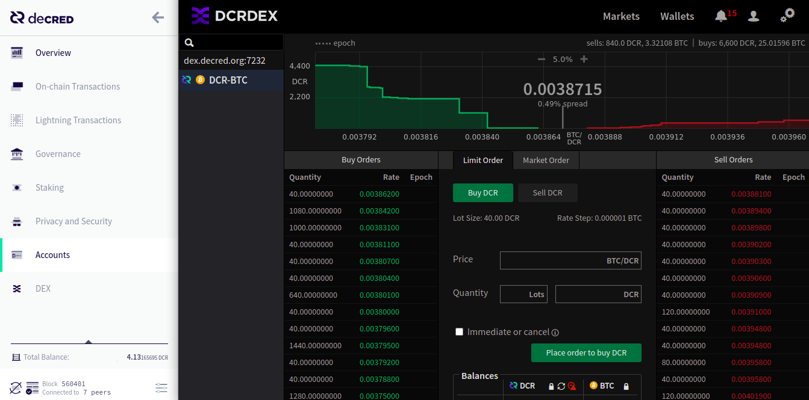
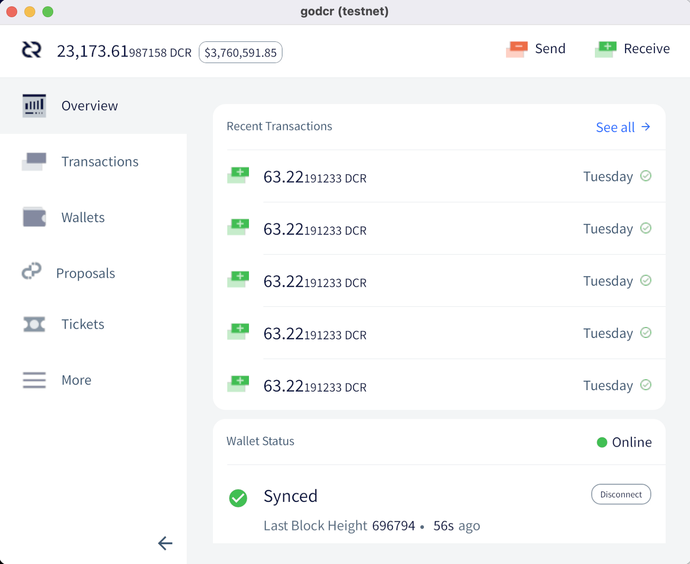

# Revista Decred Mayo 2021


Novedades en Mayo

- El nuevo sistema del fondo de tesorería está recibiendo activamente recompensas en bloque y ya se ha probado de manera exitosa con las nuevas transacciones tspend.
- Se lanzó la versión 1.6.3 del software de nodos y billeteras para corregir algunos problemas con la participación del VSP y agregar algunas de las funciones más recientes.
- Se lanzó DCRDEX v0.2.0, incorporando más de 3 meses de trabajo, y se agregó una integración del DCRDEX experimental a Decrediton v1.6.3.

Contenido

- [Lanzamiento del parche v1.6.3](https://github.com/DecredES/translations/blob/master/decredJournal/2021/05/index.md#nuevo-parche-v163)
- [Nueva tesorería activada](https://github.com/DecredES/translations/blob/master/decredJournal/2021/05/index.md#la-nueva-tesorer%C3%ADa-por-fin-se-encuentra-activa)
- [Desarrollo](https://github.com/DecredES/translations/blob/master/decredJournal/2021/05/index.md#desarrollo)
- [Comunidad](https://github.com/DecredES/translations/blob/master/decredJournal/2021/05/index.md#comunidad)
- [Gobernanza](https://github.com/DecredES/translations/blob/master/decredJournal/2021/05/index.md#gobernanza)
- [Red](https://github.com/DecredES/translations/blob/master/decredJournal/2021/05/index.md#red)
- [Ecosistema](https://github.com/DecredES/translations/blob/master/decredJournal/2021/05/index.md#ecosistema)
- [Alcance](https://github.com/DecredES/translations/blob/master/decredJournal/2021/05/index.md#alcance)
- [Media](https://github.com/DecredES/translations/blob/master/decredJournal/2021/05/index.md#media)
- [Discusiones](https://github.com/DecredES/translations/blob/master/decredJournal/2021/05/index.md#discusiones)
- [Mercados](https://github.com/DecredES/translations/blob/master/decredJournal/2021/05/index.md#mercados)
- [Relevante Externo](https://github.com/DecredES/translations/blob/master/decredJournal/2021/05/index.md#relevantes-externos)
- [Sobre esta versión](https://github.com/DecredES/translations/blob/master/decredJournal/2021/05/index.md#sobre-esta-edici%C3%B3n)

## Nuevo parche V1.6.3
La última versión de nuestra billetera insignia de GUI, Decrediton, soluciona problemas con el staking de VSP, hace que la billetera sea más "genial" con el desbloqueo granular de cuentas y agrega la integración experimental de la [nueva versión del DCRDEX](https://xaur.github.io/decred-news/journal/202105#dcrdex). La línea de comandos dcrwallet también se actualiza con correcciones y mejoras del staking en VSP.

Los usuarios de Decrediton deben tener en cuenta:

- La pestaña DEX solo se muestra en modo completo y está oculta en modo SPV.
- Necesita ejecutar Bitcoin Core y sincronizarlo completamente para usar la pestaña DEX.
- La descarga de Windows se actualizó para corregir el [error](https://github.com/decred/decrediton/pull/3469) predeterminado del directorio de Bitcoin, si obtuvo el instalador antes del 25 de mayo, descárguelo de nuevo y vuelva a instalarlo.

Vea las notas de la versión completa y las descargas [aquí](https://github.com/decred/decred-binaries/releases/tag/v1.6.3). Como siempre, respete el ritual de [verificación de firmas](https://docs.decred.org/advanced/verifying-binaries/) para asegurarse de ejecutar los binarios correctos.

## La nueva tesorería por fin se encuentra activa

Las nuevas reglas de consenso se activaron el 8 de mayo. A partir del bloque [552,448](https://explorer.dcrdata.org/block/00000000000000001c6fc262b2673d94827f87daa329b0bdeb7866562ef919cf), el 10% de las recompensas del bloque fluyen a la [nueva cuenta del fondo de tesorería](https://explorer.dcrdata.org/treasury?chart=balance&zoom=knj8yxs0-kpz09i80&bin=month) y ya no fluyen a la [dirección anterior](https://explorer.dcrdata.org/address/Dcur2mcGjmENx4DhNqDctW5wJCVyT3Qeqkx).

La diferencia clave es que la nueva cuenta del Fondo de Tesorería está controlada por los stake holders de Decred. Gastar desde la dirección anterior solo requería una transacción firmada por Decred Holdings Group LLC ("DHG"), una entidad corporativa convencional creada para iniciar Decred. Solo es posible gastar desde la nueva cuenta si los stake holders votan para aprobar una transacción especial de “gasto de tesorería” (“tspend”).

Un sofisticado proceso de votación para respaldarlo se especificó en [Decred Change Proposal 6](https://github.com/decred/dcps/blob/master/dcp-0006/dcp-0006.mediawiki) y se implementó en la versión de software v1.6. En términos simples, los pasos clave son:

- Los administradores de Politeia crean una transacción tspend que se ajusta a ciertos requisitos (no gastar demasiado dinero, con un tiempo de vencimiento no demasiado largo, firmada por una de las dos claves permitidas por consenso, etc.)
- La transacción se publica en el mempool y las billeteras de votación comienzan a votar sobre ella.
- La votación tiene una duración de hasta 12 días, pero puede acelerarse a tan solo ~ 7 días si el resultado no se puede cambiar por los votos restantes.
- Hasta 17,280 tickets que son llamados a votar durante este período pueden emitir votos para gastar (junto con la aprobación de bloque normal y los votos de actualización por consenso).
- Si se aprueba la votación, la transacción se incluye en un bloque (hasta 1 día después) y se paga a los contratistas.

El nuevo sistema de la tesorería se probó con éxito en mainnet rápidamente después de la activación. El 10 de mayo se [notificó](https://twitter.com/decredproject/status/1391877816292151296) a los stake holders que configuraran sus billeteras de votación. Luego, el 12 de mayo, se transmitió a la red una pequeña [transacción](https://explorer.dcrdata.org/tx/7507bcc72bfde895065034e12e6d462f2360163cd0c879f0db35514f9456b2c1) tspend de prueba. La ventana de votación más cercana fue del 13 al 24 de mayo, pero el voto tuvo una aceleración después de acumular 6,755 votos a favor y 1 en contra durante 9 días. De los 12,550 tickets que tuvieron la oportunidad de votar en ese período, el 54% votó activamente. El tspend se extrajo en el bloque [556,416](https://explorer.dcrdata.org/block/000000000000000000b8bed4b8511e3c5197d3eee6372db2ba199481e14d5376).

A partir de la versión del software v1.6.3, la votación tspend solo es compatible con los "votantes en solitario" que administran billeteras de votación las 24 horas del día, los 7 días de la semana (~ 77% de todos los stakeholders a partir del 1 de junio). [Se está trabajando para habilitar](https://github.com/decred/decrediton/issues/3184) esto para los votantes de VSP.

La votaciónp para el gasto del fondo de tesorería se convertirá en un proceso mensual importante para pagar a las personas que construyen Decred. [Se aconseja](https://twitter.com/decredproject/status/1391877959410233344) a los votantes individuales que se preparen para las próximas votaciones tspend configurando sus billeteras de votación con el siguiente comando:

```code

dcrctl --wallet settreasurypolicy "03f6e7041f1cf51ee10e0a01cd2b0385ce3cd9debaabb2296f7e9dee9329da946c" "yes or no"

```

Este comando expresa su confianza en la administración de la tesorería actual y su clave ```03f6e704 ...```, y establece cómo su billetera votará por los gastos firmados por ella. Puede verificar esta clave en el [DCP-0006](https://github.com/decred/dcps/blob/master/dcp-0006/dcp-0006.mediawiki) o en el [código fuente](https://github.com/decred/dcrd/blob/master/chaincfg/mainnetparams.go#L389). La votación es semiautomatizada con esta configuración única, pero es posible votar en transacciones tspend individuales cuando se necesita un control más granular.

¡Felicitaciones a todas los stake holders por este hito y gracias a todos los [colaboradores](https://twitter.com/matheusd_tech/status/1390981711736053760) que lo han hecho realidad!

## Desarrollo
[**dcrd**](https://github.com/decred/dcrd)

- Mover el código para manejar la [firma](https://github.com/decred/dcrd/pull/2642) de scripts estándar a su propio subpaquete con el fin de prepararse para la futura división del manejo de scripts estándar del código crítico de consenso.
- [script rc](https://github.com/decred/dcrd/pull/2646) de OpenBSD actualizado para las características 6.9.
- Manejo de la [versión](https://github.com/decred/dcrd/pull/2651) de la aplicación reelaborada para analizarla a partir de un solo string, que es más fácil de administrar y es a prueba de errores.
- Realizar un apagado elegante cuando se recibe la señal [SIGHUP](https://github.com/decred/dcrd/pull/2645).
- Se agregó la [versión](https://github.com/decred/dcrd/pull/2650) del script al resultado de  `gettxout` RPC. La versión del script será más importante en el futuro cuando se introduzca una nueva versión.
- [Vacíe](https://github.com/decred/dcrd/pull/2649) la base de datos del bloque en el disco antes de la base de datos UTXO para garantizar que esta última se pueda recuperar después de un apagado no limpio.
- Se [reformuló](https://github.com/decred/dcrd/pull/2652) la lógica relacionada con UTXO. Esto hace que el flujo sea más fácil de seguir y allana el camino para optimizar la base de datos UTXO.

[**dcrwallet**](https://github.com/decred/dcrwallet)

Fusionado en el lanzamiento de la v1.6.3:

- Heurística mejorada para crear [transacciones divididas](https://github.com/decred/dcrwallet/pull/2034) adicionales para corregir errores de saldo más insuficientes al comprar los tickets.
- [Selección de entrada](https://github.com/decred/dcrwallet/pull/2035) fija al pagar las tarifas del VSP, resolviendo dos errores: uno en el que las entradas previstas no se estaban utilizando y podrían permanecer bloqueadas, y otro en el que la tarifa de VSP podría pagarse de la cuenta incorrecta, posiblemente degradando la privacidad de las billeteras mezcladas.
- Asegurar de que las [cuentas](https://github.com/decred/dcrwallet/pull/2037) de billetera previstas se utilicen para pagar la tarifa de VSP y recibir el cambio al sincronizar los tickets de VSP fallidos.
- [Múltiples](https://github.com/decred/dcrwallet/pull/2045) [correcciones](https://github.com/decred/dcrwallet/pull/2046) para [rastrear](https://github.com/decred/dcrwallet/pull/2048) los tickets administrados por VSP con respecto a la programación de pagos de tarifas, manejo de errores, revocaciones y transacciones de tarifas vencidas.
- Asegurarse de que {no haya pagos de tarifas duplicados](https://github.com/decred/dcrwallet/pull/2042) y de que el cliente de VSP realice un seguimiento de todos.
- Realizar un apagado elegante cuando se recibe la señal [SIGHUP](https://github.com/decred/dcrwallet/pull/2039).
- Agregar un nuevo endpoint de gRPC que expone los tickets y las tarifas [rastreados](https://github.com/decred/dcrwallet/pull/2040) por el cliente VSP (utilizado por Decrediton).

Fusionado en la rama master:

- Implementó el método `gettxout` que devuelve información sobre una salida de transacción no gastada, que es necesaria para que DCRDEX opere una billetera DCR en [modo SPV](https://github.com/decred/dcrdex/pull/788).
- [Métodos](https://github.com/decred/dcrwallet/pull/1978) implementados para obtener cfilters ([filtros de bloque compacto](https://bitcoinops.org/en/topics/compact-block-filters/)) y el mejor bloque. Son similares a las implementaciones de dcrd y también permiten que DCRDEX administre DCR en modo SPV.

[**Decrediton**](https://github.com/decred/decrediton)

Fusionado en el lanzamiento de la v1.6.3:

- Permitir [enviar](https://github.com/decred/decrediton/pull/3446) fondos entre cuentas en carteras de privacidad (excepto en la cuenta mixta).
- Mostrar solo la vista "Procesar tickets gestionados" [cuando sea necesario](https://github.com/decred/decrediton/pull/3457).
- Se corrigió la página en blanco que se muestra al inicio en lugar de una [barra de carga](https://github.com/decred/decrediton/pull/3449).
- Se corrigió la frase de contraseña incorrecta que permitía [omitir](https://github.com/decred/decrediton/pull/3454) la migración de seguridad de la cuenta.
- [Bloqueo fijo](https://github.com/decred/decrediton/pull/3453) de la cuenta de la billetera para evitar el bloqueo de las cuentas donde se procesan los tickets de VSP, pero también para bloquear las cuentas que ya no necesitan ser desbloqueadas.
- Use constantemente Lodash para la [verificación de tipos](https://github.com/decred/decrediton/pull/3135).
- Se corrigieron las cuentas sin mezclar y cambiar que no se [desbloquearon](https://github.com/decred/decrediton/pull/3476) cuando el comprador automático de tickets está en modo de privacidad.
- [Directorio](https://github.com/decred/decrediton/pull/3469) de Bitcoin predeterminado fijo en Windows.

Fusionado en la rama master:

- Manejo fijo del valor [cero](https://github.com/decred/decrediton/pull/3468) de "Balance para mantener".
- Se Introdujo el [script de precarga](https://github.com/decred/decrediton/pull/3397) y convirtió algunas comunicaciones entre los procesos principal y del renderizador a un enfoque más robusto usando invoke / handle. Este es un primer paso para aislar todas las llamadas relacionadas con el nodo para que la integración del nodo se pueda desactivar para el código de la interfaz de usuario principal.



[**Politeia**](https://github.com/decred/politeia)

La mayor parte del trabajo se ha dedicado a actualizar el código de la interfaz de usuario, probar y corregir errores después de la actualización masiva al nuevo backend de almacenamiento y la nueva API.

- Actualizado [Acerca de Politeia](https://github.com/decred/politeiagui/pull/2378).
- Poner el token de la propuesta en el [asunto](https://github.com/decred/politeia/pull/1417) de la notificación por correo electrónico.
- Manejar consistentemente tokens de propuesta [cortos](https://github.com/decred/politeiagui/pull/2365) en el código base de la interfaz.
- Se corrigieron varios errores de IU relacionados con los [comentarios](https://github.com/decred/politeiagui/pull/2384).
- [Carga inicial](https://github.com/decred/politeiagui/pull/2395) de la interfaz de usuario.
- 2 arreglos en backend y ~ 14 correcciones de errores en la interfaz de usuario.
- [Pruebas unitarias](https://github.com/decred/politeiagui/pull/2364) fijas y de un [extremo a otro](https://github.com/decred/politeiagui/pull/2383) para trabajar con la nueva API de backend.
- Actualizaciones de dependencia, limpieza de código, mejora de API.

Sistema de gestión de contratistas (CMS):

- Cambió la [visibilidad](https://github.com/decred/politeia/pull/1351) de la revisión por pares de la factura de basada en el dominio del autor a basada en el dominio de la línea de pedido de la factura. Esto permitirá a los contratistas revisar todo el trabajo facturado en su dominio, incluso si proviene de contratistas en otros dominios. Los dominios actuales son Desarrollo, Investigación, Diseño y Marketing.
- Agregar más [notificaciones](https://github.com/decred/politeia/pull/1353) por correo electrónico: "La presentación oportuna de facturas será mucho más importante una vez que el pago de la tesorería esté completamente automatizado, por lo que es necesario seguir insistiendo".
- Actualización de documentos y limpieza de código.
~ 4 correcciones de errores de backend y ~ 1 de UI.

Se ha [lanzado Politeia v1.0.1](https://github.com/decred/politeia/releases/tag/v1.0.1), incluidas todas las correcciones y mejoras de backend anteriores.

El progreso hacia la v1.1.0 ahora se puede rastrear en la página de [Hitos](https://github.com/decred/politeia/milestones).

[**vspd**](https://github.com/decred/vspd)


- Se agregaron [enlaces](https://github.com/decred/vspd/pull/247) de explorador de bloques para transacciones de tickets y tarifas a la interfaz de usuario.
- Se agregó la mejor [altura](https://github.com/decred/vspd/pull/254) de bloque a la respuesta de estado (útil para detectar VSP estancados).
- Completar la [altura de compra](https://github.com/decred/vspd/pull/250) de tickets para todos los tickets confirmados y muéstrelo en la página de administración.
- [Estética](https://github.com/decred/vspd/pull/263) mejorada de la página de administración.
- Agregar un marco para las [actualizaciones](https://github.com/decred/vspd/pull/242) de la base de datos.
- Registro mejorado al [recuperarse](https://github.com/decred/vspd/pull/255) de fallas en el manejo de solicitudes.
- Agregar parámetros de [configuración](https://github.com/decred/vspd/pull/249) para el tamaño máximo de registro y los archivos de registro máximos para mantener.
- [Eliminar las transacciones de tarifas confirmadas](https://github.com/decred/vspd/pull/260) de la base de datos, reduciendo el uso del disco en [~2x](https://github.com/decred/vspd/pull/243#issuecomment-844945549).
- Almacer cada ticket en su propio [depósito de base de datos](https://github.com/decred/vspd/pull/243). Combinado con la optimización anterior, permite intercambiar ~ 40% más de uso del disco por ~ 50% más rápida inserción y ~ 85% más rápida iteración sobre los tickets.

[**dcrstakepool**](https://github.com/decred/dcrstakepool)

- Se corrigió la [incompatibilidad](https://github.com/decred/dcrstakepool/pull/636) entre dcrstakepool (software VSP antiguo) y dcrwallet v1.6.3 en algunas [configuraciones raras](https://github.com/decred/dcrwebapi/pull/139#issuecomment-843101864).

[**dcrpool**](https://github.com/decred/dcrpool)

- No intente ejecutar con una versión de la base de datos [más reciente](https://github.com/decred/dcrpool/pull/326) de lo esperado
- Manejar las [señales](https://github.com/decred/dcrpool/pull/327) de apagado `SIGTERM` y `SIGHUP`.
- Corregir las notificaciones en cadena que se [bloqueaban](https://github.com/decred/dcrpool/pull/324) por el procesamiento de pagos y agregar una solución para el error de [manejo de reorganización](https://github.com/decred/dcrwallet/issues/1740) de dcrwallet.

Los problemas solucionados del tercer [candidato](https://github.com/decred/dcrpool/releases/tag/v1.2.0-rc3) de lanzamiento v1.2.0 fueron descubiertos desde RC2, pero las fallas de confirmación de la base de monedas siguen sin resolverse. El lanzamiento se pospone hasta nuevo aviso mientras el equipo está explorando soluciones.

[**DCRDEX**](https://github.com/decred/dcrdex)

¡Se ha lanzado DCRDEX v0.2.0! Incorpora más de 3 meses de trabajo desde la versión v0.1.5. Los cambios más notables son:

- Mejoras en la interfaz de usuario y la usabilidad que incluyen un diseño receptivo y un gráfico de profundidad interactivo.
- Soporte para el control de clientes por parte de Decrediton y uso de sus cuentas.
- Importación / exportación de cuenta.
- Soporte experimental de Bitcoin Cash (BCH).

Consulta los Avisos importantes y la lista completa de cambios en las [notas de la versión](https://github.com/decred/decred-binaries/releases/tag/v1.6.3#dcrdex-v020).

La [página del DEX](https://dex.decred.org/) guía a través de unos pasos de instalación simplificados. Los usuarios más avanzados pueden obtener los binarios [aquí](https://github.com/decred/decred-binaries/releases/tag/v1.6.3#downloads-v163) e instalarlos manualmente. No olvide [verificar](https://docs.decred.org/advanced/verifying-binaries/) las descargas para asegurarse de que no hayan sido modificadas.

Fusionado en la rama master:

- Soporte inicial de activos [Ethereum del lado del servidor](https://github.com/decred/dcrdex/pull/979).
- No permitir el [cambio](https://github.com/decred/dcrdex/pull/1055) a una billetera que no pueda liquidar las operaciones activas del usuario.
- Se solucionó un problema esquivo y de larga data con la actualización de la [puntuación](https://github.com/decred/dcrdex/pull/1083) para usuarios sin conexión.
- actualizado a los [últimos](https://github.com/decred/dcrdex/pull/953) paquetes dcrd y dcrwallet

Se está realizando un gran trabajo emocionante hacia el [hito 0.3](https://github.com/decred/dcrdex/milestone/12), sobre todo Ethereum y SPV.

[**dcrandroid**](https://github.com/planetdecred/dcrandroid)

- No permitir el envío desde [cuentas no mezcladas](https://github.com/planetdecred/dcrandroid/pull/541).
- Se agregaron [retrasos](https://github.com/planetdecred/dcrandroid/pull/542) en la entrada de contraseña para resistir ataques de fuerza bruta.
- Mostrar las transacciones relacionadas con el [staking en la página](https://github.com/planetdecred/dcrandroid/pull/543) de descripción general.
- Actualizaron las [dependencias](https://github.com/planetdecred/dcrandroid/pull/546) y reemplazó los usos de "CoinShuffle++" con "StakeShuffle".
- Mantener la [pantalla encendida](https://github.com/planetdecred/dcrandroid/pull/553) hasta que la mezcla se complete o cancele.
- Mostrar [formato de texto enriquecido](https://github.com/planetdecred/dcrandroid/pull/557) para propuestas Politeia (sin usar WebView)
- Traducciones al chino y al francés actualizadas.
- [Billetera fija solo para ver](https://github.com/planetdecred/dcrandroid/pull/560) que se enumera como fuente al enviar fondos.

Combinado en la biblioteca compartida [dcrlibwallet](https://github.com/planetdecred/dcrlibwallet):

- Se agregó un código para obtener la [descripción](https://github.com/planetdecred/dcrlibwallet/pull/192) de la propuesta y se cambió de guardar los archivos de la propuesta a cargarlos a pedido.
- Integrar un [certificado](https://github.com/planetdecred/dcrlibwallet/pull/193) TLS firmado para [cspp.decred.org](https://cspp.decred.org/) que se requiere cuando se usa mainnet.
- Errores corregidos con los balances e integración de Politeia.

[**dcrios**](https://github.com/planetdecred/dcrios)

- [Modo de privacidad](https://github.com/planetdecred/dcrios/pull/727) implementado con configuración guiada del mezclador.
- Mostrar el [equivalente en USD](https://github.com/planetdecred/dcrios/pull/746) del saldo DCR de la billetera en la página Descripción general.
- Se agregaron [retrasos](https://github.com/planetdecred/dcrios/pull/749) en la entrada de contraseña para resistir ataques de fuerza bruta
- Cuando hay más de una billetera en la página Descripción general, muestra a [qué billetera](https://github.com/planetdecred/dcrios/pull/776) pertenecen las transacciones.
- Mostrar [notificaciones](https://github.com/planetdecred/dcrios/pull/766) más específicas para las transacciones de staking (ticket votado o revocado).
- Mostrar formato de [texto enriquecido](https://github.com/planetdecred/dcrios/pull/773) para propuestas Politeia (sin usar UIWebView)
- Se corrigió la lista incorrecta de [cuentas](https://github.com/planetdecred/dcrios/pull/765) para enviar.
- Soporte agregado para iOS 11.
~ 17 correcciones de errores y ajustes en la interfaz de usuario.

[**godcr**](https://github.com/planetdecred/godcr)

- Páginas implementadas: [descripción general](https://github.com/planetdecred/godcr/pull/395) de tickets, [lista de tickets](https://github.com/planetdecred/godcr/pull/406) y [restaurar billetera](https://github.com/planetdecred/godcr/pull/386).
- Implementar el botón [Max](https://github.com/planetdecred/godcr/pull/396) para establecer la cantidad máxima de DCR que se puede enviar
- Agreagar el envío de campos de entrada presionando [Enter](https://github.com/planetdecred/godcr/pull/414).
- Agregar animaciones de [carga](https://github.com/planetdecred/godcr/pull/400) a algunos modales.
- Soporte inicial del [modo oscuro](https://github.com/planetdecred/godcr/pull/401).
- Infraestructura de [traducción de idiomas](https://github.com/planetdecred/godcr/pull/426) agregada.
~ 14 correcciones de errores.

Elias Naur (creador de la biblioteca Gio que da poder a godcr) ha revisado amablemente el código de la interfaz de usuario y ha compartido sus [recomendaciones](https://paste.sr.ht/~eliasnaur/cea1d29d6a5f96668b5e166c2f39ef596974574f). Se crearon problemas para abordarlos, y algunos ya están completados (por ejemplo, [#409](https://github.com/planetdecred/godcr/issues/409), [#411](https://github.com/planetdecred/godcr/issues/411), [#416](https://github.com/planetdecred/godcr/issues/416)).



[**dcrdata**](https://github.com/decred/dcrdata)
  
- [Versión inicial](https://github.com/decred/dcrdata/pull/1824) de la nueva página del fondo de tesorería `/treasury`.
- [Mostrar](https://github.com/decred/dcrdata/pull/1827) las transacciones de gasto del fondo de tesorería en la página de [mempool](https://dcrdata.decred.org/mempool), enviar - votos Sí / No en la página de transacciones de voto en el ticket y votar el recuento en la página de transacciones de tspend.
- Agregar un endpoint más simple para [consultar los tipos de cambio](https://github.com/decred/dcrdata/pull/1826).
- Agregó la parte de [monedas mixtas](https://github.com/decred/dcrdata/pull/1825) a la [página de inicio](https://dcrdata.decred.org/) (en Distribución).

[**docs**](https://github.com/decred/dcrdocs)

- Se eliminó el [HTML en línea](https://github.com/decred/dcrdocs/pull/1168) para las imágenes: un paso hacia el empaquetado de todos los documentos como un solo [archivo PDF](https://github.com/decred/dcrdocs/issues/923).
- Varias actualizaciones sobre el replanteo de [vspd](https://github.com/decred/dcrdocs/pull/1171).

[**decred.org**](https://github.com/decred/dcrweb)

- [`/release`](https://decred.org/release/) página de lanzamiento [actualizada](https://github.com/decred/dcrweb/pull/982) para v1.6.3.
- [Etiquetas SEO](https://github.com/decred/dcrweb/pull/979) mejoradas.
- Contribuidores [inactivos](https://github.com/decred/dcrweb/pull/990) eliminados.
- [Página actualizada](https://github.com/decred/dcrweb/pull/957) de [`/exchanges`](https://decred.org/exchanges/).
- Sección de [carteras de hardware](https://github.com/decred/dcrweb/pull/989) agregada en la página [`/wallets`](https://decred.org/wallets/).

Otros:

- [Actualización](https://bounty.decred.org/2021/05/status-update/) del programa Bug Bounty: un total de 180 envíos procesados hasta ahora, y 16 de ellos son elegibles para un pago.
- Se extrajo una configuración ligera de [tema](https://github.com/decredcommunity/jekyll-themes) de Jekyll en su propio repositorio para su reutilización. Permite publicar algunas páginas de Markdown sin scripts de seguimiento de terceros. Puede verlo en acción en mini sitios web para [eventos](https://decredcommunity.github.io/events/index/), [propuestas](https://decredcommunity.github.io/proposals/) y proyectos de [estadísticas de redes sociales](https://decredcommunity.github.io/social-media-stats/).
- Las traducciones requieren un mantenimiento continuo. Únase a la sala de chat [#translations](https://chat.decred.org/#/room/#translations:decred.org) para coordinarse con los otros traductores y desarrolladores.

## Comunidad

Damos la bienvenida a los nuevos colaboradores con código fusionado de la rama principal: @LasTshaMAN ([politeia](https://github.com/decred/politeia/commits?author=LasTshaMAN))!

- Seguidores en [Twitter](https://twitter.com/decredproject): 45,724 (+1,333)
- Suscriptores en [Reddit](https://www.reddit.com/r/decred/): 11,190 (+203)
- Usuarios en la sala [#general de Matrix](https://chat.decred.org/): 467 (+25)
- Usuarios en [Discord](https://discord.com/invite/GJ2GXfz): 1,787 (+221)
- Usuarios en [Telegram](https://t.me/Decred): 2,705 (+60)
- Suscriptores en [YouTube](https://www.youtube.com/decredchannel): 4,540 (+40), visualizaciones: 186,000 (+4,000)
- Estrellas en el repositorio dcrd en [GitHub](https://github.com/decred/dcrd): 598 (+7), forks: 255 (+1)

Ya se [publicó](https://decredcommunity.github.io/social-media-stats/posts/20210604.1) el resumen de mayo de las interesantes dinámicas de las redes sociales, ahora con tablas para facilitar la lectura. Se agradecen los comentarios para comprender lo valiosos que son estos informes.

Las tablas de crecimiento de la comunidad se han modificado, actualizado y trasladado a una nueva [ubicación](https://decredcommunity.github.io/social-media-stats/docs/charts).

## Gobernanza

En mayo, el fondo de la tesorería recibió 11 342 DCR (2 564 para la [dirección anterior](https://explorer.dcrdata.org/address/Dcur2mcGjmENx4DhNqDctW5wJCVyT3Qeqkx) y 8 778 para el [nuevo sistema](https://explorer.dcrdata.org/treasury?chart=balance&zoom=knj8yxs0-kr5vh280&bin=month)) por valor de 1.97 millones de dólares a la tasa promedio de mayo de 173.47 dólares. No se gastó DCR en mayo. El 2 de junio, se gastaron 698 DCR de la dirección anterior para las facturas de abril, por un valor de $121K a la tarifa de mayo, o $ 139 000 a la tarifa de facturación de abril de $198.60. Al 3 de junio, el saldo combinado del fondo de de tesorería es de 683 438 DCR (107 millones de dólares a 156 dólares cada DCR).

En mayo se presentó y aprobó 1 propuesta, la propuesta para el desarrollo continuo de Politeia (detallada el [mes pasado](https://xaur.github.io/decred-news/journal/202104)) tuvo una aprobación del 98.4% y una participación del 44%.

Se han [agregado](https://twitter.com/_Checkmatey_/status/1392266971228430338) gráficos de la tesorería en [checkonchain.com](https://checkonchain.com/) para ayudar con las decisiones de gobernanza en torno a los gastos.

## Red

Hashrate: el [hashrate](https://explorer.dcrdata.org/charts?chart=hashrate&zoom=ko2vefoc-kpf16yhd&scale=linear&bin=block&axis=time) de mayo se abrió a ~418 Ph/s y cerró ~  351Ph/s, tocando fondo en 234 Ph/s alcanzando un máximo de 497 Ph/s durante todo el mes. 

Parece haber una correlación entre el repunte de precios de diciembre a abril de ~ 25 a ~ 200 USD y el aumento de la tasa de hash de ~ 350 a 450–550 Ph / s. Luego, en la dirección opuesta, la corrección de precios del 17 al 23 de abril se produjo a lo largo de la caída de la tasa de hash de ~ 450 a ~ 250 Ph / s. Más recientemente, la disminución de la tasa de hash del 10 al 23 de mayo se correlacionó con la caída del precio de ~ 200 a ~ 110 USD.


Distribución del hashrate [reportada en los pools](https://miningpoolstats.stream/decred) el 1 de junio:

- Poolin 39%
- F2Pool 17%
- Antpool 3%
- BTC.com 1.6%
- Luxor 1.3%
- Huobipool 0.4%
- UUPool 0.1%
- Coinmine 0.05%
- okex 0.01%
- Otros 38%

La distribución de [1 000 bloques realmente extraídos](https://miningpoolstats.stream/decred) casi coincide con el hashrate informado. Los bloques minados no identificados se dividen en 4 direcciones: [Dsacz](https://explorer.dcrdata.org/address/DsaczRtjC31N6XVV69qcBoyR2BEEmjRDay3?chart=balance&zoom=kmcdrds0-kpz09i80&bin=month) 25%, [DsR4G](https://explorer.dcrdata.org/address/DsR4GSVsMxShvk6dpod9DBTbX7DuZhE2jjs?chart=balance&zoom=kmcdrds0-kr5vh280&bin=month) 7%, [DsbNN](https://explorer.dcrdata.org/address/DsbNNnupnCWd9MrHycs1NvwrtfhSYKF6ZGB?chart=balance&zoom=kl433z40-kr5vh280&bin=month) 4% y [DsaWD](https://explorer.dcrdata.org/address/DsaWDBxVjxtV1ugqXsV3PGmAD4jLwryvSX3?chart=balance&zoom=knj8yxs0-kr5vh280&bin=month) 0,2%.

**Staking**: el precio de los tickets varió entre 173-198 DCR, con un promedio de 30 días de 183.7 DCR (-2.1).

[La cantidad bloqueada](https://explorer.dcrdata.org/charts?chart=ticket-pool-value&zoom=ko2vefoc-kpf16yhd&scale=linear&bin=block&axis=time) fue de 7.39 a 7.62 millones de DCR, lo que significa que del 57.2 al 58.7% del suministro circulante [participó](https://explorer.dcrdata.org/charts?chart=stake-participation&zoom=ko2vefoc-kpf16yhd&scale=linear&bin=block&axis=time) en la prueba de participación.

**VSP**: El 1 de junio, los servidores vspd administraron 8 200 (+ 1 100) tickets y los servidores dcrstakepool anteriores que [aún figuran en la lista](https://decred.org/vsp/), 1 100 (- 1 100). En conjunto, los 12 sistemas anteriores y los 13 nuevos VSP administraron el 22.5% del grupo de tickets. Los VSP anteriores recientemente excluidos de la lista, pero aún activos, administraron 61 tickets.

El 14 de mayo se [descubrió](https://github.com/decred/dcrwebapi/issues/138) que 4 VSP anteriores no se actualizaron a las nuevas reglas de consenso y se bifurcaron fuera de la red el 8 de mayo, mientras tenían ~ 350 tickets de sus clientes. Todos menos uno finalmente se actualizaron para continuar sirviendo sus tickets, mientras que [Stakepool.dcrstats.com](https://stakepool.dcrstats.com/) cambió al modo de mantenimiento y dejó de informar las estadísticas. El estado de sus 77 tickets en vivo se desconoce al 8 de junio.

**Nodos**: a lo largo de mayo hubo alrededor de 215 nodos accesibles según [dcrextdata](https://analytics.planetdecred.org/).

Versiones de nodo a partir de la [instantánea](https://nodes.jholdstock.uk/user_agents) del 1 de junio (252 en total, solo dcrd): 
- v1.6.2–42%
- v1.6.0–21%
- v1.6.1–17%
- compilaciones de desarrollo v1.7 - 8%
- compilaciones de desarrollo v1.6 4%
- v1.5.2–3%, v1.5.1–2.7%, v1.5.0–0.8%.

## Ecosistema

Bienvenido a la nueva instancia de [vspd](https://github.com/decred/vspd) [123.dcr.rocks](https://123.dcr.rocks/) de [@thefrankbraun](https://twitter.com/thefrankbraun). La tarifa del servicio es del 0.49% y las billteras de votación están [ubicadas](https://twitter.com/thefrankbraun/status/1389014142095437825) en 3 centros de datos en 2 continentes. Desde que se incluyó en la lista el 1 de mayo, el servicio ya ha votado ~ 430 tickets y gestiona ~ 650 tickets a partir del 8 de junio.

Legacy VSP [dcrpool.dittrex.com](https://dcrpool.dittrex.com/) fue [eliminado](https://github.com/decred/dcrwebapi/pull/140) de la [lista](https://decred.org/vsp/), pero todavía está en línea viendo su último ticket en vivo. El servicio ha votado más de 800 tickets desde [noviembre de 2018](https://github.com/decred/dcrwebapi/pull/48). La instancia vspd de reemplazo de Dittrex está activa, [esperando](https://github.com/decred/dcrwebapi/pull/133) su primer ticket votado para agregarse a la lista.

No todos los intercambios manejaron la sexta actualización de consenso de Decred sin problemas:

- Binance se ha actualizado por adelantado y no se vio afectado por la bifurcación cuando sucedió.
- Bittrex se atascó en el bloque [552 447](https://explorer.dcrdata.org/block/552447), el último bloque que se adhiere a las antiguas reglas de consenso. Su [página de estado](https://global.bittrex.com/Status) informó que la billetera DCR estaba deshabilitada y en "Mantenimiento de billetera", que cambió a "Normal" alrededor del 13 de mayo.
- Poloniex [tuiteó](https://twitter.com/PoloSupport/status/1390916088397852675) que su billetera DCR fue deshabilitada por "mantenimiento" (~ 4 horas después de la actualización de consenso), y [tuiteó nuevamente](https://twitter.com/PoloSupport/status/1395727656251973639) el 21 de mayo que se volvió a habilitar.

Desde aproximadamente el 17 de mayo, los usuarios de Ledger Live han estado informando problemas con la sincronización y el envío de su DCR. La última actualización en la [página de incidentes](https://status.ledger.com/incidents/j1sypv88pgs6) de Ledger dice que la solución se estaba probando el 20 de mayo, pero su [tweet](https://status.ledger.com/incidents/j1sypv88pgs6) del 3 de junio confirma que el problema aún no está resuelto. A partir del 8 de junio, la [página de estado](https://status.ledger.com/) informa una interrupción de DCR y un 75% de tiempo de actividad durante los últimos 90 días.

Los siguientes servicios se han eliminado de decred.org:

- [instaex.io](https://instaex.io/) — El sitio está caido.
- [fexpro.net](https://fexpro.net/) — Errores de certificado.
- [changenow.io](https://changenow.io/) — Los pares de trading DCR se encuentran [inactivos](https://github.com/decred/dcrweb/pull/988) por más de tres meses.
- [transak.com](https://global.transak.com/) — [Ya no parece admitir](https://github.com/decred/dcrweb/issues/984) la compra de DCR.
- Se [eliminaron](https://github.com/decred/dcrweb/issues/983) 6 OTC ya que ninguno de ellos citaba activamente a DCR.

[MarketplaceGOLD](https://marketplacegold.com/) ha compilado una lista de comerciantes que [aceptan DCR a nivel mundial](https://marketplacegold.com/crypto/186-decred-dcr) y lo [anunció en r / decred](https://www.reddit.com/r/decred/comments/nbcvob/where_decred_dcr_is_accepted_locally_and_globally/).

```

Advertencia: los autores de la revista DEcred no tienen idea de la confiabilidad de ninguno de los servicios mencionados anteriormente. Haga su propia investigación antes de confiar su información personal o sus activos a cualquier entidad.

```

Únase a nuestro chat de [#services](https://chat.decred.org/#/room/#services:decred.org) para seguir las actualizaciones del ecosistema Decred.

## Alcance

Logros de Monde PR para mayo:
- Lanzó 2 historias para publicaciones financieras y criptográficas.
- Respondió a 12 solicitudes de comentarios / oportunidades de relaciones públicas.
- Consiguió 2 entrevistas con los medios.

Cobertura de noticias por Monde PR:
- Un artículo en [Brave New Coin](https://bravenewcoin.com/insights/crypto-market-forecast-week-of-may-3rd-2021) con noticias sobre la activación de la tesorería descentralizada.
- Un artículo en [CoinDesk](https://www.coindesk.com/bitcoiners-future-consensus-2018-2021) con comentarios de @lukebp sobre su experiencia en Consensus. La pieza fue distribuida a [Yahoo! Finanzas](https://finance.yahoo.com/news/8-400-bitcoiners-went-hilton-200356039.html).
- El anuncio de integración de DCRDEX fue cubierto por [Bankless Times](https://www.banklesstimes.com/2021/05/27/decred-announces-initial-dcrdex-integration-into-decrediton-wallet/) y [Crowdfund Insider](https://www.crowdfundinsider.com/2021/05/175918-digital-currency-project-decred-announces-initial-integration-of-its-decentralized-exchange-into-decrediton-wallet/). El artículo de Crowdfund Insider se distribuyó a [Crypto News BTC](https://cryptonewsbtc.org/2021/05/28/digital-currency-project-decred-announces-initial-integration-of-its-decentralized-exchange-into-decrediton-wallet/), [MCC Exchange](https://mcc.exchange/2021/05/27/digital-currency-project-decred-announces-initial-integration-of-its-decentralized-exchange-into-decrediton-wallet/) y [MoneyNow](https://moneynow.cc/decreds-virtual-currency-allocation-announces-initial-integration-of-its-decentralized-wallet-into-decrediton-wallet/). El anuncio también fue cubierto por [CryptoNEXA](https://www.cryptonexa.com/2021/06/02/decred-and-zcash-lead-the-weekly-top/), [CriptoNoticias](https://www.criptonoticias.com/mercados/decred-zcash-lideran-top-semanal-mercado-halla-plena-recuperacion/) y [Crypto News](https://cryptonews.com/news/polygon-enjin-decred-uniswap-and-horizen-led-the-market-last-10514.htm). El artículo de Crypto News se distribuyó a [IQ Stock Market](https://www.iqstockmarket.com/n/polygon-enjin-decred-uniswap-horizen-led-market-last-week-2325136/).

## Media

Artículos seleccionados:
- Big Tech on steroids: por qué la década de 2020 será la "década del DAO" por [Dominic Frisby](https://en.wikipedia.org/wiki/Dominic_Frisby) ([MoneyWeek](https://moneyweek.com/investments/alternative-finance/bitcoin-crypto/603213/decade-of-the-dao-decentralised-autonomous-organisation))
- Thinking Out Loud #2: juerga de gráficos Decred por @PermabullNino ([substack.com](https://permabullnino.substack.com/p/thinking-out-loud-2-decred-charting))

Videos:
- Supply finito — Fundamentales de Decred por @phoenixgreen ([youtube](https://www.youtube.com/watch?v=pRIEiCvBYPE))
- ¿Por qué la gobernanza es importante — Fundamentales de Decred por @phoenixgreen ([youtube](https://www.youtube.com/watch?v=hrL4sS8HuXg))
- Actualización Decred — $150M DAO manejado por stakeholders, DCRDEX en la dcrwallet, v1.6.2 y más por @Exitus ([youtube](https://www.youtube.com/watch?v=S_asvjm4lFI))
- ¿Por qué esta es la década de la DAO? — Big Tech on steroids por Dominic Frisby ([youtube](https://www.youtube.com/watch?v=dQLN-DNnVKU))
- Decred 2021: DCR coin (Explicación de Decred) por Layah Heilpern de Exodus ([youtube](https://www.youtube.com/watch?v=Kkb4BWmth7k))
- Análisis del precio de Decred — 26 de Mayo del 2021 por Josh Olszewicz de Brave New Coin ([youtube](https://www.youtube.com/watch?v=LUg_DXUHdmg))
- Talking Decred con Jake Yocom-Piatt por Dominic Frisby ([youtube](https://www.youtube.com/watch?v=ZCfIM8IHurU)) — @jy-p insinuado en la actualización de la tecnología de mezcla con criptografía post-cuántica.

Arte y diversión:
- Los juegos están amañados: la revolución no será centralizada por @karamble ([twitter](https://twitter.com/karamblez/status/1398087058892148740))
- [Lego Stakey](https://twitter.com/Talha_Habib/status/1398268623572111362) hecho por jóvenes hodlers
- @jz ha estado ocupado con el hashtag [#RealDecredMemes](https://twitter.com/hashtag/RealDecredMemes): [gráfico / menú de médula de DCR](https://twitter.com/jz_bz/status/1391442849808408580), [águila de la libertad](https://twitter.com/jz_bz/status/1392177374008053760), [niveles de iluminación](https://twitter.com/jz_bz/status/1395560884433473537) de los votantes, [lluvia de ideas](https://twitter.com/jz_bz/status/1396211915098136578).
- CoinDesk envía [señales contradictorias](https://twitter.com/CoinDesk/status/1395432897834848256) sobre su simpatía por Stakey.

Traducciones:
- La Revista Decred edición de Abril 2021 se [tradujo](https://xaur.github.io/decred-news/) al árabe (@arij, @ abdulrahman4) y al chino (@Dominic). ¡Gracias a todos!

Otro contenido no en Inglés:
- Nuevo fondo de tesorería en Decred cubierto por [CriptoNoticias](https://www.criptonoticias.com/comunidad/protocolo-decred-esta-5-dias-descentralizar-tesoreria/).
- Parece que @Dominic ejecuta en secreto un nuevo podcast Decred en chino con 3 episodios ya publicados: [primero](https://twitter.com/wanbihou/status/1383625001098649602) con un ingeniero de hardware anónimo sobre eventos en la comunidad, [segundo](https://twitter.com/wanbihou/status/1388412787076984832) sobre gobernanza con decreder y [tercero](https://twitter.com/wanbihou/status/1393825045902807041) con Mable Jiang de 51% Podcast (donde @Dominic fué un [invitado](https://podcasts.apple.com/cn/podcast/51-with-mable-jiang-presented-by-multicoin-capital/id1540917284?l=en&i=1000515571194) recientemente).


## Discusiones

Hilos seleccionados de Reddit:
- [Prueba de espacio y tiempo](https://www.reddit.com/r/decred/comments/n2sdwq/thoughts_on_alternatives_to_proof_of_work/) de Chia (PoST) como reemplazo de PoW.
- Mi novia hizo este delicioso [pastel](https://www.reddit.com/r/decred/comments/n7l6ca/my_gf_made_this_deliciously_looking_cake_full_of/) lleno de Decred.
- Decred: [directo a la luna](https://www.reddit.com/r/decred/comments/ncnmca/decred_a_moonshot_and_the_continuity_of_proof_of/), y la continuidad de la prueba del consenso de trabajo.
- ¿[Aún necesitamos](https://www.reddit.com/r/decred/comments/njdrw6/do_we_still_need_centralized_exchanges/) a los exchanges centralizados?.
- Por qué Decred vale un [porcentaje distinto de cero](https://www.reddit.com/r/decred/comments/nors4z/why_decred_is_worth_a_nonzero_percentage_of/) de la capitalización de mercado de Bitcoin.

Discusiones seleccionadas de Twitter:
- [Un largo debate](https://twitter.com/lukebp_/status/1388987670832074758) entre @lukebp y @BuckPerley sobre gobernanza formal e informal.

> La DAO de Decred ha logrado un nuevo hito para todo el espacio criptográfico: un fondo de riqueza soberana digital.
> 
> La red de Decred es lo más parecido a un estado de Nación Digital.
>
> Un DAO de Capa 1 con su propia tesorería, su propio exchange, su propia moneda y su propia billetera. ([@ammarooni](https://twitter.com/Ammarooni/status/1390869248910794753)).


## Mercados

En Mayo, DCR cotizaba entre 90.4 y 229.4 USD / 0.0027 a 0.0047 BTC. La tarifa diaria promedio fue de $173.47.

@PermabullNino publicó una "[ola de gráficos](https://permabullnino.substack.com/p/thinking-out-loud-2-decred-charting)" con muchas métricas exclusivas de Decred y comentarios sucintos. USD 40 y BTC 0.004 parecen ser niveles importantes para muchos mineros y stakers.

La serie de @PermabullNino, "[Permabullish Banter](https://permabullnino.substack.com/)", informa que la impresora de monedas estables está en modo "brr" completo, y algunas [ideas](https://permabullnino.substack.com/p/pb-banter-5-25-2021) sobre el USDC.

@Checkmate ha actualizado [checkonchain.com](https://checkonchain.com/) con nuevos gráficos que rastrean el [volumen](https://twitter.com/_Checkmatey_/status/1391743198242885634) de operaciones del [dondo de tesorería de Decred](https://www.reddit.com/r/decred/comments/nakdpc/new_decred_onchain_metric_charts_live/) y DCRDEX.

Se ha ha negociado 383 000 DCR y 1 400 BTC en mayo dentro del [DCRDEX](https://dex.decred.org/), con un promedio de volumen diario de operaciones de 12 000 DCR y 46 BTC.

## Relevantes Externos
[La señalización](https://taproot.watch/) para la activación de Taproot en Bitcoin ha alcanzado un nivel superior al 90% (a principios de junio en ~ 97%) y está programado para bloquearse en algún momento de junio cuando finalice la ventana de señalización actual.

Según los [informes](https://www.coindesk.com/iran-central-bank-ban-trading-crypto-mined-abroad), el Banco Central de Irán ha prohibido el comercio de criptomonedas que se "extraen en el extranjero", en un esfuerzo por detener la fuga de capitales. Las empresas iraníes todavía pueden obtener criptomonedas de mineros iraníes registrados, para usarlas en pagos internacionales.

El grupo de minería de Bitcoin Marathon Mining [ha extraído](https://www.coindesk.com/marathon-miners-censor-bitcoin-transactions-ofac-compliant) un bloque que describe como "totalmente compatible con las regulaciones de EE. UU.", Habiendo censurado transacciones de entidades que cree que están sancionadas por el Departamento del Tesoro de EE. UU. O han estado involucradas en la actividad de la dark web. A pesar de sus esfuerzos, algunas transacciones del mercado de la dark web llegaron a este bloque, que estaba destinado a ser un hito para la censura de Bitcoin.

Después de que Elon Musk criticara las características ambientales de Bitcoin y Tesla [dejara](https://twitter.com/elonmusk/status/1392602041025843203) de aceptarlo como pago, se unió a Michael Saylor y otros para [promover](https://twitter.com/elonmusk/status/1392602041025843203) un nuevo "Consejo Minero de Bitcoin para promover la transparencia en el uso de la energía y acelerar las iniciativas de sostenibilidad en todo el mundo".

Cathie Wood, de Ark, también [comentó](https://www.coindesk.com/ark-cathie-wood-crash-esg-movement) en Consensus que las preocupaciones de ESG (Environmental Social and Governance) con Bitcoin significaron que "muchas compras institucionales se detuvieron", lo que atribuye a Elon Musk un papel en este movimiento.

El DAO PoolTogether, asociado con la lotería Pool Together y que controla más del 50% de todos los tokens POOL, [ha votado](https://snapshot.org/#/poolpool.pooltogether.eth/proposal/QmfDcwyhMyhiTmszt8EX1a2vGfJzAN5TcXGMUwm7W7G7rq) para [diversificar](https://gov.pooltogether.com/t/ptip-11-treasury-diversification/963) las tenencias vendiendo el 5.38% de todos los tokens POOL, actualmente controlados por el DAO, a una selección de VC por la suma acordada de 7 millones de USDC. Los tokens de POOL comprados por los VC tendrán un período de bloqueo de 1 año, que se otorgará durante un período de 1 año siguiente.

Esto es parte de una aparente [tendencia](https://www.coindesk.com/synthetix-baderdao-sushiswap-lido-dao-treasuries) reciente de los DAO a diversificar sus tenencias.

La gran víctima de la quiebra del préstamo flash de Ethereum de mayo fue xToken, donde un atacante [explotó](https://www.theblockcrypto.com/post/104667/defi-protocol-xtoken-exploit-attack) errores en dos contratos diferentes dentro de la misma transacción, obteniendo una ganancia de $24.5 millones después de pagar una tarifa de transacción de $21 900 para obtener el préstamo flash.

Binance Smart Chain ahora está proporcionando [competencia](https://www.crowdfundinsider.com/2021/05/175611-defi-hack-analysis-project-pancakebunny-attacked-via-major-200-million-flash-loan-vulnerability/) para Ethereum en DeFi, después de que los tokens BUNNY fueron alcanzados por $200 millones en tokens mal generados después de una hazaña económica con, lo adivinó, préstamos flash.

Coinbase está [ampliando](https://decrypt.co/72109/coinbase-says-its-a-media-company-really) su cometido para convertirse también en una empresa de medios, yendo directamente a su audiencia con contenido de tipo "verificación de hechos" aprobado por su departamento de marketing.

Eso es todo por mayo. Comparte tus historias para el próximo número en nuestro chat de [#journal](https://chat.decred.org/#/room/#journal:decred.org) desclasificado.

## Sobre esta edición
Esta es la edición número 38 de la Revista Decred. Un índice de todas las ediciones, y traducciones están disponibles [aquí](https://xaur.github.io/decred-news/).

La mayoría de la información de terceros se transmite directamente desde la fuente después de un control de fiabilidad mínimo. Los autores de la Revista Decred no tienen la capacidad de verificar todas las reclamaciones. Tenga cuidado con las estafas y haga su propia investigación.

Créditos (por orden alfabético)

- Escritura y redacción: bee, degeri, l1ndseymm, richardred
- Revisión y comentarios: chappjc, davecgh, dnldd, jholdstock, karamble, lukebp, matheusd, oshorefueled
- Imagen de portada: saender
- Financiado por: Los stakeholders de Decred

